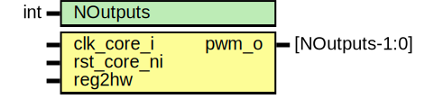

# Entity: pwm_core

## Diagram

## Description

Copyright lowRISC contributors.
 Licensed under the Apache License, Version 2.0, see LICENSE for details.
 SPDX-License-Identifier: Apache-2.0
 Description: PWM Core Module
 
## Generics

| Generic name | Type | Value | Description |
| ------------ | ---- | ----- | ----------- |
| NOutputs     | int  | 6     |             |
## Ports

| Port name   | Direction | Type           | Description |
| ----------- | --------- | -------------- | ----------- |
| clk_core_i  | input     |                |             |
| rst_core_ni | input     |                |             |
| reg2hw      | input     |                |             |
| pwm_o       | output    | [NOutputs-1:0] |             |
## Signals

| Name               | Type                      | Description                    |
| ------------------ | ------------------------- | ------------------------------ |
| reg2hw_sync        | pwm_reg_pkg::pwm_reg2hw_t |                                |
| clr_phase_cntr     | logic                     |                                |
| clr_blink_cntr     | logic [NOutputs-1:0]      |                                |
| cntr_en_sync       | logic                     |                                |
| clk_div_sync       | logic [26:0]              |                                |
| dc_resn_sync       | logic [3:0]               |                                |
| beat_ctr_q         | logic [26:0]              |                                |
| beat_ctr_d         | logic [26:0]              |                                |
| beat_ctr_en        | logic                     |                                |
| beat_end           | logic                     |                                |
| phase_ctr_q        | logic [15:0]              |                                |
| phase_ctr_d        | logic [15:0]              |                                |
| phase_ctr_incr     | logic [15:0]              |                                |
| phase_ctr_next     | logic [15:0]              |                                |
| phase_ctr_overflow | logic                     |                                |
| phase_ctr_en       | logic                     |                                |
| cycle_end          | logic                     |                                |
| unused_regen       | logic                     |                                |
| unused_reg         | logic                     | unused register configuration  |
## Processes
- unnamed: ( @(posedge clk_core_i or negedge rst_core_ni) )
- unnamed: ( @(posedge clk_core_i or negedge rst_core_ni) )
## Instantiations

- u_pwm_cdc: pwm_cdc
