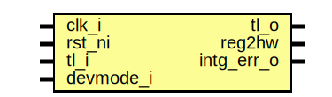

# Entity: pwm_reg_top

- **File**: pwm_reg_top.sv
## Diagram

## Description

Copyright lowRISC contributors.
 Licensed under the Apache License, Version 2.0, see LICENSE for details.
 SPDX-License-Identifier: Apache-2.0
 Register Top module auto-generated by `reggen`
 
## Ports

| Port name  | Direction | Type | Description                                              |
| ---------- | --------- | ---- | -------------------------------------------------------- |
| clk_i      | input     |      |                                                          |
| rst_ni     | input     |      |                                                          |
| tl_i       | input     |      |                                                          |
| tl_o       | output    |      |                                                          |
| reg2hw     | output    |      | Write                                                    |
| intg_err_o | output    |      | Integrity check errors                                   |
| devmode_i  | input     |      | If 1, explicit error return for unmapped register access |
## Signals

| Name                         | Type               | Description                                                                                                               |
| ---------------------------- | ------------------ | ------------------------------------------------------------------------------------------------------------------------- |
| reg_we                       | logic              | register signals                                                                                                          |
| reg_re                       | logic              |                                                                                                                           |
| reg_addr                     | logic [AW-1:0]     |                                                                                                                           |
| reg_wdata                    | logic [DW-1:0]     |                                                                                                                           |
| reg_be                       | logic [DBW-1:0]    |                                                                                                                           |
| reg_rdata                    | logic [DW-1:0]     |                                                                                                                           |
| reg_error                    | logic              |                                                                                                                           |
| addrmiss                     | logic              |                                                                                                                           |
| wr_err                       | logic              |                                                                                                                           |
| reg_rdata_next               | logic [DW-1:0]     |                                                                                                                           |
| tl_reg_h2d                   | tlul_pkg::tl_h2d_t |                                                                                                                           |
| tl_reg_d2h                   | tlul_pkg::tl_d2h_t |                                                                                                                           |
| intg_err                     | logic              | incoming payload check                                                                                                    |
| intg_err_q                   | logic              |                                                                                                                           |
| tl_o_pre                     | tlul_pkg::tl_d2h_t | outgoing integrity generation                                                                                             |
| alert_test_we                | logic              | Define SW related signals Format: <reg>_<field>_{wd|we|qs} or <reg>_{wd|we|qs} if field == 1 or 0                         |
| alert_test_wd                | logic              |                                                                                                                           |
| regen_we                     | logic              |                                                                                                                           |
| regen_qs                     | logic              |                                                                                                                           |
| regen_wd                     | logic              |                                                                                                                           |
| cfg_we                       | logic              |                                                                                                                           |
| cfg_clk_div_qs               | logic [26:0]       |                                                                                                                           |
| cfg_clk_div_wd               | logic [26:0]       |                                                                                                                           |
| cfg_dc_resn_qs               | logic [3:0]        |                                                                                                                           |
| cfg_dc_resn_wd               | logic [3:0]        |                                                                                                                           |
| cfg_cntr_en_qs               | logic              |                                                                                                                           |
| cfg_cntr_en_wd               | logic              |                                                                                                                           |
| pwm_en_we                    | logic              |                                                                                                                           |
| pwm_en_en_0_qs               | logic              |                                                                                                                           |
| pwm_en_en_0_wd               | logic              |                                                                                                                           |
| pwm_en_en_1_qs               | logic              |                                                                                                                           |
| pwm_en_en_1_wd               | logic              |                                                                                                                           |
| pwm_en_en_2_qs               | logic              |                                                                                                                           |
| pwm_en_en_2_wd               | logic              |                                                                                                                           |
| pwm_en_en_3_qs               | logic              |                                                                                                                           |
| pwm_en_en_3_wd               | logic              |                                                                                                                           |
| pwm_en_en_4_qs               | logic              |                                                                                                                           |
| pwm_en_en_4_wd               | logic              |                                                                                                                           |
| pwm_en_en_5_qs               | logic              |                                                                                                                           |
| pwm_en_en_5_wd               | logic              |                                                                                                                           |
| invert_we                    | logic              |                                                                                                                           |
| invert_invert_0_qs           | logic              |                                                                                                                           |
| invert_invert_0_wd           | logic              |                                                                                                                           |
| invert_invert_1_qs           | logic              |                                                                                                                           |
| invert_invert_1_wd           | logic              |                                                                                                                           |
| invert_invert_2_qs           | logic              |                                                                                                                           |
| invert_invert_2_wd           | logic              |                                                                                                                           |
| invert_invert_3_qs           | logic              |                                                                                                                           |
| invert_invert_3_wd           | logic              |                                                                                                                           |
| invert_invert_4_qs           | logic              |                                                                                                                           |
| invert_invert_4_wd           | logic              |                                                                                                                           |
| invert_invert_5_qs           | logic              |                                                                                                                           |
| invert_invert_5_wd           | logic              |                                                                                                                           |
| pwm_param_0_we               | logic              |                                                                                                                           |
| pwm_param_0_phase_delay_0_qs | logic [15:0]       |                                                                                                                           |
| pwm_param_0_phase_delay_0_wd | logic [15:0]       |                                                                                                                           |
| pwm_param_0_htbt_en_0_qs     | logic              |                                                                                                                           |
| pwm_param_0_htbt_en_0_wd     | logic              |                                                                                                                           |
| pwm_param_0_blink_en_0_qs    | logic              |                                                                                                                           |
| pwm_param_0_blink_en_0_wd    | logic              |                                                                                                                           |
| pwm_param_1_we               | logic              |                                                                                                                           |
| pwm_param_1_phase_delay_1_qs | logic [15:0]       |                                                                                                                           |
| pwm_param_1_phase_delay_1_wd | logic [15:0]       |                                                                                                                           |
| pwm_param_1_htbt_en_1_qs     | logic              |                                                                                                                           |
| pwm_param_1_htbt_en_1_wd     | logic              |                                                                                                                           |
| pwm_param_1_blink_en_1_qs    | logic              |                                                                                                                           |
| pwm_param_1_blink_en_1_wd    | logic              |                                                                                                                           |
| pwm_param_2_we               | logic              |                                                                                                                           |
| pwm_param_2_phase_delay_2_qs | logic [15:0]       |                                                                                                                           |
| pwm_param_2_phase_delay_2_wd | logic [15:0]       |                                                                                                                           |
| pwm_param_2_htbt_en_2_qs     | logic              |                                                                                                                           |
| pwm_param_2_htbt_en_2_wd     | logic              |                                                                                                                           |
| pwm_param_2_blink_en_2_qs    | logic              |                                                                                                                           |
| pwm_param_2_blink_en_2_wd    | logic              |                                                                                                                           |
| pwm_param_3_we               | logic              |                                                                                                                           |
| pwm_param_3_phase_delay_3_qs | logic [15:0]       |                                                                                                                           |
| pwm_param_3_phase_delay_3_wd | logic [15:0]       |                                                                                                                           |
| pwm_param_3_htbt_en_3_qs     | logic              |                                                                                                                           |
| pwm_param_3_htbt_en_3_wd     | logic              |                                                                                                                           |
| pwm_param_3_blink_en_3_qs    | logic              |                                                                                                                           |
| pwm_param_3_blink_en_3_wd    | logic              |                                                                                                                           |
| pwm_param_4_we               | logic              |                                                                                                                           |
| pwm_param_4_phase_delay_4_qs | logic [15:0]       |                                                                                                                           |
| pwm_param_4_phase_delay_4_wd | logic [15:0]       |                                                                                                                           |
| pwm_param_4_htbt_en_4_qs     | logic              |                                                                                                                           |
| pwm_param_4_htbt_en_4_wd     | logic              |                                                                                                                           |
| pwm_param_4_blink_en_4_qs    | logic              |                                                                                                                           |
| pwm_param_4_blink_en_4_wd    | logic              |                                                                                                                           |
| pwm_param_5_we               | logic              |                                                                                                                           |
| pwm_param_5_phase_delay_5_qs | logic [15:0]       |                                                                                                                           |
| pwm_param_5_phase_delay_5_wd | logic [15:0]       |                                                                                                                           |
| pwm_param_5_htbt_en_5_qs     | logic              |                                                                                                                           |
| pwm_param_5_htbt_en_5_wd     | logic              |                                                                                                                           |
| pwm_param_5_blink_en_5_qs    | logic              |                                                                                                                           |
| pwm_param_5_blink_en_5_wd    | logic              |                                                                                                                           |
| duty_cycle_0_we              | logic              |                                                                                                                           |
| duty_cycle_0_a_0_qs          | logic [15:0]       |                                                                                                                           |
| duty_cycle_0_a_0_wd          | logic [15:0]       |                                                                                                                           |
| duty_cycle_0_b_0_qs          | logic [15:0]       |                                                                                                                           |
| duty_cycle_0_b_0_wd          | logic [15:0]       |                                                                                                                           |
| duty_cycle_1_we              | logic              |                                                                                                                           |
| duty_cycle_1_a_1_qs          | logic [15:0]       |                                                                                                                           |
| duty_cycle_1_a_1_wd          | logic [15:0]       |                                                                                                                           |
| duty_cycle_1_b_1_qs          | logic [15:0]       |                                                                                                                           |
| duty_cycle_1_b_1_wd          | logic [15:0]       |                                                                                                                           |
| duty_cycle_2_we              | logic              |                                                                                                                           |
| duty_cycle_2_a_2_qs          | logic [15:0]       |                                                                                                                           |
| duty_cycle_2_a_2_wd          | logic [15:0]       |                                                                                                                           |
| duty_cycle_2_b_2_qs          | logic [15:0]       |                                                                                                                           |
| duty_cycle_2_b_2_wd          | logic [15:0]       |                                                                                                                           |
| duty_cycle_3_we              | logic              |                                                                                                                           |
| duty_cycle_3_a_3_qs          | logic [15:0]       |                                                                                                                           |
| duty_cycle_3_a_3_wd          | logic [15:0]       |                                                                                                                           |
| duty_cycle_3_b_3_qs          | logic [15:0]       |                                                                                                                           |
| duty_cycle_3_b_3_wd          | logic [15:0]       |                                                                                                                           |
| duty_cycle_4_we              | logic              |                                                                                                                           |
| duty_cycle_4_a_4_qs          | logic [15:0]       |                                                                                                                           |
| duty_cycle_4_a_4_wd          | logic [15:0]       |                                                                                                                           |
| duty_cycle_4_b_4_qs          | logic [15:0]       |                                                                                                                           |
| duty_cycle_4_b_4_wd          | logic [15:0]       |                                                                                                                           |
| duty_cycle_5_we              | logic              |                                                                                                                           |
| duty_cycle_5_a_5_qs          | logic [15:0]       |                                                                                                                           |
| duty_cycle_5_a_5_wd          | logic [15:0]       |                                                                                                                           |
| duty_cycle_5_b_5_qs          | logic [15:0]       |                                                                                                                           |
| duty_cycle_5_b_5_wd          | logic [15:0]       |                                                                                                                           |
| blink_param_0_we             | logic              |                                                                                                                           |
| blink_param_0_x_0_qs         | logic [15:0]       |                                                                                                                           |
| blink_param_0_x_0_wd         | logic [15:0]       |                                                                                                                           |
| blink_param_0_y_0_qs         | logic [15:0]       |                                                                                                                           |
| blink_param_0_y_0_wd         | logic [15:0]       |                                                                                                                           |
| blink_param_1_we             | logic              |                                                                                                                           |
| blink_param_1_x_1_qs         | logic [15:0]       |                                                                                                                           |
| blink_param_1_x_1_wd         | logic [15:0]       |                                                                                                                           |
| blink_param_1_y_1_qs         | logic [15:0]       |                                                                                                                           |
| blink_param_1_y_1_wd         | logic [15:0]       |                                                                                                                           |
| blink_param_2_we             | logic              |                                                                                                                           |
| blink_param_2_x_2_qs         | logic [15:0]       |                                                                                                                           |
| blink_param_2_x_2_wd         | logic [15:0]       |                                                                                                                           |
| blink_param_2_y_2_qs         | logic [15:0]       |                                                                                                                           |
| blink_param_2_y_2_wd         | logic [15:0]       |                                                                                                                           |
| blink_param_3_we             | logic              |                                                                                                                           |
| blink_param_3_x_3_qs         | logic [15:0]       |                                                                                                                           |
| blink_param_3_x_3_wd         | logic [15:0]       |                                                                                                                           |
| blink_param_3_y_3_qs         | logic [15:0]       |                                                                                                                           |
| blink_param_3_y_3_wd         | logic [15:0]       |                                                                                                                           |
| blink_param_4_we             | logic              |                                                                                                                           |
| blink_param_4_x_4_qs         | logic [15:0]       |                                                                                                                           |
| blink_param_4_x_4_wd         | logic [15:0]       |                                                                                                                           |
| blink_param_4_y_4_qs         | logic [15:0]       |                                                                                                                           |
| blink_param_4_y_4_wd         | logic [15:0]       |                                                                                                                           |
| blink_param_5_we             | logic              |                                                                                                                           |
| blink_param_5_x_5_qs         | logic [15:0]       |                                                                                                                           |
| blink_param_5_x_5_wd         | logic [15:0]       |                                                                                                                           |
| blink_param_5_y_5_qs         | logic [15:0]       |                                                                                                                           |
| blink_param_5_y_5_wd         | logic [15:0]       |                                                                                                                           |
| addr_hit                     | logic [22:0]       |                                                                                                                           |
| unused_wdata                 | logic              | Unused signal tieoff wdata / byte enable are not always fully used add a blanket unused statement to handle lint waivers  |
| unused_be                    | logic              |                                                                                                                           |
## Constants

| Name | Type | Value | Description |
| ---- | ---- | ----- | ----------- |
| AW   | int  | 7     |             |
| DW   | int  | 32    |             |
| DBW  | int  | DW/8  | Byte Width  |
## Processes
- unnamed: ( @(posedge clk_i or negedge rst_ni) )
- unnamed: (  )
- unnamed: (  )
**Description**
Check sub-word write is permitted

- unnamed: (  )
**Description**
Read data return

## Instantiations

- u_chk: tlul_cmd_intg_chk
- u_rsp_intg_gen: tlul_rsp_intg_gen
- u_reg_if: tlul_adapter_reg
- u_alert_test: prim_subreg_ext
**Description**
Register instances
R[alert_test]: V(True)

- u_regen: prim_subreg
**Description**
R[regen]: V(False)

- u_cfg_clk_div: prim_subreg
**Description**
R[cfg]: V(False)
F[clk_div]: 26:0

- u_cfg_dc_resn: prim_subreg
**Description**
F[dc_resn]: 30:27

- u_cfg_cntr_en: prim_subreg
**Description**
F[cntr_en]: 31:31

