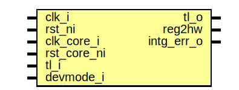

# Entity: pwm_reg_top

- **File**: pwm_reg_top.sv
## Diagram

## Description

 Copyright lowRISC contributors.
 Licensed under the Apache License, Version 2.0, see LICENSE for details.
 SPDX-License-Identifier: Apache-2.0

 Register Top module auto-generated by `reggen`

## Ports

| Port name   | Direction | Type | Description                                              |
| ----------- | --------- | ---- | -------------------------------------------------------- |
| clk_i       | input     |      |                                                          |
| rst_ni      | input     |      |                                                          |
| clk_core_i  | input     |      |                                                          |
| rst_core_ni | input     |      |                                                          |
| tl_i        | input     |      |                                                          |
| tl_o        | output    |      |                                                          |
| reg2hw      | output    |      | Write                                                    |
| intg_err_o  | output    |      |  Integrity check errors                                  |
| devmode_i   | input     |      | If 1, explicit error return for unmapped register access |
## Signals

| Name                                  | Type               | Description                                                                                                                  |
| ------------------------------------- | ------------------ | ---------------------------------------------------------------------------------------------------------------------------- |
| reg_we                                | logic              |  register signals                                                                                                            |
| reg_re                                | logic              |                                                                                                                              |
| reg_addr                              | logic [AW-1:0]     |                                                                                                                              |
| reg_wdata                             | logic [DW-1:0]     |                                                                                                                              |
| reg_be                                | logic [DBW-1:0]    |                                                                                                                              |
| reg_rdata                             | logic [DW-1:0]     |                                                                                                                              |
| reg_error                             | logic              |                                                                                                                              |
| addrmiss                              | logic              |                                                                                                                              |
| wr_err                                | logic              |                                                                                                                              |
| reg_rdata_next                        | logic [DW-1:0]     |                                                                                                                              |
| reg_busy                              | logic              |                                                                                                                              |
| tl_reg_h2d                            | tlul_pkg::tl_h2d_t |                                                                                                                              |
| tl_reg_d2h                            | tlul_pkg::tl_d2h_t |                                                                                                                              |
| intg_err                              | logic              |  incoming payload check                                                                                                      |
| intg_err_q                            | logic              |                                                                                                                              |
| tl_o_pre                              | tlul_pkg::tl_d2h_t |  outgoing integrity generation                                                                                               |
| sync_core_update                      | logic              |  cdc oversampling signals                                                                                                    |
| alert_test_we                         | logic              |  Define SW related signals  Format: <reg>_<field>_{wd|we|qs}         or <reg>_{wd|we|qs} if field == 1 or 0                  |
| alert_test_wd                         | logic              |                                                                                                                              |
| regen_we                              | logic              |                                                                                                                              |
| regen_qs                              | logic [0:0]        |                                                                                                                              |
| regen_busy                            | logic              |                                                                                                                              |
| cfg_we                                | logic              |                                                                                                                              |
| cfg_qs                                | logic [31:0]       |                                                                                                                              |
| cfg_busy                              | logic              |                                                                                                                              |
| pwm_en_we                             | logic              |                                                                                                                              |
| pwm_en_qs                             | logic [5:0]        |                                                                                                                              |
| pwm_en_busy                           | logic              |                                                                                                                              |
| invert_we                             | logic              |                                                                                                                              |
| invert_qs                             | logic [5:0]        |                                                                                                                              |
| invert_busy                           | logic              |                                                                                                                              |
| pwm_param_0_we                        | logic              |                                                                                                                              |
| pwm_param_0_qs                        | logic [31:0]       |                                                                                                                              |
| pwm_param_0_busy                      | logic              |                                                                                                                              |
| pwm_param_1_we                        | logic              |                                                                                                                              |
| pwm_param_1_qs                        | logic [31:0]       |                                                                                                                              |
| pwm_param_1_busy                      | logic              |                                                                                                                              |
| pwm_param_2_we                        | logic              |                                                                                                                              |
| pwm_param_2_qs                        | logic [31:0]       |                                                                                                                              |
| pwm_param_2_busy                      | logic              |                                                                                                                              |
| pwm_param_3_we                        | logic              |                                                                                                                              |
| pwm_param_3_qs                        | logic [31:0]       |                                                                                                                              |
| pwm_param_3_busy                      | logic              |                                                                                                                              |
| pwm_param_4_we                        | logic              |                                                                                                                              |
| pwm_param_4_qs                        | logic [31:0]       |                                                                                                                              |
| pwm_param_4_busy                      | logic              |                                                                                                                              |
| pwm_param_5_we                        | logic              |                                                                                                                              |
| pwm_param_5_qs                        | logic [31:0]       |                                                                                                                              |
| pwm_param_5_busy                      | logic              |                                                                                                                              |
| duty_cycle_0_we                       | logic              |                                                                                                                              |
| duty_cycle_0_qs                       | logic [31:0]       |                                                                                                                              |
| duty_cycle_0_busy                     | logic              |                                                                                                                              |
| duty_cycle_1_we                       | logic              |                                                                                                                              |
| duty_cycle_1_qs                       | logic [31:0]       |                                                                                                                              |
| duty_cycle_1_busy                     | logic              |                                                                                                                              |
| duty_cycle_2_we                       | logic              |                                                                                                                              |
| duty_cycle_2_qs                       | logic [31:0]       |                                                                                                                              |
| duty_cycle_2_busy                     | logic              |                                                                                                                              |
| duty_cycle_3_we                       | logic              |                                                                                                                              |
| duty_cycle_3_qs                       | logic [31:0]       |                                                                                                                              |
| duty_cycle_3_busy                     | logic              |                                                                                                                              |
| duty_cycle_4_we                       | logic              |                                                                                                                              |
| duty_cycle_4_qs                       | logic [31:0]       |                                                                                                                              |
| duty_cycle_4_busy                     | logic              |                                                                                                                              |
| duty_cycle_5_we                       | logic              |                                                                                                                              |
| duty_cycle_5_qs                       | logic [31:0]       |                                                                                                                              |
| duty_cycle_5_busy                     | logic              |                                                                                                                              |
| blink_param_0_we                      | logic              |                                                                                                                              |
| blink_param_0_qs                      | logic [31:0]       |                                                                                                                              |
| blink_param_0_busy                    | logic              |                                                                                                                              |
| blink_param_1_we                      | logic              |                                                                                                                              |
| blink_param_1_qs                      | logic [31:0]       |                                                                                                                              |
| blink_param_1_busy                    | logic              |                                                                                                                              |
| blink_param_2_we                      | logic              |                                                                                                                              |
| blink_param_2_qs                      | logic [31:0]       |                                                                                                                              |
| blink_param_2_busy                    | logic              |                                                                                                                              |
| blink_param_3_we                      | logic              |                                                                                                                              |
| blink_param_3_qs                      | logic [31:0]       |                                                                                                                              |
| blink_param_3_busy                    | logic              |                                                                                                                              |
| blink_param_4_we                      | logic              |                                                                                                                              |
| blink_param_4_qs                      | logic [31:0]       |                                                                                                                              |
| blink_param_4_busy                    | logic              |                                                                                                                              |
| blink_param_5_we                      | logic              |                                                                                                                              |
| blink_param_5_qs                      | logic [31:0]       |                                                                                                                              |
| blink_param_5_busy                    | logic              |                                                                                                                              |
| core_regen_qs_int                     | logic              |  Define register CDC handling.  CDC handling is done on a per-reg instead of per-field boundary.                             |
| core_regen_d                          | logic [0:0]        |                                                                                                                              |
| core_regen_wdata                      | logic [0:0]        |                                                                                                                              |
| core_regen_we                         | logic              |                                                                                                                              |
| unused_core_regen_wdata               | logic              |                                                                                                                              |
| core_cfg_clk_div_qs_int               | logic [26:0]       |                                                                                                                              |
| core_cfg_dc_resn_qs_int               | logic [3:0]        |                                                                                                                              |
| core_cfg_cntr_en_qs_int               | logic              |                                                                                                                              |
| core_cfg_d                            | logic [31:0]       |                                                                                                                              |
| core_cfg_wdata                        | logic [31:0]       |                                                                                                                              |
| core_cfg_we                           | logic              |                                                                                                                              |
| unused_core_cfg_wdata                 | logic              |                                                                                                                              |
| core_pwm_en_en_0_qs_int               | logic              |                                                                                                                              |
| core_pwm_en_en_1_qs_int               | logic              |                                                                                                                              |
| core_pwm_en_en_2_qs_int               | logic              |                                                                                                                              |
| core_pwm_en_en_3_qs_int               | logic              |                                                                                                                              |
| core_pwm_en_en_4_qs_int               | logic              |                                                                                                                              |
| core_pwm_en_en_5_qs_int               | logic              |                                                                                                                              |
| core_pwm_en_d                         | logic [5:0]        |                                                                                                                              |
| core_pwm_en_wdata                     | logic [5:0]        |                                                                                                                              |
| core_pwm_en_we                        | logic              |                                                                                                                              |
| unused_core_pwm_en_wdata              | logic              |                                                                                                                              |
| core_invert_invert_0_qs_int           | logic              |                                                                                                                              |
| core_invert_invert_1_qs_int           | logic              |                                                                                                                              |
| core_invert_invert_2_qs_int           | logic              |                                                                                                                              |
| core_invert_invert_3_qs_int           | logic              |                                                                                                                              |
| core_invert_invert_4_qs_int           | logic              |                                                                                                                              |
| core_invert_invert_5_qs_int           | logic              |                                                                                                                              |
| core_invert_d                         | logic [5:0]        |                                                                                                                              |
| core_invert_wdata                     | logic [5:0]        |                                                                                                                              |
| core_invert_we                        | logic              |                                                                                                                              |
| unused_core_invert_wdata              | logic              |                                                                                                                              |
| core_pwm_param_0_phase_delay_0_qs_int | logic [15:0]       |                                                                                                                              |
| core_pwm_param_0_htbt_en_0_qs_int     | logic              |                                                                                                                              |
| core_pwm_param_0_blink_en_0_qs_int    | logic              |                                                                                                                              |
| core_pwm_param_0_d                    | logic [31:0]       |                                                                                                                              |
| core_pwm_param_0_wdata                | logic [31:0]       |                                                                                                                              |
| core_pwm_param_0_we                   | logic              |                                                                                                                              |
| unused_core_pwm_param_0_wdata         | logic              |                                                                                                                              |
| core_pwm_param_1_phase_delay_1_qs_int | logic [15:0]       |                                                                                                                              |
| core_pwm_param_1_htbt_en_1_qs_int     | logic              |                                                                                                                              |
| core_pwm_param_1_blink_en_1_qs_int    | logic              |                                                                                                                              |
| core_pwm_param_1_d                    | logic [31:0]       |                                                                                                                              |
| core_pwm_param_1_wdata                | logic [31:0]       |                                                                                                                              |
| core_pwm_param_1_we                   | logic              |                                                                                                                              |
| unused_core_pwm_param_1_wdata         | logic              |                                                                                                                              |
| core_pwm_param_2_phase_delay_2_qs_int | logic [15:0]       |                                                                                                                              |
| core_pwm_param_2_htbt_en_2_qs_int     | logic              |                                                                                                                              |
| core_pwm_param_2_blink_en_2_qs_int    | logic              |                                                                                                                              |
| core_pwm_param_2_d                    | logic [31:0]       |                                                                                                                              |
| core_pwm_param_2_wdata                | logic [31:0]       |                                                                                                                              |
| core_pwm_param_2_we                   | logic              |                                                                                                                              |
| unused_core_pwm_param_2_wdata         | logic              |                                                                                                                              |
| core_pwm_param_3_phase_delay_3_qs_int | logic [15:0]       |                                                                                                                              |
| core_pwm_param_3_htbt_en_3_qs_int     | logic              |                                                                                                                              |
| core_pwm_param_3_blink_en_3_qs_int    | logic              |                                                                                                                              |
| core_pwm_param_3_d                    | logic [31:0]       |                                                                                                                              |
| core_pwm_param_3_wdata                | logic [31:0]       |                                                                                                                              |
| core_pwm_param_3_we                   | logic              |                                                                                                                              |
| unused_core_pwm_param_3_wdata         | logic              |                                                                                                                              |
| core_pwm_param_4_phase_delay_4_qs_int | logic [15:0]       |                                                                                                                              |
| core_pwm_param_4_htbt_en_4_qs_int     | logic              |                                                                                                                              |
| core_pwm_param_4_blink_en_4_qs_int    | logic              |                                                                                                                              |
| core_pwm_param_4_d                    | logic [31:0]       |                                                                                                                              |
| core_pwm_param_4_wdata                | logic [31:0]       |                                                                                                                              |
| core_pwm_param_4_we                   | logic              |                                                                                                                              |
| unused_core_pwm_param_4_wdata         | logic              |                                                                                                                              |
| core_pwm_param_5_phase_delay_5_qs_int | logic [15:0]       |                                                                                                                              |
| core_pwm_param_5_htbt_en_5_qs_int     | logic              |                                                                                                                              |
| core_pwm_param_5_blink_en_5_qs_int    | logic              |                                                                                                                              |
| core_pwm_param_5_d                    | logic [31:0]       |                                                                                                                              |
| core_pwm_param_5_wdata                | logic [31:0]       |                                                                                                                              |
| core_pwm_param_5_we                   | logic              |                                                                                                                              |
| unused_core_pwm_param_5_wdata         | logic              |                                                                                                                              |
| core_duty_cycle_0_a_0_qs_int          | logic [15:0]       |                                                                                                                              |
| core_duty_cycle_0_b_0_qs_int          | logic [15:0]       |                                                                                                                              |
| core_duty_cycle_0_d                   | logic [31:0]       |                                                                                                                              |
| core_duty_cycle_0_wdata               | logic [31:0]       |                                                                                                                              |
| core_duty_cycle_0_we                  | logic              |                                                                                                                              |
| unused_core_duty_cycle_0_wdata        | logic              |                                                                                                                              |
| core_duty_cycle_1_a_1_qs_int          | logic [15:0]       |                                                                                                                              |
| core_duty_cycle_1_b_1_qs_int          | logic [15:0]       |                                                                                                                              |
| core_duty_cycle_1_d                   | logic [31:0]       |                                                                                                                              |
| core_duty_cycle_1_wdata               | logic [31:0]       |                                                                                                                              |
| core_duty_cycle_1_we                  | logic              |                                                                                                                              |
| unused_core_duty_cycle_1_wdata        | logic              |                                                                                                                              |
| core_duty_cycle_2_a_2_qs_int          | logic [15:0]       |                                                                                                                              |
| core_duty_cycle_2_b_2_qs_int          | logic [15:0]       |                                                                                                                              |
| core_duty_cycle_2_d                   | logic [31:0]       |                                                                                                                              |
| core_duty_cycle_2_wdata               | logic [31:0]       |                                                                                                                              |
| core_duty_cycle_2_we                  | logic              |                                                                                                                              |
| unused_core_duty_cycle_2_wdata        | logic              |                                                                                                                              |
| core_duty_cycle_3_a_3_qs_int          | logic [15:0]       |                                                                                                                              |
| core_duty_cycle_3_b_3_qs_int          | logic [15:0]       |                                                                                                                              |
| core_duty_cycle_3_d                   | logic [31:0]       |                                                                                                                              |
| core_duty_cycle_3_wdata               | logic [31:0]       |                                                                                                                              |
| core_duty_cycle_3_we                  | logic              |                                                                                                                              |
| unused_core_duty_cycle_3_wdata        | logic              |                                                                                                                              |
| core_duty_cycle_4_a_4_qs_int          | logic [15:0]       |                                                                                                                              |
| core_duty_cycle_4_b_4_qs_int          | logic [15:0]       |                                                                                                                              |
| core_duty_cycle_4_d                   | logic [31:0]       |                                                                                                                              |
| core_duty_cycle_4_wdata               | logic [31:0]       |                                                                                                                              |
| core_duty_cycle_4_we                  | logic              |                                                                                                                              |
| unused_core_duty_cycle_4_wdata        | logic              |                                                                                                                              |
| core_duty_cycle_5_a_5_qs_int          | logic [15:0]       |                                                                                                                              |
| core_duty_cycle_5_b_5_qs_int          | logic [15:0]       |                                                                                                                              |
| core_duty_cycle_5_d                   | logic [31:0]       |                                                                                                                              |
| core_duty_cycle_5_wdata               | logic [31:0]       |                                                                                                                              |
| core_duty_cycle_5_we                  | logic              |                                                                                                                              |
| unused_core_duty_cycle_5_wdata        | logic              |                                                                                                                              |
| core_blink_param_0_x_0_qs_int         | logic [15:0]       |                                                                                                                              |
| core_blink_param_0_y_0_qs_int         | logic [15:0]       |                                                                                                                              |
| core_blink_param_0_d                  | logic [31:0]       |                                                                                                                              |
| core_blink_param_0_wdata              | logic [31:0]       |                                                                                                                              |
| core_blink_param_0_we                 | logic              |                                                                                                                              |
| unused_core_blink_param_0_wdata       | logic              |                                                                                                                              |
| core_blink_param_1_x_1_qs_int         | logic [15:0]       |                                                                                                                              |
| core_blink_param_1_y_1_qs_int         | logic [15:0]       |                                                                                                                              |
| core_blink_param_1_d                  | logic [31:0]       |                                                                                                                              |
| core_blink_param_1_wdata              | logic [31:0]       |                                                                                                                              |
| core_blink_param_1_we                 | logic              |                                                                                                                              |
| unused_core_blink_param_1_wdata       | logic              |                                                                                                                              |
| core_blink_param_2_x_2_qs_int         | logic [15:0]       |                                                                                                                              |
| core_blink_param_2_y_2_qs_int         | logic [15:0]       |                                                                                                                              |
| core_blink_param_2_d                  | logic [31:0]       |                                                                                                                              |
| core_blink_param_2_wdata              | logic [31:0]       |                                                                                                                              |
| core_blink_param_2_we                 | logic              |                                                                                                                              |
| unused_core_blink_param_2_wdata       | logic              |                                                                                                                              |
| core_blink_param_3_x_3_qs_int         | logic [15:0]       |                                                                                                                              |
| core_blink_param_3_y_3_qs_int         | logic [15:0]       |                                                                                                                              |
| core_blink_param_3_d                  | logic [31:0]       |                                                                                                                              |
| core_blink_param_3_wdata              | logic [31:0]       |                                                                                                                              |
| core_blink_param_3_we                 | logic              |                                                                                                                              |
| unused_core_blink_param_3_wdata       | logic              |                                                                                                                              |
| core_blink_param_4_x_4_qs_int         | logic [15:0]       |                                                                                                                              |
| core_blink_param_4_y_4_qs_int         | logic [15:0]       |                                                                                                                              |
| core_blink_param_4_d                  | logic [31:0]       |                                                                                                                              |
| core_blink_param_4_wdata              | logic [31:0]       |                                                                                                                              |
| core_blink_param_4_we                 | logic              |                                                                                                                              |
| unused_core_blink_param_4_wdata       | logic              |                                                                                                                              |
| core_blink_param_5_x_5_qs_int         | logic [15:0]       |                                                                                                                              |
| core_blink_param_5_y_5_qs_int         | logic [15:0]       |                                                                                                                              |
| core_blink_param_5_d                  | logic [31:0]       |                                                                                                                              |
| core_blink_param_5_wdata              | logic [31:0]       |                                                                                                                              |
| core_blink_param_5_we                 | logic              |                                                                                                                              |
| unused_core_blink_param_5_wdata       | logic              |                                                                                                                              |
| addr_hit                              | logic [22:0]       |                                                                                                                              |
| shadow_busy                           | logic              |  shadow busy                                                                                                                 |
| reg_busy_sel                          | logic              |  register busy                                                                                                               |
| unused_wdata                          | logic              |  Unused signal tieoff  wdata / byte enable are not always fully used  add a blanket unused statement to handle lint waivers  |
| unused_be                             | logic              |                                                                                                                              |
## Constants

| Name | Type | Value | Description |
| ---- | ---- | ----- | ----------- |
| AW   | int  | 7     |             |
| DW   | int  | 32    |             |
| DBW  | int  | DW/8  | Byte Width  |
## Processes
- unnamed: ( @(posedge clk_i or negedge rst_ni) )
  - **Type:** always_ff
- unnamed: (  )
  - **Type:** always_comb
- unnamed: (  )
  - **Type:** always_comb
- unnamed: (  )
  - **Type:** always_comb
- unnamed: (  )
  - **Type:** always_comb
- unnamed: (  )
  - **Type:** always_comb
- unnamed: (  )
  - **Type:** always_comb
- unnamed: (  )
  - **Type:** always_comb
- unnamed: (  )
  - **Type:** always_comb
- unnamed: (  )
  - **Type:** always_comb
- unnamed: (  )
  - **Type:** always_comb
- unnamed: (  )
  - **Type:** always_comb
- unnamed: (  )
  - **Type:** always_comb
- unnamed: (  )
  - **Type:** always_comb
- unnamed: (  )
  - **Type:** always_comb
- unnamed: (  )
  - **Type:** always_comb
- unnamed: (  )
  - **Type:** always_comb
- unnamed: (  )
  - **Type:** always_comb
- unnamed: (  )
  - **Type:** always_comb
- unnamed: (  )
  - **Type:** always_comb
- unnamed: (  )
  - **Type:** always_comb
- unnamed: (  )
  - **Type:** always_comb
- unnamed: (  )
  - **Type:** always_comb
- unnamed: (  )
  - **Type:** always_comb
- unnamed: (  )
  - **Type:** always_comb
**Description**
 Check sub-word write is permitted 
- unnamed: (  )
  - **Type:** always_comb
**Description**
 Read data return 
- unnamed: (  )
  - **Type:** always_comb
## Instantiations

- u_chk: tlul_cmd_intg_chk
- u_rsp_intg_gen: tlul_rsp_intg_gen
- u_reg_if: tlul_adapter_reg
- u_core_tgl: prim_pulse_sync
- u_regen_cdc: prim_reg_cdc
- u_cfg_cdc: prim_reg_cdc
- u_pwm_en_cdc: prim_reg_cdc
- u_invert_cdc: prim_reg_cdc
- u_pwm_param_0_cdc: prim_reg_cdc
- u_pwm_param_1_cdc: prim_reg_cdc
- u_pwm_param_2_cdc: prim_reg_cdc
- u_pwm_param_3_cdc: prim_reg_cdc
- u_pwm_param_4_cdc: prim_reg_cdc
- u_pwm_param_5_cdc: prim_reg_cdc
- u_duty_cycle_0_cdc: prim_reg_cdc
- u_duty_cycle_1_cdc: prim_reg_cdc
- u_duty_cycle_2_cdc: prim_reg_cdc
- u_duty_cycle_3_cdc: prim_reg_cdc
- u_duty_cycle_4_cdc: prim_reg_cdc
- u_duty_cycle_5_cdc: prim_reg_cdc
- u_blink_param_0_cdc: prim_reg_cdc
- u_blink_param_1_cdc: prim_reg_cdc
- u_blink_param_2_cdc: prim_reg_cdc
- u_blink_param_3_cdc: prim_reg_cdc
- u_blink_param_4_cdc: prim_reg_cdc
- u_blink_param_5_cdc: prim_reg_cdc
- u_alert_test: prim_subreg_ext
**Description**
 Register instances
 R[alert_test]: V(True)

- u_regen: prim_subreg
**Description**
 R[regen]: V(False)

- u_cfg_clk_div: prim_subreg
**Description**
 R[cfg]: V(False)
   F[clk_div]: 26:0

- u_cfg_dc_resn: prim_subreg
**Description**
   F[dc_resn]: 30:27

- u_cfg_cntr_en: prim_subreg
**Description**
   F[cntr_en]: 31:31

