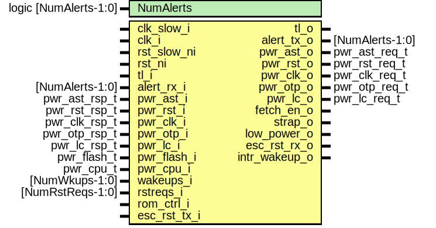

# Entity: pwrmgr

- **File**: pwrmgr.sv
## Diagram

## Description

Copyright lowRISC contributors.
 Licensed under the Apache License, Version 2.0, see LICENSE for details.
 SPDX-License-Identifier: Apache-2.0
 Power Manager
 
## Generics

| Generic name | Type                  | Value     | Description |
| ------------ | --------------------- | --------- | ----------- |
| NumAlerts    | logic [NumAlerts-1:0] | undefined |             |
## Ports

| Port name     | Direction | Type             | Description                           |
| ------------- | --------- | ---------------- | ------------------------------------- |
| clk_slow_i    | input     |                  | Clocks and resets                     |
| clk_i         | input     |                  |                                       |
| rst_slow_ni   | input     |                  |                                       |
| rst_ni        | input     |                  |                                       |
| tl_i          | input     |                  | Bus Interface                         |
| tl_o          | output    |                  |                                       |
| alert_rx_i    | input     | [NumAlerts-1:0]  | Alerts                                |
| alert_tx_o    | output    | [NumAlerts-1:0]  |                                       |
| pwr_ast_i     | input     | pwr_ast_rsp_t    | AST interface                         |
| pwr_ast_o     | output    | pwr_ast_req_t    |                                       |
| pwr_rst_i     | input     | pwr_rst_rsp_t    | rstmgr interface                      |
| pwr_rst_o     | output    | pwr_rst_req_t    |                                       |
| pwr_clk_o     | output    | pwr_clk_req_t    | clkmgr interface                      |
| pwr_clk_i     | input     | pwr_clk_rsp_t    |                                       |
| pwr_otp_i     | input     | pwr_otp_rsp_t    | otp interface                         |
| pwr_otp_o     | output    | pwr_otp_req_t    |                                       |
| pwr_lc_i      | input     | pwr_lc_rsp_t     | life cycle interface                  |
| pwr_lc_o      | output    | pwr_lc_req_t     |                                       |
| pwr_flash_i   | input     | pwr_flash_t      | flash interface                       |
| pwr_cpu_i     | input     | pwr_cpu_t        | processor interface                   |
| fetch_en_o    | output    |                  |                                       |
| wakeups_i     | input     | [NumWkups-1:0]   | peripherals wakeup and reset requests |
| rstreqs_i     | input     | [NumRstReqs-1:0] |                                       |
| strap_o       | output    |                  | pinmux and other peripherals          |
| low_power_o   | output    |                  |                                       |
| rom_ctrl_i    | input     |                  | rom_ctrl interface                    |
| esc_rst_tx_i  | input     |                  | escalation interface                  |
| esc_rst_rx_o  | output    |                  |                                       |
| intr_wakeup_o | output    |                  |                                       |
## Signals

| Name                    | Type                       | Description                                                                             |
| ----------------------- | -------------------------- | --------------------------------------------------------------------------------------- |
| esc_rst_req             | logic                      |                                                                                         |
| peri_reqs_raw           | pwr_peri_t                 |                                                                                         |
| reg2hw                  | pwrmgr_reg2hw_t            |                                                                                         |
| hw2reg                  | pwrmgr_hw2reg_t            |                                                                                         |
| peri_reqs_masked        | pwr_peri_t                 |                                                                                         |
| req_pwrup               | logic                      |                                                                                         |
| ack_pwrup               | logic                      |                                                                                         |
| req_pwrdn               | logic                      |                                                                                         |
| ack_pwrdn               | logic                      |                                                                                         |
| pwrup_cause             | pwrup_cause_e              |                                                                                         |
| low_power_fall_through  | logic                      |                                                                                         |
| low_power_abort         | logic                      |                                                                                         |
| flash_rsp               | pwr_flash_t                |                                                                                         |
| otp_rsp                 | pwr_otp_rsp_t              |                                                                                         |
| rom_ctrl_done           | logic                      |                                                                                         |
| rom_ctrl_good           | logic                      |                                                                                         |
| slow_wakeup_en          | logic [NumWkups-1:0]       | Captured signals These signals, though on clk_i domain, are safe for clk_slow_i to use  |
| slow_reset_en           | logic [NumRstReqs-1:0]     |                                                                                         |
| slow_ast                | pwr_ast_rsp_t              |                                                                                         |
| slow_peri_reqs          | pwr_peri_t                 |                                                                                         |
| slow_peri_reqs_masked   | pwr_peri_t                 |                                                                                         |
| slow_pwrup_cause        | pwrup_cause_e              |                                                                                         |
| slow_pwrup_cause_toggle | logic                      |                                                                                         |
| slow_req_pwrup          | logic                      |                                                                                         |
| slow_ack_pwrup          | logic                      |                                                                                         |
| slow_req_pwrdn          | logic                      |                                                                                         |
| slow_ack_pwrdn          | logic                      |                                                                                         |
| slow_main_pd_n          | logic                      |                                                                                         |
| slow_io_clk_en          | logic                      |                                                                                         |
| slow_core_clk_en        | logic                      |                                                                                         |
| slow_usb_clk_en_lp      | logic                      |                                                                                         |
| slow_usb_clk_en_active  | logic                      |                                                                                         |
| alert_test              | logic [NumAlerts-1:0]      |                                                                                         |
| alerts                  | logic [NumAlerts-1:0]      |                                                                                         |
| low_power_hint          | logic                      |                                                                                         |
| lowpwr_cfg_wen          | logic                      |                                                                                         |
| clr_hint                | logic                      |                                                                                         |
| wkup                    | logic                      |                                                                                         |
| clr_cfg_lock            | logic                      |                                                                                         |
| wake_info_wen           | logic                      |                                                                                         |
| wake_info_data          | logic [TotalWakeWidth-1:0] |                                                                                         |
## Processes
- unnamed: ( @(posedge clk_i or negedge rst_ni) )
## Instantiations

- u_esc_rx: prim_esc_receiver
- u_reg: pwrmgr_reg_top
- i_cdc: pwrmgr_cdc
- i_slow_fsm: pwrmgr_slow_fsm
- i_fsm: pwrmgr_fsm
- i_wake_info: pwrmgr_wake_info
- intr_wakeup: prim_intr_hw
**Description**
This interrupt is asserted whenever the fast FSM transitions
into active state.  However, it does not assert during POR

