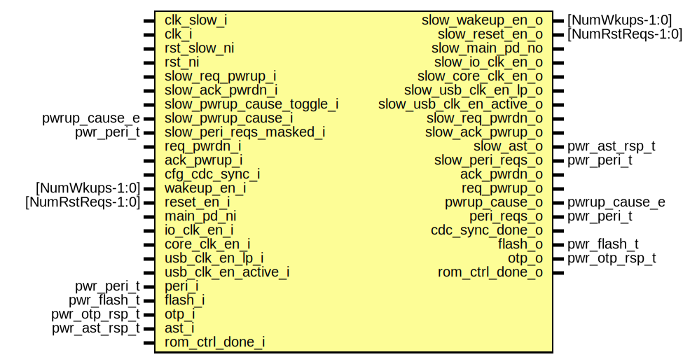

# Entity: pwrmgr_cdc
## Diagram

## Description
Copyright lowRISC contributors.
 Licensed under the Apache License, Version 2.0, see LICENSE for details.
 SPDX-License-Identifier: Apache-2.0
 Power Manager CDC handling
 
## Ports
| Port name                 | Direction | Type             | Description                      |
| ------------------------- | --------- | ---------------- | -------------------------------- |
| clk_slow_i                | input     |                  | Clocks and resets                |
| clk_i                     | input     |                  |                                  |
| rst_slow_ni               | input     |                  |                                  |
| rst_ni                    | input     |                  |                                  |
| slow_req_pwrup_i          | input     |                  | slow domain signals,             |
| slow_ack_pwrdn_i          | input     |                  |                                  |
| slow_pwrup_cause_toggle_i | input     |                  |                                  |
| slow_pwrup_cause_i        | input     | pwrup_cause_e    |                                  |
| slow_wakeup_en_o          | output    | [NumWkups-1:0]   |                                  |
| slow_reset_en_o           | output    | [NumRstReqs-1:0] |                                  |
| slow_main_pd_no           | output    |                  |                                  |
| slow_io_clk_en_o          | output    |                  |                                  |
| slow_core_clk_en_o        | output    |                  |                                  |
| slow_usb_clk_en_lp_o      | output    |                  |                                  |
| slow_usb_clk_en_active_o  | output    |                  |                                  |
| slow_req_pwrdn_o          | output    |                  |                                  |
| slow_ack_pwrup_o          | output    |                  |                                  |
| slow_ast_o                | output    | pwr_ast_rsp_t    |                                  |
| slow_peri_reqs_o          | output    | pwr_peri_t       |                                  |
| slow_peri_reqs_masked_i   | input     | pwr_peri_t       |                                  |
| req_pwrdn_i               | input     |                  | fast domain signals              |
| ack_pwrup_i               | input     |                  |                                  |
| cfg_cdc_sync_i            | input     |                  |                                  |
| wakeup_en_i               | input     | [NumWkups-1:0]   |                                  |
| reset_en_i                | input     | [NumRstReqs-1:0] |                                  |
| main_pd_ni                | input     |                  |                                  |
| io_clk_en_i               | input     |                  |                                  |
| core_clk_en_i             | input     |                  |                                  |
| usb_clk_en_lp_i           | input     |                  |                                  |
| usb_clk_en_active_i       | input     |                  |                                  |
| ack_pwrdn_o               | output    |                  |                                  |
| req_pwrup_o               | output    |                  |                                  |
| pwrup_cause_o             | output    | pwrup_cause_e    |                                  |
| peri_reqs_o               | output    | pwr_peri_t       |                                  |
| cdc_sync_done_o           | output    |                  |                                  |
| peri_i                    | input     | pwr_peri_t       | peripheral inputs, mixed domains |
| flash_i                   | input     | pwr_flash_t      |                                  |
| flash_o                   | output    | pwr_flash_t      |                                  |
| otp_i                     | input     | pwr_otp_rsp_t    | otp interface                    |
| otp_o                     | output    | pwr_otp_rsp_t    |                                  |
| ast_i                     | input     | pwr_ast_rsp_t    | AST inputs, unknown domain       |
| rom_ctrl_done_i           | input     |                  | rom_ctrl signals                 |
| rom_ctrl_done_o           | output    |                  |                                  |
## Signals
| Name                  | Type          | Description |
| --------------------- | ------------- | ----------- |
| slow_cdc_sync         | logic         |             |
| slow_ast_q            | pwr_ast_rsp_t |             |
| slow_ast_q2           | pwr_ast_rsp_t |             |
| pwrup_cause_toggle_q  | logic         |             |
| pwrup_cause_toggle_q2 | logic         |             |
| pwrup_cause_chg       | logic         |             |
## Processes
- unnamed: _( @(posedge clk_slow_i or negedge rst_slow_ni) )_

- unnamed: _( @(posedge clk_slow_i or negedge rst_slow_ni) )_
if possible, we should simulate below with random delays through
flop_2sync

**Description**
if possible, we should simulate below with random delays through
flop_2sync

- unnamed: _( @(posedge clk_slow_i or negedge rst_slow_ni) )_
only register configurations can be sync'd using slow_cdc_sync

**Description**
only register configurations can be sync'd using slow_cdc_sync

- unnamed: _( @(posedge clk_i or negedge rst_ni) )_

- unnamed: _( @(posedge clk_i or negedge rst_ni) )_

## Instantiations
- i_req_pwrdn_sync: prim_flop_2sync
- i_ack_pwrup_sync: prim_flop_2sync
- i_slow_cdc_sync: prim_pulse_sync
- i_req_pwrup_sync: prim_flop_2sync
- i_ack_pwrdn_sync: prim_flop_2sync
- i_pwrup_chg_sync: prim_flop_2sync
- i_scdc_sync: prim_pulse_sync
- u_sync_flash_idle: prim_flop_2sync
- u_sync_rom_ctrl: prim_flop_2sync
