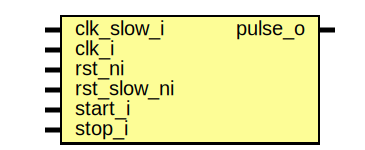

# Entity: pwrmgr_cdc_pulse

- **File**: pwrmgr_cdc_pulse.sv
## Diagram

## Description

Copyright lowRISC contributors.
 Licensed under the Apache License, Version 2.0, see LICENSE for details.
 SPDX-License-Identifier: Apache-2.0
 Power Manager module to find slow clock edges
 The clock is not used directly to avoid STA issues, instead a toggle
 pulse is used.
 
## Ports

| Port name   | Direction | Type | Description |
| ----------- | --------- | ---- | ----------- |
| clk_slow_i  | input     |      |             |
| clk_i       | input     |      |             |
| rst_ni      | input     |      |             |
| rst_slow_ni | input     |      |             |
| start_i     | input     |      |             |
| stop_i      | input     |      |             |
| pulse_o     | output    |      |             |
## Signals

| Name           | Type  | Description |
| -------------- | ----- | ----------- |
| slow_toggle_pq | logic |             |
| slow_toggle_nq | logic |             |
| clk_slow_pq    | logic |             |
| clk_slow_nq    | logic |             |
| clk_slow_pq2   | logic |             |
| clk_slow_nq2   | logic |             |
| toggle         | logic |             |
| valid          | logic |             |
## Processes
- unnamed: ( @(posedge clk_slow_i or negedge rst_slow_ni) )
**Description**
toggle pulse generated on positive edge

- unnamed: ( @(negedge clk_slow_i or negedge rst_slow_ni) )
**Description**
toggle pulse generated on negative edge

- unnamed: ( @(posedge clk_i or negedge rst_ni) )
- unnamed: ( @(posedge clk_i or negedge rst_ni) )
## Instantiations

- i_pos_sync: prim_flop_2sync
- i_neg_sync: prim_flop_2sync
