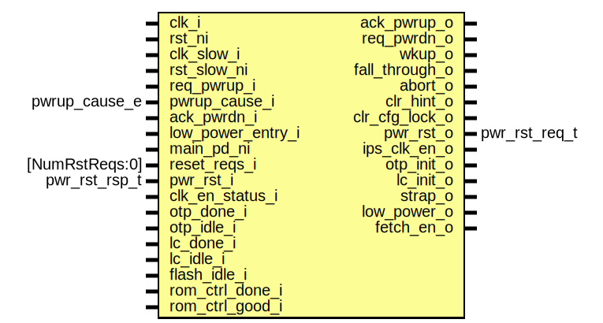

# Entity: pwrmgr_fsm

- **File**: pwrmgr_fsm.sv
## Diagram

## Description

 Copyright lowRISC contributors.
 Licensed under the Apache License, Version 2.0, see LICENSE for details.
 SPDX-License-Identifier: Apache-2.0

 Power Manager Fast FSM

## Ports

| Port name         | Direction | Type           | Description              |
| ----------------- | --------- | -------------- | ------------------------ |
| clk_i             | input     |                |                          |
| rst_ni            | input     |                |                          |
| clk_slow_i        | input     |                |                          |
| rst_slow_ni       | input     |                |                          |
| req_pwrup_i       | input     |                |  interface with slow_fsm |
| pwrup_cause_i     | input     | pwrup_cause_e  |                          |
| ack_pwrup_o       | output    |                |                          |
| req_pwrdn_o       | output    |                |                          |
| ack_pwrdn_i       | input     |                |                          |
| low_power_entry_i | input     |                |                          |
| main_pd_ni        | input     |                |                          |
| reset_reqs_i      | input     | [NumRstReqs:0] |                          |
| wkup_o            | output    |                | generate wake interrupt  |
| fall_through_o    | output    |                |                          |
| abort_o           | output    |                |                          |
| clr_hint_o        | output    |                |                          |
| clr_cfg_lock_o    | output    |                |                          |
| pwr_rst_o         | output    | pwr_rst_req_t  |  rstmgr                  |
| pwr_rst_i         | input     | pwr_rst_rsp_t  |                          |
| ips_clk_en_o      | output    |                |  clkmgr                  |
| clk_en_status_i   | input     |                |                          |
| otp_init_o        | output    |                |  otp                     |
| otp_done_i        | input     |                |                          |
| otp_idle_i        | input     |                |                          |
| lc_init_o         | output    |                |  lc                      |
| lc_done_i         | input     |                |                          |
| lc_idle_i         | input     |                |                          |
| flash_idle_i      | input     |                |  flash                   |
| rom_ctrl_done_i   | input     |                |  rom_ctrl                |
| rom_ctrl_good_i   | input     |                |                          |
| strap_o           | output    |                |  pinmux                  |
| low_power_o       | output    |                |                          |
| fetch_en_o        | output    |                |  processing elements     |
## Signals

| Name               | Type                               | Description                                                                                                                                           |
| ------------------ | ---------------------------------- | ----------------------------------------------------------------------------------------------------------------------------------------------------- |
| pd_n_rsts_asserted | logic                              |  all powered down domains have resets asserted                                                                                                        |
| all_rsts_asserted  | logic                              |  all domains have resets asserted                                                                                                                     |
| reset_valid        | logic                              |  resets are valid                                                                                                                                     |
| reset_cause_q      | reset_cause_e                      |                                                                                                                                                       |
| reset_cause_d      | reset_cause_e                      |                                                                                                                                                       |
| reset_req          | logic                              |  reset request                                                                                                                                        |
| strap_sampled      | logic                              |  strap sample should only happen on cold boot or when the  the system goes through a reset cycle                                                      |
| fetch_en_q         | lc_ctrl_pkg::lc_tx_t               |  disable processing element fetching                                                                                                                  |
| fetch_en_d         | lc_ctrl_pkg::lc_tx_t               |  disable processing element fetching                                                                                                                  |
| state_d            | fast_pwr_state_e                   |                                                                                                                                                       |
| state_q            | fast_pwr_state_e                   |                                                                                                                                                       |
| reset_ongoing_q    | logic                              |                                                                                                                                                       |
| reset_ongoing_d    | logic                              |                                                                                                                                                       |
| req_pwrdn_q        | logic                              |                                                                                                                                                       |
| req_pwrdn_d        | logic                              |                                                                                                                                                       |
| ack_pwrup_q        | logic                              |                                                                                                                                                       |
| ack_pwrup_d        | logic                              |                                                                                                                                                       |
| ip_clk_en_q        | logic                              |                                                                                                                                                       |
| ip_clk_en_d        | logic                              |                                                                                                                                                       |
| rst_lc_req_q       | logic [PowerDomains-1:0]           |                                                                                                                                                       |
| rst_sys_req_q      | logic [PowerDomains-1:0]           |                                                                                                                                                       |
| rst_lc_req_d       | logic [PowerDomains-1:0]           |                                                                                                                                                       |
| rst_sys_req_d      | logic [PowerDomains-1:0]           |                                                                                                                                                       |
| otp_init           | logic                              |                                                                                                                                                       |
| lc_init            | logic                              |                                                                                                                                                       |
| low_power_q        | logic                              |                                                                                                                                                       |
| low_power_d        | logic                              |                                                                                                                                                       |
| rst_sys_src_n      | [PowerDomains-1:OffDomainSelStart] |                                                                                                                                                       |
| slow_lc_done       | logic                              |  Life cycle broadcast may take time to propagate through the system.  The sync below simulates that behavior using the slowest clock in the  system.  |
| lc_done            | logic                              |                                                                                                                                                       |
## Constants

| Name              | Type | Value                | Description                                                                        |
| ----------------- | ---- | -------------------- | ---------------------------------------------------------------------------------- |
| OffDomainSelStart | int  | ALWAYS_ON_DOMAIN + 1 |  when there are multiple on domains, the latter 1 should become another parameter  |
## Processes
- unnamed: ( @(posedge clk_i or negedge rst_ni) )
  - **Type:** always_ff
- unnamed: ( @(posedge clk_i or negedge rst_ni) )
  - **Type:** always_ff
- unnamed: (  )
  - **Type:** always_comb
## Instantiations

- u_fetch_en: prim_lc_sender
- u_slow_sync_lc_done: prim_flop_2sync
- u_sync_lc_done: prim_flop_2sync
- u_reg_otp_init: prim_flop
- u_reg_lc_init: prim_flop
