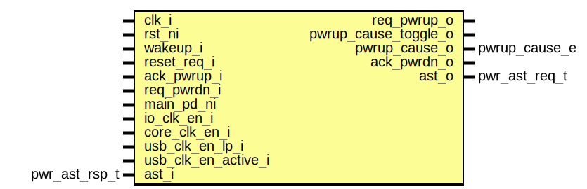

# Entity: pwrmgr_slow_fsm

- **File**: pwrmgr_slow_fsm.sv
## Diagram

## Description

Copyright lowRISC contributors.
 Licensed under the Apache License, Version 2.0, see LICENSE for details.
 SPDX-License-Identifier: Apache-2.0
 Power Manager Slow FSM
 
## Ports

| Port name            | Direction | Type          | Description                       |
| -------------------- | --------- | ------------- | --------------------------------- |
| clk_i                | input     |               |                                   |
| rst_ni               | input     |               |                                   |
| wakeup_i             | input     |               | sync'ed requests from peripherals |
| reset_req_i          | input     |               |                                   |
| req_pwrup_o          | output    |               | interface with fast fsm           |
| pwrup_cause_toggle_o | output    |               |                                   |
| pwrup_cause_o        | output    | pwrup_cause_e |                                   |
| ack_pwrup_i          | input     |               |                                   |
| req_pwrdn_i          | input     |               |                                   |
| ack_pwrdn_o          | output    |               |                                   |
| main_pd_ni           | input     |               | low power entry configuration     |
| io_clk_en_i          | input     |               |                                   |
| core_clk_en_i        | input     |               |                                   |
| usb_clk_en_lp_i      | input     |               |                                   |
| usb_clk_en_active_i  | input     |               |                                   |
| ast_i                | input     | pwr_ast_rsp_t | AST interface                     |
| ast_o                | output    | pwr_ast_req_t |                                   |
## Signals

| Name                | Type             | Description                                                                                     |
| ------------------- | ---------------- | ----------------------------------------------------------------------------------------------- |
| state_q             | slow_pwr_state_e |                                                                                                 |
| state_d             | slow_pwr_state_e |                                                                                                 |
| cause_q             | pwrup_cause_e    |                                                                                                 |
| cause_d             | pwrup_cause_e    |                                                                                                 |
| cause_toggle_q      | logic            |                                                                                                 |
| cause_toggle_d      | logic            |                                                                                                 |
| req_pwrup_q         | logic            |                                                                                                 |
| req_pwrup_d         | logic            |                                                                                                 |
| ack_pwrdn_q         | logic            |                                                                                                 |
| ack_pwrdn_d         | logic            |                                                                                                 |
| pd_nq               | logic            | All power signals and signals going to analog logic are flopped to avoid transitional glitches  |
| pd_nd               | logic            | All power signals and signals going to analog logic are flopped to avoid transitional glitches  |
| pwr_clamp_q         | logic            |                                                                                                 |
| pwr_clamp_d         | logic            |                                                                                                 |
| pwr_clamp_env_q     | logic            |                                                                                                 |
| pwr_clamp_env_d     | logic            |                                                                                                 |
| core_clk_en_q       | logic            |                                                                                                 |
| core_clk_en_d       | logic            |                                                                                                 |
| io_clk_en_q         | logic            |                                                                                                 |
| io_clk_en_d         | logic            |                                                                                                 |
| usb_clk_en_q        | logic            |                                                                                                 |
| usb_clk_en_d        | logic            |                                                                                                 |
| all_clks_valid      | logic            |                                                                                                 |
| all_clks_invalid    | logic            |                                                                                                 |
| unused_slow_clk_val | logic            |                                                                                                 |
## Processes
- unnamed: ( @(posedge clk_i or negedge rst_ni) )
- unnamed: (  )
