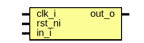

# Entity: rising_edge_detector

- **File**: rising_edge_detector.sv
## Diagram

## Description

Copyright lowRISC contributors.
 Licensed under the Apache License, Version 2.0, see LICENSE for details.
 SPDX-License-Identifier: Apache-2.0
 
## Ports

| Port name | Direction | Type | Description |
| --------- | --------- | ---- | ----------- |
| clk_i     | input     |      |             |
| rst_ni    | input     |      |             |
| in_i      | input     |      |             |
| out_o     | output    |      |             |
## Signals

| Name   | Type  | Description       |
| ------ | ----- | ----------------- |
| last_q | logic | Store last value  |
## Processes
- proc_last: ( @(posedge clk_i or negedge rst_ni) )
