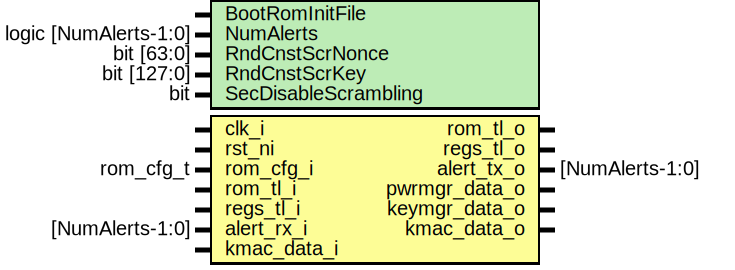

# Entity: rom_ctrl

## Diagram

## Description

Copyright lowRISC contributors.
 Licensed under the Apache License, Version 2.0, see LICENSE for details.
 SPDX-License-Identifier: Apache-2.0
 
## Generics

| Generic name    | Type                  | Value     | Description |
| --------------- | --------------------- | --------- | ----------- |
| BootRomInitFile |                       | ""        |             |
| NumAlerts       | logic [NumAlerts-1:0] | undefined |             |
| RndCnstScrNonce | bit [63:0]            | '0        |             |
| RndCnstScrKey   | bit [127:0]           | '0        |             |
## Ports

| Port name     | Direction | Type            | Description                  |
| ------------- | --------- | --------------- | ---------------------------- |
| clk_i         | input     |                 |                              |
| rst_ni        | input     |                 |                              |
| rom_cfg_i     | input     | rom_cfg_t       | ROM configuration parameters |
| rom_tl_i      | input     |                 |                              |
| rom_tl_o      | output    |                 |                              |
| regs_tl_i     | input     |                 |                              |
| regs_tl_o     | output    |                 |                              |
| alert_rx_i    | input     | [NumAlerts-1:0] | Alerts                       |
| alert_tx_o    | output    | [NumAlerts-1:0] |                              |
| pwrmgr_data_o | output    |                 | Connections to other blocks  |
| keymgr_data_o | output    |                 |                              |
| kmac_data_i   | input     |                 |                              |
| kmac_data_o   | output    |                 |                              |
## Signals

| Name                | Type                      | Description                                                                  |
| ------------------- | ------------------------- | ---------------------------------------------------------------------------- |
| rom_select          | logic                     |                                                                              |
| rom_index           | logic [RomIndexWidth-1:0] |                                                                              |
| rom_req             | logic                     |                                                                              |
| rom_scr_rdata       | logic [39:0]              |                                                                              |
| rom_clr_rdata       | logic [39:0]              |                                                                              |
| rom_rvalid          | logic                     |                                                                              |
| bus_rom_index       | logic [RomIndexWidth-1:0] |                                                                              |
| bus_rom_req         | logic                     |                                                                              |
| bus_rom_gnt         | logic                     |                                                                              |
| bus_rom_rdata       | logic [38:0]              |                                                                              |
| bus_rom_rvalid      | logic                     |                                                                              |
| checker_rom_index   | logic [RomIndexWidth-1:0] |                                                                              |
| checker_rom_req     | logic                     |                                                                              |
| checker_rom_rdata   | logic [39:0]              |                                                                              |
| kmac_rom_data       | logic [63:0]              | Pack / unpack kmac connection data ========================================  |
| kmac_rom_rdy        | logic                     |                                                                              |
| kmac_rom_vld        | logic                     |                                                                              |
| kmac_rom_last       | logic                     |                                                                              |
| kmac_done           | logic                     |                                                                              |
| kmac_digest         | logic [255:0]             |                                                                              |
| digest_share1       | [255:0]                   |                                                                              |
| unused_kmac_error   | logic                     |                                                                              |
| unused_kmac_digest  | logic                     |                                                                              |
| reg2hw              | rom_ctrl_regs_reg2hw_t    | Register block ============================================================  |
| hw2reg              | rom_ctrl_regs_hw2reg_t    |                                                                              |
| reg_integrity_error | logic                     |                                                                              |
| digest_q            | logic [255:0]             | The checker FSM ===========================================================  |
| exp_digest_q        | logic [255:0]             | The checker FSM ===========================================================  |
| digest_d            | logic [255:0]             |                                                                              |
| digest_de           | logic                     |                                                                              |
| exp_digest_word_d   | logic [31:0]              |                                                                              |
| exp_digest_de       | logic                     |                                                                              |
| exp_digest_idx      | logic [2:0]               |                                                                              |
| checker_alert       | logic                     |                                                                              |
| bus_integrity_error | logic                     |                                                                              |
| alert_test          | logic [NumAlerts-1:0]     | Alert generation ==========================================================  |
| alerts              | logic [NumAlerts-1:0]     |                                                                              |
## Constants

| Name          | Type         | Value               | Description                                                                                                                                                 |
| ------------- | ------------ | ------------------- | ----------------------------------------------------------------------------------------------------------------------------------------------------------- |
| RomSizeByte   | int unsigned | ROM_CTRL_ROM_SIZE   | ROM_CTRL_ROM_SIZE is auto-generated by regtool and comes from the bus window size, measured in bytes of content (i.e. 4 times the number of 32 bit words).  |
| RomSizeWords  | int unsigned | RomSizeByte >> 2    |                                                                                                                                                             |
| RomIndexWidth | int unsigned | vbits(RomSizeWords) |                                                                                                                                                             |
## Instantiations

- u_reg_regs: rom_ctrl_regs_reg_top
- u_checker_fsm: rom_ctrl_fsm
