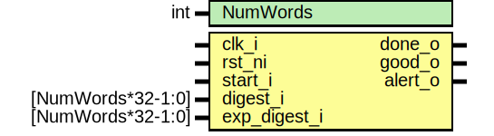

# Entity: rom_ctrl_compare

- **File**: rom_ctrl_compare.sv
## Diagram

## Description

 Copyright lowRISC contributors.
 Licensed under the Apache License, Version 2.0, see LICENSE for details.
 SPDX-License-Identifier: Apache-2.0

 The comparator inside the ROM checker

 This module is in charge of comparing the digest that was computed over the ROM data with the
 expected digest stored in the top few words.

 TODO: Think properly about hardening here. A glitch that messes up the comparison isn't a
       show-stopper (because the attacker will still have the wrong CreatorRootKey in the key
       manager), but glitching the FSM our counter could probably confuse some of the other blocks
       that we communicate with.

## Generics

| Generic name | Type | Value | Description |
| ------------ | ---- | ----- | ----------- |
| NumWords     | int  | 2     |             |
## Ports

| Port name    | Direction | Type              | Description                                                        |
| ------------ | --------- | ----------------- | ------------------------------------------------------------------ |
| clk_i        | input     |                   |                                                                    |
| rst_ni       | input     |                   |                                                                    |
| start_i      | input     |                   |                                                                    |
| done_o       | output    |                   |                                                                    |
| good_o       | output    |                   |                                                                    |
| digest_i     | input     | [NumWords*32-1:0] |  CSR inputs for DIGEST and EXP_DIGEST. Ordered with word 0 as LSB. |
| exp_digest_i | input     | [NumWords*32-1:0] |                                                                    |
| alert_o      | output    |                   |  To alert system                                                   |
## Signals

| Name            | Type             | Description                                                        |
| --------------- | ---------------- | ------------------------------------------------------------------ |
| addr_q          | logic [AW-1:0]   |                                                                    |
| state_q         | logic [4:0]      |                                                                    |
| state_d         | logic [4:0]      |                                                                    |
| matches_q       | logic            |                                                                    |
| matches_d       | logic            |                                                                    |
| fsm_alert       | logic            |                                                                    |
| start_alert     | logic            |  start_i should only be signalled when we're in the Waiting state  |
| wait_addr_alert | logic            |  addr_q should be zero when we're in the Waiting state             |
| done_addr_alert | logic            |  addr_q should be EndAddr when we're in the Done state             |
| digest_idx      | logic [AW+5-1:0] |                                                                    |
| digest_word     | logic [31:0]     |                                                                    |
| exp_digest_word | logic [31:0]     |                                                                    |
## Constants

| Name        | Type         | Value           | Description                                                                                                                                                                                                                 |
| ----------- | ------------ | --------------- | --------------------------------------------------------------------------------------------------------------------------------------------------------------------------------------------------------------------------- |
| AW          | int          | vbits(NumWords) |                                                                                                                                                                                                                             |
| EndAddrInt  | int unsigned | NumWords        |                                                                                                                                                                                                                             |
| LastAddrInt | int unsigned | NumWords - 1    |                                                                                                                                                                                                                             |
| EndAddr     | bit [AW-1:0] | undefined       |  Note that if NumWords is a power of 2 then EndAddr will be zero. That's ok: we're just using a  comparison with EndAddr to check that the address counter hasn't started wandering around when  we're in the wrong state.  |
| LastAddr    | bit [AW-1:0] | undefined       |                                                                                                                                                                                                                             |
## Types

| Name    | Type                                                                                                                                                                                                         | Description                                                                                                                                                                                                                                                                                                                                                                                                                                                                                                                                                                                                                                                              |
| ------- | ------------------------------------------------------------------------------------------------------------------------------------------------------------------------------------------------------------ | ------------------------------------------------------------------------------------------------------------------------------------------------------------------------------------------------------------------------------------------------------------------------------------------------------------------------------------------------------------------------------------------------------------------------------------------------------------------------------------------------------------------------------------------------------------------------------------------------------------------------------------------------------------------------ |
| state_e | enum logic [4:0] {      Waiting  = 5'b00100,      Checking = 5'b10010,      Done     = 5'b11001   } |  This module must wait until triggered by a write to start_i. At that point, it cycles through  the words of DIGEST and EXP_DIGEST, comparing them to one another and passing each digest word  to the key manager. Finally, it gets to the Done state.   States:      Waiting     Checking     Done   Encoding generated with:  $ util/design/sparse-fsm-encode.py -d 3 -m 3 -n 5 -s 1 --language=sv   Hamming distance histogram:    0: --   1: --   2: --   3: |||||||||||||||||||| (66.67%)   4: |||||||||| (33.33%)   5: --   Minimum Hamming distance: 3  Maximum Hamming distance: 4  Minimum Hamming weight: 1  Maximum Hamming weight: 3   |
## Processes
- unnamed: (  )
  - **Type:** always_comb
- unnamed: ( @(posedge clk_i or negedge rst_ni) )
  - **Type:** always_ff
**Description**
 Increment addr_q on each cycle when in Checking 
## Instantiations

- u_state_regs: prim_flop
