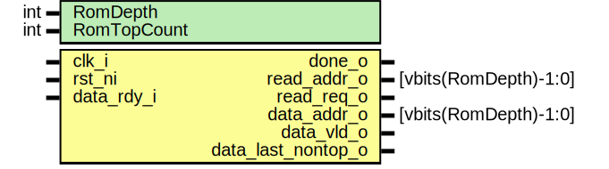

# Entity: rom_ctrl_counter

- **File**: rom_ctrl_counter.sv
## Diagram

## Description

 Copyright lowRISC contributors.
 Licensed under the Apache License, Version 2.0, see LICENSE for details.
 SPDX-License-Identifier: Apache-2.0

 A counter module that drives the ROM accesses from the checker.

 This module doesn't need state hardening: an attacker that glitches its behaviour can stall the
 chip or read ROM data in the wrong order. Assuming we've picked a key for the ROM that ensures
 all words have different values, exploiting a glitch in this module to hide a ROM modification
 would still need a pre-image attack on SHA-3.

 RomDepth is the number of words in the ROM. RomTopCount is the number of those words (at the top
 of the address space) that are considered part of the expected hash.

 When it comes out of reset, the module starts reading from address zero. Once the reading is
 done, it will signal done_o. The surrounding (hardened) design should check that done_o never has
 a high -> low transition.

 The read_addr_o signal should be connected to the stateful mux that controls access to ROM. This
 mux gives access to the rom_ctrl_counter until done_o is asserted. The data_addr_o signal gives
 the address of the ROM word that was just read.

 The data_* signals are used to handshake with KMAC, although the surrounding FSM will step in
 once we've got to the top of memory. The counter uses the output buffer on the ROM instance to
 hold data and drives rom_addr_o and data_vld_o to make a rdy/vld interface with the ROM output.
 This interface should signal things correctly until done_o goes high. data_last_nontop_o is set
 on the last word before the top RomTopCount words.

## Generics

| Generic name | Type | Value | Description |
| ------------ | ---- | ----- | ----------- |
| RomDepth     | int  | 16    |             |
| RomTopCount  | int  | 2     |             |
## Ports

| Port name          | Direction | Type                  | Description |
| ------------------ | --------- | --------------------- | ----------- |
| clk_i              | input     |                       |             |
| rst_ni             | input     |                       |             |
| done_o             | output    |                       |             |
| read_addr_o        | output    | [vbits(RomDepth)-1:0] |             |
| read_req_o         | output    |                       |             |
| data_addr_o        | output    | [vbits(RomDepth)-1:0] |             |
| data_rdy_i         | input     |                       |             |
| data_vld_o         | output    |                       |             |
| data_last_nontop_o | output    |                       |             |
## Signals

| Name          | Type           | Description |
| ------------- | -------------- | ----------- |
| go            | logic          |             |
| req_q         | logic          |             |
| vld_q         | logic          |             |
| addr_q        | logic [AW-1:0] |             |
| addr_d        | logic [AW-1:0] |             |
| done_q        | logic          |             |
| done_d        | logic          |             |
| last_nontop_q | logic          |             |
| last_nontop_d | logic          |             |
## Constants

| Name           | Type         | Value                  | Description                                                                                                                                |
| -------------- | ------------ | ---------------------- | ------------------------------------------------------------------------------------------------------------------------------------------ |
| RomNonTopCount | int          | RomDepth - RomTopCount |  The number of ROM entries that should be hashed. We assume there are at least 2, so that we can  register the data_last_nontop_o signal.  |
| AW             | int          | vbits(RomDepth)        |                                                                                                                                            |
| TopAddrInt     | int unsigned | RomDepth - 1           |                                                                                                                                            |
| TNTAddrInt     | int unsigned | RomNonTopCount - 2     |                                                                                                                                            |
| TopAddr        | bit [AW-1:0] | undefined              |                                                                                                                                            |
| TNTAddr        | bit [AW-1:0] | undefined              |                                                                                                                                            |
## Processes
- unnamed: ( @(posedge clk_i or negedge rst_ni) )
  - **Type:** always_ff
- unnamed: ( @(posedge clk_i or negedge rst_ni) )
  - **Type:** always_ff
