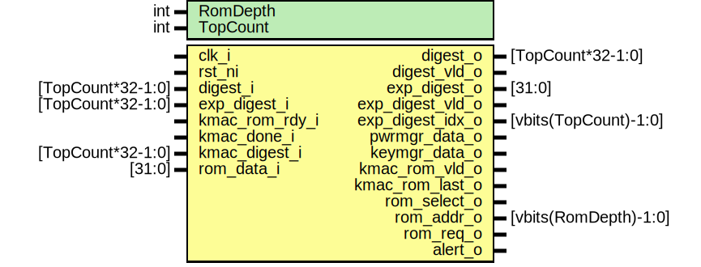

# Entity: rom_ctrl_fsm

## Diagram

## Description

Copyright lowRISC contributors.
 Licensed under the Apache License, Version 2.0, see LICENSE for details.
 SPDX-License-Identifier: Apache-2.0
 The ROM checker FSM module
 
## Generics

| Generic name | Type | Value | Description |
| ------------ | ---- | ----- | ----------- |
| RomDepth     | int  | 16    |             |
| TopCount     | int  | 8     |             |
## Ports

| Port name        | Direction | Type                  | Description                                                                                                                                                                                             |
| ---------------- | --------- | --------------------- | ------------------------------------------------------------------------------------------------------------------------------------------------------------------------------------------------------- |
| clk_i            | input     |                       |                                                                                                                                                                                                         |
| rst_ni           | input     |                       |                                                                                                                                                                                                         |
| digest_i         | input     | [TopCount*32-1:0]     | CSR inputs for DIGEST and EXP_DIGEST. To make the indexing look nicer, these are ordered sothat DIGEST_0 is the bottom 32 bits (they get reversed while we're shuffling around the wires in rom_ctrl).  |
| exp_digest_i     | input     | [TopCount*32-1:0]     |                                                                                                                                                                                                         |
| digest_o         | output    | [TopCount*32-1:0]     | CSR outputs for DIGEST and EXP_DIGEST. Ordered with word 0 as LSB.                                                                                                                                      |
| digest_vld_o     | output    |                       |                                                                                                                                                                                                         |
| exp_digest_o     | output    | [31:0]                |                                                                                                                                                                                                         |
| exp_digest_vld_o | output    |                       |                                                                                                                                                                                                         |
| exp_digest_idx_o | output    | [vbits(TopCount)-1:0] |                                                                                                                                                                                                         |
| pwrmgr_data_o    | output    |                       | To power manager and key manager                                                                                                                                                                        |
| keymgr_data_o    | output    |                       |                                                                                                                                                                                                         |
| kmac_rom_rdy_i   | input     |                       | To KMAC (ROM data)                                                                                                                                                                                      |
| kmac_rom_vld_o   | output    |                       |                                                                                                                                                                                                         |
| kmac_rom_last_o  | output    |                       |                                                                                                                                                                                                         |
| kmac_done_i      | input     |                       | To KMAC (digest data)                                                                                                                                                                                   |
| kmac_digest_i    | input     | [TopCount*32-1:0]     |                                                                                                                                                                                                         |
| rom_select_o     | output    |                       | To ROM mux                                                                                                                                                                                              |
| rom_addr_o       | output    | [vbits(RomDepth)-1:0] |                                                                                                                                                                                                         |
| rom_req_o        | output    |                       |                                                                                                                                                                                                         |
| rom_data_i       | input     | [31:0]                | Raw bits from ROM                                                                                                                                                                                       |
| alert_o          | output    |                       | To alert system                                                                                                                                                                                         |
## Signals

| Name                     | Type            | Description                                                                                  |
| ------------------------ | --------------- | -------------------------------------------------------------------------------------------- |
| counter_done             | logic           | The counter / address generator                                                              |
| counter_read_addr        | logic [AW-1:0]  |                                                                                              |
| counter_read_req         | logic           |                                                                                              |
| counter_data_addr        | logic [AW-1:0]  |                                                                                              |
| counter_data_rdy         | logic           |                                                                                              |
| counter_data_vld         | logic           |                                                                                              |
| counter_lnt              | logic           |                                                                                              |
| start_checker_q          | logic           | The compare block (responsible for comparing CSR data and forwarding it to the key manager)  |
| checker_done             | logic           |                                                                                              |
| checker_good             | logic           |                                                                                              |
| checker_alert            | logic           |                                                                                              |
| state_q                  | logic [5:0]     |                                                                                              |
| state_d                  | logic [5:0]     |                                                                                              |
| fsm_alert                | logic           |                                                                                              |
| reading_top              | logic           | Snoop on ROM reads to populate EXP_DIGEST, one word at a time                                |
| rel_addr_wide            | logic [AW-1:0]  |                                                                                              |
| rel_addr                 | logic [TAW-1:0] |                                                                                              |
| unused_top_rel_addr_wide | logic           |                                                                                              |
## Constants

| Name            | Type         | Value               | Description |
| --------------- | ------------ | ------------------- | ----------- |
| AW              | int          | vbits(RomDepth)     |             |
| TAW             | int          | vbits(TopCount)     |             |
| TopStartAddrInt | int unsigned | RomDepth - TopCount |             |
| TopStartAddr    | bit [AW-1:0] | undefined           |             |
## Types

| Name    | Type                                                                                                                                                                                                | Description |
| ------- | --------------------------------------------------------------------------------------------------------------------------------------------------------------------------------------------------- | ----------- |
| state_e | enum logic [5:0] {     ReadingLow  = 6'b111101,     ReadingHigh = 6'b110110,     RomAhead    = 6'b000011,     KmacAhead   = 6'b101010,     Checking    = 6'b010000,     Done        = 6'b001100   } |             |
## Processes
- unnamed: (  )
- unnamed: ( @(posedge clk_i or negedge rst_ni) )
**Description**
Start the checker when transitioning into the "Checking" state

## Instantiations

- u_counter: rom_ctrl_counter
- u_compare: rom_ctrl_compare
- u_state_regs: prim_flop
