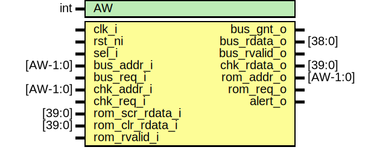

# Entity: rom_ctrl_mux

- **File**: rom_ctrl_mux.sv
## Diagram

## Description

Copyright lowRISC contributors.
 Licensed under the Apache License, Version 2.0, see LICENSE for details.
 SPDX-License-Identifier: Apache-2.0
 The mux to select between ROM inputs
 
## Generics

| Generic name | Type | Value | Description |
| ------------ | ---- | ----- | ----------- |
| AW           | int  | 8     |             |
| DW           | int  | 39    |             |
## Ports

| Port name       | Direction | Type     | Description                         |
| --------------- | --------- | -------- | ----------------------------------- |
| clk_i           | input     |          |                                     |
| rst_ni          | input     |          |                                     |
| sel_i           | input     |          | select signal. 1 = checker; 0 = bus |
| bus_addr_i      | input     | [AW-1:0] | Interface for bus                   |
| bus_req_i       | input     |          |                                     |
| bus_gnt_o       | output    |          |                                     |
| bus_rdata_o     | output    | [DW-1:0] |                                     |
| bus_rvalid_o    | output    |          |                                     |
| chk_addr_i      | input     | [AW-1:0] | Interface for ROM checker           |
| chk_req_i       | input     |          |                                     |
| chk_rdata_o     | output    | [DW-1:0] |                                     |
| rom_addr_o      | output    | [AW-1:0] | Interface for ROM                   |
| rom_req_o       | output    |          |                                     |
| rom_scr_rdata_i | input     | [DW-1:0] |                                     |
| rom_clr_rdata_i | input     | [DW-1:0] |                                     |
| rom_rvalid_i    | input     |          |                                     |
| alert_o         | output    |          | Alert output                        |
## Signals

| Name  | Type  | Description                                                                                                                                                                   |
| ----- | ----- | ----------------------------------------------------------------------------------------------------------------------------------------------------------------------------- |
| sel_q | logic | TODO: sel_q will definitely need to be multi-bit for glitch resistance. We'll probably also have to chase the "signal bit signals" back a bit further through the logic too.  |
## Processes
- unnamed: ( @(posedge clk_i or negedge rst_ni) )
