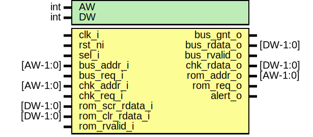

# Entity: rom_ctrl_mux
## Diagram

## Description
Copyright lowRISC contributors.
 Licensed under the Apache License, Version 2.0, see LICENSE for details.
 SPDX-License-Identifier: Apache-2.0
 The mux to select between ROM inputs
 
## Generics
| Generic name | Type | Value | Description |
| ------------ | ---- | ----- | ----------- |
| AW           | int  | 8     |             |
## Ports
| Port name       | Direction | Type     | Description                         |
| --------------- | --------- | -------- | ----------------------------------- |
| clk_i           | input     |          |                                     |
| rst_ni          | input     |          |                                     |
| sel_i           | input     |          | select signal. 1 = checker; 0 = bus |
| bus_addr_i      | input     | [AW-1:0] | Interface for bus                   |
| bus_req_i       | input     |          |                                     |
| bus_gnt_o       | output    |          |                                     |
| bus_rdata_o     | output    | [38:0]   |                                     |
| bus_rvalid_o    | output    |          |                                     |
| chk_addr_i      | input     | [AW-1:0] | Interface for ROM checker           |
| chk_req_i       | input     |          |                                     |
| chk_rdata_o     | output    | [39:0]   |                                     |
| rom_addr_o      | output    | [AW-1:0] | Interface for ROM                   |
| rom_req_o       | output    |          |                                     |
| rom_scr_rdata_i | input     | [39:0]   |                                     |
| rom_clr_rdata_i | input     | [39:0]   |                                     |
| rom_rvalid_i    | input     |          |                                     |
| alert_o         | output    |          | Alert output                        |
## Signals
| Name                 | Type  | Description                                                                                                                                                                                                                                                                                                                                                  |
| -------------------- | ----- | ------------------------------------------------------------------------------------------------------------------------------------------------------------------------------------------------------------------------------------------------------------------------------------------------------------------------------------------------------------ |
| sel_q                | logic | TODO: sel_q will definitely need to be multi-bit for glitch resistance. We'll probably also have to chase the "signal bit signals" back a bit further through the logic too.                                                                                                                                                                                 |
| unused_bus_rdata_top | logic | We use a Hsiao (39,32) ECC scheme for data integrity, but have expanded the ROM to 40 bits rather than 39 bits (it's no more expensive with many macro libraries, and it's slightly nicer for scrambling, because 40 is a whole number of 4-bit sboxes). Of course, this means that we never actually pass the top bit through to the bus. Waive that here.  |
## Processes
- unnamed: _( @(posedge clk_i or negedge rst_ni) )_

