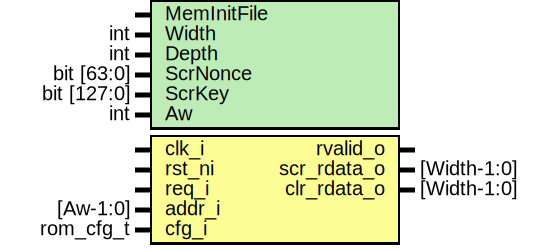

# Entity: rom_ctrl_scrambled_rom

## Diagram

## Description

Copyright lowRISC contributors.
 Licensed under the Apache License, Version 2.0, see LICENSE for details.
 SPDX-License-Identifier: Apache-2.0
 A scrambled ROM. This is scrambled with a fixed key, passed in as a parameter (this parameter
 will be a compile-time random constant).
 This code follows the structure of prim_ram_1p_scr.sv (although it's much simplified because the
 key is fixed and we don't support writes). For more information about what is going on, see that
 file. Using the parameter names in prim_ram_1p_scr, we have NumPrinceRoundsHalf = 2 (so
 approximately 5 effective rounds), NumDiffRounds = 2 and NumAddrScrRounds = 2 (enabling address
 scrambling with 2 rounds).
 
## Generics

| Generic name | Type        | Value         | Description                                                                                                                    |
| ------------ | ----------- | ------------- | ------------------------------------------------------------------------------------------------------------------------------ |
| MemInitFile  |             | ""            | In either case, the input file should be scrambled. That is, it should contain the bits that will appear in the physical ROM.  |
| Width        | int         | 40            | The width of ROM words in bits                                                                                                 |
| Depth        | int         | 16            | The number of words in the ROM                                                                                                 |
| ScrNonce     | bit [63:0]  | '0            | The nonce for data and address scrambling                                                                                      |
| ScrKey       | bit [127:0] | '0            | The (fixed) key for the PRINCE cipher                                                                                          |
| Aw           | int         | $clog2(Depth) |                                                                                                                                |
## Ports

| Port name   | Direction | Type        | Description |
| ----------- | --------- | ----------- | ----------- |
| clk_i       | input     |             |             |
| rst_ni      | input     |             |             |
| req_i       | input     |             |             |
| addr_i      | input     | [Aw-1:0]    |             |
| rvalid_o    | output    |             |             |
| scr_rdata_o | output    | [Width-1:0] |             |
| clr_rdata_o | output    | [Width-1:0] |             |
| cfg_i       | input     | rom_cfg_t   |             |
## Signals

| Name      | Type              | Description                                                                  |
| --------- | ----------------- | ---------------------------------------------------------------------------- |
| addr_scr  | logic [Aw-1:0]    | Address scrambling ========================================================  |
| keystream | logic [63:0]      | Keystream generation ======================================================  |
| rdata_scr | logic [Width-1:0] | The physical ROM ==========================================================  |
| rdata_xor | logic [Width-1:0] | Data scrambling ===========================================================  |
## Constants

| Name         | Type          | Value             | Description |
| ------------ | ------------- | ----------------- | ----------- |
| Aw           | int           | $clog2(Depth)     |             |
| DataScrNonce | bit [63-Aw:0] | ScrNonce[63-Aw:0] |             |
| AddrScrNonce | bit [Aw-1:0]  | ScrNonce[63-:Aw]  |             |
## Instantiations

- u_sp_addr: prim_subst_perm
- u_prince: prim_prince
- u_rom: prim_rom_adv
- u_sp_data: prim_subst_perm
