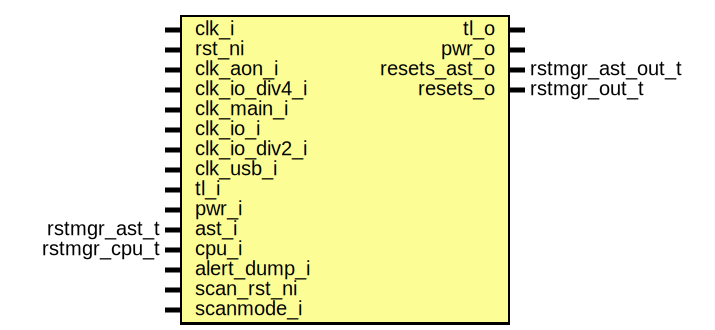

# Entity: rstmgr

- **File**: rstmgr.sv
## Diagram

## Description

 Copyright lowRISC contributors.
 Licensed under the Apache License, Version 2.0, see LICENSE for details.
 SPDX-License-Identifier: Apache-2.0

 This module is the overall reset manager wrapper
 TODO: This module is only a draft implementation that covers most of the rstmgr
 functoinality but is incomplete
 This top level controller is fairly hardcoded right now, but will be switched to a template

## Ports

| Port name     | Direction | Type             | Description                                                                    |
| ------------- | --------- | ---------------- | ------------------------------------------------------------------------------ |
| clk_i         | input     |                  |  Primary module clocks                                                         |
| rst_ni        | input     |                  | this is currently connected to top level reset, but will change once ast is in |
| clk_aon_i     | input     |                  |                                                                                |
| clk_io_div4_i | input     |                  |                                                                                |
| clk_main_i    | input     |                  |                                                                                |
| clk_io_i      | input     |                  |                                                                                |
| clk_io_div2_i | input     |                  |                                                                                |
| clk_usb_i     | input     |                  |                                                                                |
| tl_i          | input     |                  |  Bus Interface                                                                 |
| tl_o          | output    |                  |                                                                                |
| pwr_i         | input     |                  |  pwrmgr interface                                                              |
| pwr_o         | output    |                  |                                                                                |
| ast_i         | input     | rstmgr_ast_t     |  ast interface                                                                 |
| cpu_i         | input     | rstmgr_cpu_t     |  cpu related inputs                                                            |
| alert_dump_i  | input     |                  |  Interface to alert handler                                                    |
| scan_rst_ni   | input     |                  |  dft bypass                                                                    |
| scanmode_i    | input     |                  |                                                                                |
| resets_ast_o  | output    | rstmgr_ast_out_t |  reset outputs                                                                 |
| resets_o      | output    | rstmgr_out_t     |                                                                                |
## Signals

| Name              | Type                                     | Description                                                                                                                                                                                                                                                                                                                                                                                                                                                                 |
| ----------------- | ---------------------------------------- | --------------------------------------------------------------------------------------------------------------------------------------------------------------------------------------------------------------------------------------------------------------------------------------------------------------------------------------------------------------------------------------------------------------------------------------------------------------------------- |
| rst_por_aon_n     | logic [PowerDomains-1:0]                 |  receive POR and stretch  The por is at first stretched and synced on clk_aon  The rst_ni and pok_i input will be changed once AST is integrated                                                                                                                                                                                                                                                                                                                            |
| local_rst_n       | logic                                    | //////////////////////////////////////////////////  Register Interface                             // //////////////////////////////////////////////////  local_rst_n is the reset used by the rstmgr for its internal logic                                                                                                                                                                                                                                                |
| reg2hw            | rstmgr_reg_pkg::rstmgr_reg2hw_t          |                                                                                                                                                                                                                                                                                                                                                                                                                                                                             |
| hw2reg            | rstmgr_reg_pkg::rstmgr_hw2reg_t          |                                                                                                                                                                                                                                                                                                                                                                                                                                                                             |
| ndmreset_req_q    | logic                                    | //////////////////////////////////////////////////  Input handling                                 // //////////////////////////////////////////////////                                                                                                                                                                                                                                                                                                                    |
| ndm_req_valid     | logic                                    |                                                                                                                                                                                                                                                                                                                                                                                                                                                                             |
| rst_lc_src_n      | logic [PowerDomains-1:0]                 | //////////////////////////////////////////////////  Source resets in the system                    //  These are hardcoded and not directly used.     //  Instead they act as async reset roots.         // //////////////////////////////////////////////////  The two source reset modules are chained together.  The output of one is fed into the  the second.  This ensures that if upstream resets for any reason, the associated downstream  reset will also reset.  |
| rst_sys_src_n     | logic [PowerDomains-1:0]                 |                                                                                                                                                                                                                                                                                                                                                                                                                                                                             |
| sw_rst_ctrl_n     | logic [NumSwResets-1:0]                  | //////////////////////////////////////////////////  Software reset controls external reg           // //////////////////////////////////////////////////                                                                                                                                                                                                                                                                                                                    |
| rst_por_n         | logic [PowerDomains-1:0]                 | //////////////////////////////////////////////////  leaf reset in the system                       //  These should all be generated                  // //////////////////////////////////////////////////  To simplify generation, each reset generates all associated power domain outputs.  If a reset does not support a particular power domain, that reset is always hard-wired to 0.                                                                                |
| rst_por_io_n      | logic [PowerDomains-1:0]                 |                                                                                                                                                                                                                                                                                                                                                                                                                                                                             |
| rst_por_io_div2_n | logic [PowerDomains-1:0]                 |                                                                                                                                                                                                                                                                                                                                                                                                                                                                             |
| rst_por_io_div4_n | logic [PowerDomains-1:0]                 |                                                                                                                                                                                                                                                                                                                                                                                                                                                                             |
| rst_por_usb_n     | logic [PowerDomains-1:0]                 |                                                                                                                                                                                                                                                                                                                                                                                                                                                                             |
| rst_lc_n          | logic [PowerDomains-1:0]                 |                                                                                                                                                                                                                                                                                                                                                                                                                                                                             |
| rst_lc_io_div4_n  | logic [PowerDomains-1:0]                 |                                                                                                                                                                                                                                                                                                                                                                                                                                                                             |
| rst_sys_n         | logic [PowerDomains-1:0]                 |                                                                                                                                                                                                                                                                                                                                                                                                                                                                             |
| rst_sys_io_n      | logic [PowerDomains-1:0]                 |                                                                                                                                                                                                                                                                                                                                                                                                                                                                             |
| rst_sys_io_div4_n | logic [PowerDomains-1:0]                 |                                                                                                                                                                                                                                                                                                                                                                                                                                                                             |
| rst_sys_aon_n     | logic [PowerDomains-1:0]                 |                                                                                                                                                                                                                                                                                                                                                                                                                                                                             |
| rst_spi_device_n  | logic [PowerDomains-1:0]                 |                                                                                                                                                                                                                                                                                                                                                                                                                                                                             |
| rst_usb_n         | logic [PowerDomains-1:0]                 |                                                                                                                                                                                                                                                                                                                                                                                                                                                                             |
| rst_hw_req        | logic                                    | //////////////////////////////////////////////////  Reset info construction                        // //////////////////////////////////////////////////                                                                                                                                                                                                                                                                                                                    |
| rst_low_power     | logic                                    |                                                                                                                                                                                                                                                                                                                                                                                                                                                                             |
| rst_ndm           | logic                                    |                                                                                                                                                                                                                                                                                                                                                                                                                                                                             |
| rst_cpu_nq        | logic                                    |                                                                                                                                                                                                                                                                                                                                                                                                                                                                             |
| first_reset       | logic                                    |                                                                                                                                                                                                                                                                                                                                                                                                                                                                             |
| dump_capture      | logic                                    |                                                                                                                                                                                                                                                                                                                                                                                                                                                                             |
| slots             | logic [2**SlotCntWidth-1:0][RdWidth-1:0] |                                                                                                                                                                                                                                                                                                                                                                                                                                                                             |
| slots_q           | logic [CrashStoreSlot-1:0][RdWidth-1:0]  |                                                                                                                                                                                                                                                                                                                                                                                                                                                                             |
| unused_idx        | logic [IdxWidth-SlotCntWidth-1:0]        |                                                                                                                                                                                                                                                                                                                                                                                                                                                                             |
|                   | [IdxWidth-1:SlotCntWidth]                |                                                                                                                                                                                                                                                                                                                                                                                                                                                                             |
## Constants

| Name           | Type | Value                                                     | Description                                                                                                                                               |
| -------------- | ---- | --------------------------------------------------------- | --------------------------------------------------------------------------------------------------------------------------------------------------------- |
| CrashRemainder | int  | $bits(alert_pkg::alert_crashdump_t) % RdWidth > 0 ? 1 : 0 | //////////////////////////////////////////////////  Crash info capture                             // //////////////////////////////////////////////////  |
| CrashStoreSlot | int  |                                                           |                                                                                                                                                           |
| TotalWidth     | int  | CrashStoreSlot * RdWidth                                  |                                                                                                                                                           |
| SlotCntWidth   | int  | $clog2(CrashStoreSlot)                                    |                                                                                                                                                           |
## Processes
- unnamed: ( @(posedge clk_i or negedge local_rst_n) )
  - **Type:** always_ff
**Description**
 first reset is a flag that blocks reset recording until first de-assertion 
- unnamed: ( @(posedge clk_i or negedge rst_ni) )
  - **Type:** always_ff
- unnamed: (  )
  - **Type:** always_comb
## Instantiations

- u_reg: rstmgr_reg_top
- u_sync: prim_flop_2sync
- u_lc_src: rstmgr_ctrl
**Description**
 lc reset sources

- u_sys_src: rstmgr_ctrl
**Description**
 sys reset sources

- u_aon_por: prim_flop_2sync
- u_aon_por_io: prim_flop_2sync
- u_aon_por_io_div2: prim_flop_2sync
- u_aon_por_io_div4: prim_flop_2sync
- u_aon_por_usb: prim_flop_2sync
- u_0_lc: prim_flop_2sync
- u_0_lc_io_div4: prim_flop_2sync
- u_aon_sys: prim_flop_2sync
- u_0_sys: prim_flop_2sync
- u_0_sys_io: prim_flop_2sync
- u_aon_sys_io_div4: prim_flop_2sync
- u_0_sys_io_div4: prim_flop_2sync
- u_aon_sys_aon: prim_flop_2sync
- u_0_spi_device: prim_flop_2sync
- u_aon_usb: prim_flop_2sync
- u_cpu_reset_synced: prim_flop_2sync
