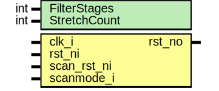

# Entity: rstmgr_por

## Diagram

## Description

Copyright lowRISC contributors.
 Licensed under the Apache License, Version 2.0, see LICENSE for details.
 SPDX-License-Identifier: Apache-2.0
 This module stretches the POR
 
## Generics

| Generic name | Type | Value | Description |
| ------------ | ---- | ----- | ----------- |
| FilterStages | int  | 3     |             |
| StretchCount | int  | 32    |             |
## Ports

| Port name   | Direction | Type | Description |
| ----------- | --------- | ---- | ----------- |
| clk_i       | input     |      |             |
| rst_ni      | input     |      |             |
| scan_rst_ni | input     |      |             |
| scanmode_i  | input     |      |             |
| rst_no      | output    |      |             |
## Signals

| Name               | Type                     | Description      |
| ------------------ | ------------------------ | ---------------- |
| rst_root_n_pre_mux | logic                    |                  |
| rst_root_n         | logic                    |                  |
| rst_filter_n       | logic [FilterStages-1:0] |                  |
| rst_stable         | logic                    |                  |
| rst_clean_n        | logic                    |                  |
| cnt                | logic [CtrWidth-1:0]     |                  |
| cnt_en             | logic                    |                  |
| rst_nd             | logic                    | stretch the POR  |
| rst_nq             | logic                    | stretch the POR  |
## Constants

| Name     | Type | Value                  | Description |
| -------- | ---- | ---------------------- | ----------- |
| CtrWidth | int  | $clog2(StretchCount+1) |             |
## Processes
- unnamed: ( @(posedge clk_i or negedge rst_root_n) )
**Description**
filter the POR

- unnamed: ( @(posedge clk_i or negedge rst_clean_n) )
## Instantiations

- rst_sync: prim_flop_2sync
**Description**
sync the POR

- u_rst_root_mux: prim_clock_mux2
- u_rst_clean_mux: prim_clock_mux2
**Description**
The stable is a vote of all filter stages.
Only when all the stages agree is the reset considered stable and count allowed.

- u_rst_flop: prim_flop
- u_rst_out_mux: prim_clock_mux2
