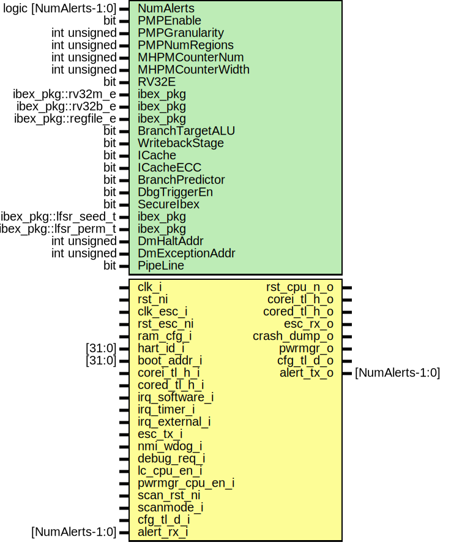

# Entity: rv_core_ibex

## Diagram

## Description

Copyright lowRISC contributors.
 Licensed under the Apache License, Version 2.0, see LICENSE for details.
 SPDX-License-Identifier: Apache-2.0
 
## Generics

| Generic name     | Type                | Value                      | Description |
| ---------------- | ------------------- | -------------------------- | ----------- |
| PMPEnable        | bit                 | 1'b0                       |             |
| PMPGranularity   | int unsigned        | 0                          |             |
| PMPNumRegions    | int unsigned        | 4                          |             |
| MHPMCounterNum   | int unsigned        | 10                         |             |
| MHPMCounterWidth | int unsigned        | 32                         |             |
| RV32E            | bit                 | 0                          |             |
| ibex_pkg         | ibex_pkg::rv32m_e   | ibex_pkg::RV32MSingleCycle |             |
| ibex_pkg         | ibex_pkg::rv32b_e   | ibex_pkg::RV32BNone        |             |
| ibex_pkg         | ibex_pkg::regfile_e | ibex_pkg::RegFileFF        |             |
| BranchTargetALU  | bit                 | 1'b1                       |             |
| WritebackStage   | bit                 | 1'b1                       |             |
| ICache           | bit                 | 1'b0                       |             |
| ICacheECC        | bit                 | 1'b0                       |             |
| BranchPredictor  | bit                 | 1'b0                       |             |
| DbgTriggerEn     | bit                 | 1'b1                       |             |
| SecureIbex       | bit                 | 1'b0                       |             |
| DmHaltAddr       | int unsigned        | 32'h1A110800               |             |
| DmExceptionAddr  | int unsigned        | 32'h1A110808               |             |
| PipeLine         | bit                 | 1'b0                       |             |
## Ports

| Port name          | Direction | Type             | Description                            |
| ------------------ | --------- | ---------------- | -------------------------------------- |
| clk_i              | input     |                  | Clock and Reset                        |
| rst_ni             | input     |                  |                                        |
| clk_esc_i          | input     |                  | Clock domain for escalation receiver   |
| rst_esc_ni         | input     |                  |                                        |
| ram_cfg_i          | input     |                  |                                        |
| hart_id_i          | input     | [31:0]           |                                        |
| boot_addr_i        | input     | [31:0]           |                                        |
| tl_i_o             | output    |                  | Instruction memory interface           |
| tl_i_i             | input     |                  |                                        |
| tl_d_o             | output    |                  | Data memory interface                  |
| tl_d_i             | input     |                  |                                        |
| irq_software_i     | input     |                  | Interrupt inputs                       |
| irq_timer_i        | input     |                  |                                        |
| irq_external_i     | input     |                  |                                        |
| esc_tx_i           | input     |                  | Escalation input for NMI               |
| esc_rx_o           | output    |                  |                                        |
| debug_req_i        | input     |                  | Debug Interface                        |
| crash_dump_o       | output    |                  | Crash dump information                 |
| lc_cpu_en_i        | input     |                  | CPU Control Signals                    |
| pwrmgr_cpu_en_i    | input     |                  |                                        |
| core_sleep_o       | output    |                  |                                        |
| scan_rst_ni        | input     |                  | dft bypass                             |
| scanmode_i         | input     |                  |                                        |
| fatal_intg_event_o | output    | alert_event_t    | alert events to peripheral module      |
| fatal_core_event_o | output    | alert_event_t    |                                        |
| recov_core_event_o | output    | alert_event_t    |                                        |
| ibus_region_cfg_i  | input     | [NumRegions-1:0] | configurations for address translation |
| dbus_region_cfg_i  | input     | [NumRegions-1:0] |                                        |
## Signals

| Name             | Type                       | Description                                                                        |
| ---------------- | -------------------------- | ---------------------------------------------------------------------------------- |
| instr_req        | logic                      | Instruction interface (internal)                                                   |
| instr_gnt        | logic                      |                                                                                    |
| instr_rvalid     | logic                      |                                                                                    |
| instr_addr       | logic [31:0]               |                                                                                    |
| instr_rdata      | logic [31:0]               |                                                                                    |
| instr_err        | logic                      |                                                                                    |
| data_req         | logic                      | Data interface (internal)                                                          |
| data_gnt         | logic                      |                                                                                    |
| data_rvalid      | logic                      |                                                                                    |
| data_we          | logic                      |                                                                                    |
| data_be          | logic [3:0]                |                                                                                    |
| data_addr        | logic [31:0]               |                                                                                    |
| data_wdata       | logic [31:0]               |                                                                                    |
| data_rdata       | logic [31:0]               |                                                                                    |
| data_err         | logic                      |                                                                                    |
| tl_i_ibex2fifo   | tl_h2d_t                   | Pipeline interfaces                                                                |
| tl_i_fifo2ibex   | tl_d2h_t                   |                                                                                    |
| tl_d_ibex2fifo   | tl_h2d_t                   |                                                                                    |
| tl_d_fifo2ibex   | tl_d2h_t                   |                                                                                    |
| tl_d_o_int       | tlul_pkg::tl_h2d_t         | Intermediate TL signals to connect an sram used in simulations.                    |
| tl_d_i_int       | tlul_pkg::tl_d2h_t         |                                                                                    |
| rvfi_valid       | logic                      |                                                                                    |
| rvfi_order       | logic [63:0]               |                                                                                    |
| rvfi_insn        | logic [31:0]               |                                                                                    |
| rvfi_trap        | logic                      |                                                                                    |
| rvfi_halt        | logic                      |                                                                                    |
| rvfi_intr        | logic                      |                                                                                    |
| rvfi_mode        | logic [ 1:0]               |                                                                                    |
| rvfi_ixl         | logic [ 1:0]               |                                                                                    |
| rvfi_rs1_addr    | logic [ 4:0]               |                                                                                    |
| rvfi_rs2_addr    | logic [ 4:0]               |                                                                                    |
| rvfi_rs3_addr    | logic [ 4:0]               |                                                                                    |
| rvfi_rs1_rdata   | logic [31:0]               |                                                                                    |
| rvfi_rs2_rdata   | logic [31:0]               |                                                                                    |
| rvfi_rs3_rdata   | logic [31:0]               |                                                                                    |
| rvfi_rd_addr     | logic [ 4:0]               |                                                                                    |
| rvfi_rd_wdata    | logic [31:0]               |                                                                                    |
| rvfi_pc_rdata    | logic [31:0]               |                                                                                    |
| rvfi_pc_wdata    | logic [31:0]               |                                                                                    |
| rvfi_mem_addr    | logic [31:0]               |                                                                                    |
| rvfi_mem_rmask   | logic [ 3:0]               |                                                                                    |
| rvfi_mem_wmask   | logic [ 3:0]               |                                                                                    |
| rvfi_mem_rdata   | logic [31:0]               |                                                                                    |
| rvfi_mem_wdata   | logic [31:0]               |                                                                                    |
| ibus_intg_err    | logic                      | integrity errors and core alert events                                             |
| dbus_intg_err    | logic                      | integrity errors and core alert events                                             |
| alert_minor      | logic                      |                                                                                    |
| alert_major      | logic                      |                                                                                    |
| esc_irq_nm       | logic                      | Escalation receiver that converts differential protocol into single ended signal.  |
| irq_nm           | logic                      | Synchronize to fast Ibex clock domain.                                             |
| lc_cpu_en        | lc_ctrl_pkg::lc_tx_t [0:0] |                                                                                    |
| pwrmgr_cpu_en    | lc_ctrl_pkg::lc_tx_t [0:0] |                                                                                    |
| instr_addr_trans | logic [31:0]               |                                                                                    |
| data_addr_trans  | logic [31:0]               |                                                                                    |
## Constants

| Name               | Type         | Value                  | Description                                                                                                           |
| ------------------ | ------------ | ---------------------- | --------------------------------------------------------------------------------------------------------------------- |
| FifoPass           | bit          | PipeLine ? 1'b0 : 1'b1 | if pipeline=1, do not allow pass through and always break the path if pipeline is 0, passthrough the fifo completely  |
| FifoDepth          | int unsigned | PipeLine ? 2 : 0       |                                                                                                                       |
| NumOutstandingReqs | int          | ICache ? 8 : 2         | ICache creates more outstanding transactions                                                                          |
## Instantiations

- u_prim_esc_receiver: prim_esc_receiver
- u_prim_flop_2sync: prim_flop_2sync
- u_lc_sync: prim_lc_sync
- u_pwrmgr_sync: prim_lc_sync
- u_ibus_trans: rv_core_addr_trans
- tl_adapter_host_i_ibex: tlul_adapter_host
- fifo_i: tlul_fifo_sync
- u_dbus_trans: rv_core_addr_trans
- tl_adapter_host_d_ibex: tlul_adapter_host
- fifo_d: tlul_fifo_sync
- u_illegal_preprocessor_branch_taken: illegal_preprocessor_branch_taken
**Description**
Induce a compilation error by instantiating a non-existent module.

- ibex_tracer_i: ibex_tracer
