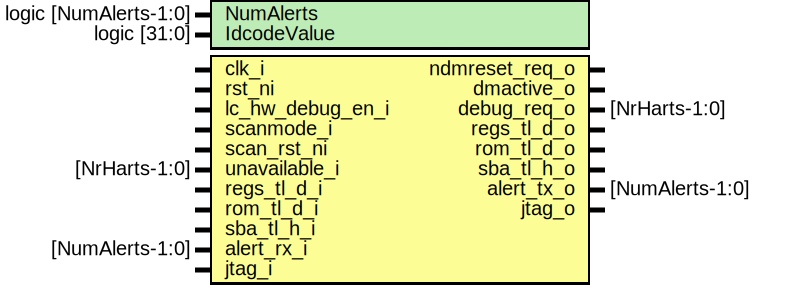

# Entity: rv_dm
## Diagram

## Description
Copyright lowRISC contributors.
 Licensed under the Apache License, Version 2.0, see LICENSE for details.
 SPDX-License-Identifier: Apache-2.0
 Top-level debug module (DM)
 This module implements the RISC-V debug specification version 0.13,
 This toplevel wraps the PULP debug module available from
 https://github.com/pulp-platform/riscv-dbg to match the needs of
 the TL-UL-based lowRISC chip design.
 
## Generics
| Generic name | Type         | Value | Description |
| ------------ | ------------ | ----- | ----------- |
| NrHarts      | int          | 1     |             |
| IdcodeValue  | logic [31:0] | _0001 |             |
## Ports
| Port name     | Direction | Type          | Description                                                                       |
| ------------- | --------- | ------------- | --------------------------------------------------------------------------------- |
| clk_i         | input     |               | clock                                                                             |
| rst_ni        | input     |               | asynchronous reset active low, connect PoR                                        |
| hw_debug_en_i | input     |               | here, not the system reset                                                        |
| scanmode_i    | input     |               |                                                                                   |
| scan_rst_ni   | input     |               |                                                                                   |
| ndmreset_o    | output    |               | non-debug module reset                                                            |
| dmactive_o    | output    |               | debug module is active                                                            |
| debug_req_o   | output    | [NrHarts-1:0] | async debug request                                                               |
| unavailable_i | input     | [NrHarts-1:0] | communicate whether the hart is unavailable                                       |
| tl_d_i        | input     |               | (e.g.: power down)bus device with debug memory, for an execution based technique  |
| tl_d_o        | output    |               |                                                                                   |
| tl_h_o        | output    |               | bus host, for system bus accesses                                                 |
| tl_h_i        | input     |               |                                                                                   |
| jtag_req_i    | input     |               |                                                                                   |
| jtag_rsp_o    | output    |               |                                                                                   |
## Signals
| Name                  | Type                              | Description                                 |
| --------------------- | --------------------------------- | ------------------------------------------- |
| hartinfo              | dm::hartinfo_t [NrHarts-1:0]      | Debug CSRs                                  |
| halted                | logic [NrHarts-1:0]               |                                             |
| resumeack             | logic [NrHarts-1:0]               | logic [NrHarts-1:0]               running;  |
| haltreq               | logic [NrHarts-1:0]               |                                             |
| resumereq             | logic [NrHarts-1:0]               |                                             |
| clear_resumeack       | logic                             |                                             |
| cmd_valid             | logic                             |                                             |
| cmd                   | dm::command_t                     |                                             |
| cmderror_valid        | logic                             |                                             |
| cmderror              | dm::cmderr_e                      |                                             |
| cmdbusy               | logic                             |                                             |
| progbuf               | logic [dm::ProgBufSize-1:0][31:0] |                                             |
| data_csrs_mem         | logic [dm::DataCount-1:0][31:0]   |                                             |
| data_mem_csrs         | logic [dm::DataCount-1:0][31:0]   |                                             |
| data_valid            | logic                             |                                             |
| hartsel               | logic [19:0]                      |                                             |
| sbaddress_csrs_sba    | logic [BusWidth-1:0]              | System Bus Access Module                    |
| sbaddress_sba_csrs    | logic [BusWidth-1:0]              |                                             |
| sbaddress_write_valid | logic                             |                                             |
| sbreadonaddr          | logic                             |                                             |
| sbautoincrement       | logic                             |                                             |
| sbaccess              | logic [2:0]                       |                                             |
| sbreadondata          | logic                             |                                             |
| sbdata_write          | logic [BusWidth-1:0]              |                                             |
| sbdata_read_valid     | logic                             |                                             |
| sbdata_write_valid    | logic                             |                                             |
| sbdata_read           | logic [BusWidth-1:0]              |                                             |
| sbdata_valid          | logic                             |                                             |
| sbbusy                | logic                             |                                             |
| sberror_valid         | logic                             |                                             |
| sberror               | logic [2:0]                       |                                             |
| dmi_req               | dm::dmi_req_t                     |                                             |
| dmi_rsp               | dm::dmi_resp_t                    |                                             |
| dmi_req_valid         | logic                             |                                             |
| dmi_req_ready         | logic                             |                                             |
| dmi_rsp_valid         | logic                             |                                             |
| dmi_rsp_ready         | logic                             |                                             |
| dmi_rst_n             | logic                             |                                             |
| testmode              | logic                             |                                             |
| host_req              | logic                             |                                             |
| host_add              | logic   [BusWidth-1:0]            |                                             |
| host_we               | logic                             |                                             |
| host_wdata            | logic   [BusWidth-1:0]            |                                             |
| host_be               | logic [BusWidth/8-1:0]            |                                             |
| host_gnt              | logic                             |                                             |
| host_r_valid          | logic                             |                                             |
| host_r_rdata          | logic   [BusWidth-1:0]            |                                             |
| host_r_err            | logic                             |                                             |
| unused_host_r_err     | logic                             |                                             |
| req                   | logic                             |                                             |
| we                    | logic                             |                                             |
| be                    | logic [BusWidth/8-1:0]            |                                             |
| wdata                 | logic   [BusWidth-1:0]            |                                             |
| rdata                 | logic   [BusWidth-1:0]            |                                             |
| rvalid                | logic                             |                                             |
| addr_b                | logic [BusWidth-1:0]              |                                             |
| addr_w                | logic [AddressWidthWords-1:0]     |                                             |
| tck_muxed             | logic                             |                                             |
| trst_n_muxed          | logic                             |                                             |
| en_ifetch             | tlul_pkg::tl_instr_en_e           |                                             |
| hw_debug_en           | lc_ctrl_pkg::lc_tx_t [0:0]        |                                             |
## Constants
| Name              | Type                | Value                         | Description                                                 |
| ----------------- | ------------------- | ----------------------------- | ----------------------------------------------------------- |
| BusWidth          | int                 | 32                            | Currently only 32 bit busses are supported by our TL-UL IP  |
| SelectableHarts   | logic [NrHarts-1:0] | undefined                     | all harts have contiguous IDs                               |
| DebugHartInfo     | dm::hartinfo_t      | undefined                     | static debug hartinfo                                       |
| AddressWidthWords | int unsigned        | BusWidth - $clog2(BusWidth/8) |                                                             |
## Processes
- unnamed: _( @(posedge clk_i or negedge rst_ni) )_

## Instantiations
- i_dm_csrs: dm_csrs
- i_dm_sba: dm_sba
- tl_adapter_host_sba: tlul_adapter_host
- i_dm_mem: dm_mem
- u_prim_clock_mux2: prim_clock_mux2
- u_prim_rst_n_mux2: prim_clock_mux2
- dap: dmi_jtag
**Description**
JTAG TAP

- u_lc_en_sync: prim_lc_sync
- tl_adapter_device_mem: tlul_adapter_sram
