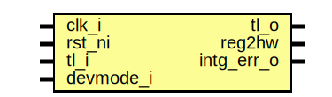

# Entity: rv_dm_regs_reg_top

- **File**: rv_dm_regs_reg_top.sv
## Diagram

## Description

 Copyright lowRISC contributors.
 Licensed under the Apache License, Version 2.0, see LICENSE for details.
 SPDX-License-Identifier: Apache-2.0

 Register Top module auto-generated by `reggen`

## Ports

| Port name  | Direction | Type | Description                                              |
| ---------- | --------- | ---- | -------------------------------------------------------- |
| clk_i      | input     |      |                                                          |
| rst_ni     | input     |      |                                                          |
| tl_i       | input     |      |                                                          |
| tl_o       | output    |      |                                                          |
| reg2hw     | output    |      | Write                                                    |
| intg_err_o | output    |      |  Integrity check errors                                  |
| devmode_i  | input     |      | If 1, explicit error return for unmapped register access |
## Signals

| Name           | Type               | Description                                                                                                                  |
| -------------- | ------------------ | ---------------------------------------------------------------------------------------------------------------------------- |
| reg_we         | logic              |  register signals                                                                                                            |
| reg_re         | logic              |                                                                                                                              |
| reg_addr       | logic [AW-1:0]     |                                                                                                                              |
| reg_wdata      | logic [DW-1:0]     |                                                                                                                              |
| reg_be         | logic [DBW-1:0]    |                                                                                                                              |
| reg_rdata      | logic [DW-1:0]     |                                                                                                                              |
| reg_error      | logic              |                                                                                                                              |
| addrmiss       | logic              |                                                                                                                              |
| wr_err         | logic              |                                                                                                                              |
| reg_rdata_next | logic [DW-1:0]     |                                                                                                                              |
| reg_busy       | logic              |                                                                                                                              |
| tl_reg_h2d     | tlul_pkg::tl_h2d_t |                                                                                                                              |
| tl_reg_d2h     | tlul_pkg::tl_d2h_t |                                                                                                                              |
| intg_err       | logic              |  incoming payload check                                                                                                      |
| intg_err_q     | logic              |                                                                                                                              |
| tl_o_pre       | tlul_pkg::tl_d2h_t |  outgoing integrity generation                                                                                               |
| alert_test_we  | logic              |  Define SW related signals  Format: <reg>_<field>_{wd|we|qs}         or <reg>_{wd|we|qs} if field == 1 or 0                  |
| alert_test_wd  | logic              |                                                                                                                              |
| addr_hit       | logic [0:0]        |                                                                                                                              |
| shadow_busy    | logic              |  shadow busy                                                                                                                 |
| reg_busy_sel   | logic              |  register busy                                                                                                               |
| unused_wdata   | logic              |  Unused signal tieoff  wdata / byte enable are not always fully used  add a blanket unused statement to handle lint waivers  |
| unused_be      | logic              |                                                                                                                              |
## Constants

| Name | Type | Value | Description |
| ---- | ---- | ----- | ----------- |
| AW   | int  | 2     |             |
| DW   | int  | 32    |             |
| DBW  | int  | DW/8  | Byte Width  |
## Processes
- unnamed: ( @(posedge clk_i or negedge rst_ni) )
  - **Type:** always_ff
- unnamed: (  )
  - **Type:** always_comb
- unnamed: (  )
  - **Type:** always_comb
**Description**
 Check sub-word write is permitted 
- unnamed: (  )
  - **Type:** always_comb
**Description**
 Read data return 
- unnamed: (  )
  - **Type:** always_comb
## Instantiations

- u_chk: tlul_cmd_intg_chk
- u_rsp_intg_gen: tlul_rsp_intg_gen
- u_reg_if: tlul_adapter_reg
- u_alert_test: prim_subreg_ext
**Description**
 Register instances
 R[alert_test]: V(True)

