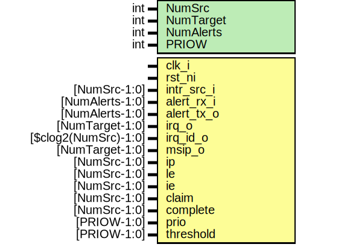

# Entity: rv_plic_assert_fpv

- **File**: rv_plic_assert_fpv.sv
## Diagram

## Description

Copyright lowRISC contributors.
 Licensed under the Apache License, Version 2.0, see LICENSE for details.
 SPDX-License-Identifier: Apache-2.0
 Testbench module for rv_plic. Intended to use with a formal tool.
 
## Generics

| Generic name | Type | Value       | Description |
| ------------ | ---- | ----------- | ----------- |
| NumSrc       | int  | 1           |             |
| NumTarget    | int  | 1           |             |
| NumAlerts    | int  | 1           |             |
| PRIOW        | int  | $clog2(7+1) |             |
## Ports

| Port name  | Direction | Type                   | Description          |
| ---------- | --------- | ---------------------- | -------------------- |
| clk_i      | input     |                        |                      |
| rst_ni     | input     |                        |                      |
| intr_src_i | input     | [NumSrc-1:0]           |                      |
| alert_rx_i | input     | [NumAlerts-1:0]        |                      |
| alert_tx_o | input     | [NumAlerts-1:0]        |                      |
| irq_o      | input     | [NumTarget-1:0]        |                      |
| irq_id_o   | input     | [$clog2(NumSrc+1)-1:0] |                      |
| msip_o     | input     | [NumTarget-1:0]        |                      |
| ip         | input     | [NumSrc-1:0]           | probe design signals |
| le         | input     | [NumSrc-1:0]           |                      |
| ie         | input     | [NumSrc-1:0]           |                      |
| claim      | input     | [NumSrc-1:0]           |                      |
| complete   | input     | [NumSrc-1:0]           |                      |
| prio       | input     | [PRIOW-1:0]            |                      |
| threshold  | input     | [PRIOW-1:0]            |                      |
## Signals

| Name         | Type                         | Description         |
| ------------ | ---------------------------- | ------------------- |
| claim_reg    | logic                        |                     |
| claimed      | logic                        |                     |
| max_priority | logic                        |                     |
| irq          | logic                        |                     |
| i_high_prio  | logic [$clog2(NumSrc+1)-1:0] |                     |
| src_sel      | int unsigned                 | symbolic variables  |
| tgt_sel      | int unsigned                 |                     |
| ip[src_sel]  | claimed                      |                     |
## Processes
- unnamed: ( @(posedge clk_i or negedge rst_ni) )
- unnamed: (  )
- unnamed: (  )
