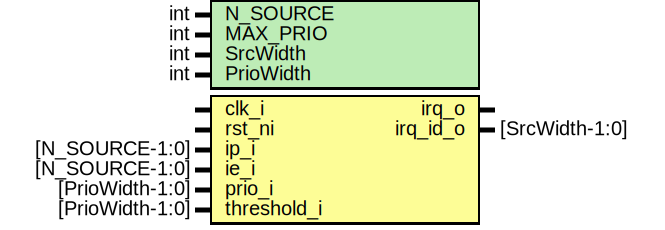

# Entity: rv_plic_target

- **File**: rv_plic_target.sv
## Diagram

## Description

 Copyright lowRISC contributors.
 Licensed under the Apache License, Version 2.0, see LICENSE for details.
 SPDX-License-Identifier: Apache-2.0

 RISC-V Platform-Level Interrupt Generator for Target

 This module basically doing IE & IP based on priority and threshold_i.
 Keep in mind that increasing MAX_PRIO affects logic size a lot.

 The module implements a binary tree to find the maximal entry. the solution
 has O(N) area and O(log(N)) delay complexity, and thus scales well with
 many input sources.

## Generics

| Generic name | Type | Value              | Description         |
| ------------ | ---- | ------------------ | ------------------- |
| N_SOURCE     | int  | 32                 |                     |
| MAX_PRIO     | int  | 7                  |                     |
| SrcWidth     | int  | $clog2(N_SOURCE)   |  derived parameter  |
| PrioWidth    | int  | $clog2(MAX_PRIO+1) |  derived parameter  |
## Ports

| Port name   | Direction | Type            | Description |
| ----------- | --------- | --------------- | ----------- |
| clk_i       | input     |                 |             |
| rst_ni      | input     |                 |             |
| ip_i        | input     | [N_SOURCE-1:0]  |             |
| ie_i        | input     | [N_SOURCE-1:0]  |             |
| prio_i      | input     | [PrioWidth-1:0] |             |
| threshold_i | input     | [PrioWidth-1:0] |             |
| irq_o       | output    |                 |             |
| irq_id_o    | output    | [SrcWidth-1:0]  |             |
## Signals

| Name     | Type                                        | Description |
| -------- | ------------------------------------------- | ----------- |
| is_tree  | logic [2**(NumLevels+1)-2:0]                |             |
| id_tree  | logic [2**(NumLevels+1)-2:0][SrcWidth-1:0]  |             |
| max_tree | logic [2**(NumLevels+1)-2:0][PrioWidth-1:0] |             |
| irq_d    | logic                                       |             |
| irq_q    | logic                                       |             |
| irq_id_d | logic [SrcWidth-1:0]                        |             |
| irq_id_q | logic [SrcWidth-1:0]                        |             |
## Constants

| Name      | Type | Value              | Description                                                                                     |
| --------- | ---- | ------------------ | ----------------------------------------------------------------------------------------------- |
| SrcWidth  | int  | $clog2(N_SOURCE)   | derived parameter                                                                               |
| PrioWidth | int  | $clog2(MAX_PRIO+1) | derived parameter                                                                               |
| NumLevels | int  | $clog2(N_SOURCE)   |  align to powers of 2 for simplicity  a full binary tree with N levels has 2**N + 2**N-1 nodes  |
## Processes
- gen_regs: ( @(posedge clk_i or negedge rst_ni) )
  - **Type:** always_ff
