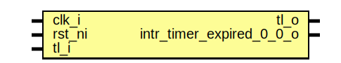

# Entity: rv_timer

## Diagram

## Description

Copyright lowRISC contributors.
 Licensed under the Apache License, Version 2.0, see LICENSE for details.
 SPDX-License-Identifier: Apache-2.0
 
## Generics

| Generic name | Type                  | Value     | Description |
| ------------ | --------------------- | --------- | ----------- |
| NumAlerts    | logic [NumAlerts-1:0] | undefined |             |
## Ports

| Port name                | Direction | Type            | Description |
| ------------------------ | --------- | --------------- | ----------- |
| clk_i                    | input     |                 |             |
| rst_ni                   | input     |                 |             |
| tl_i                     | input     |                 |             |
| tl_o                     | output    |                 |             |
| alert_rx_i               | input     | [NumAlerts-1:0] |             |
| alert_tx_o               | output    | [NumAlerts-1:0] |             |
| intr_timer_expired_0_0_o | output    |                 |             |
## Signals

| Name                | Type                         | Description                                   |
| ------------------- | ---------------------------- | --------------------------------------------- |
| reg2hw              | rv_timer_reg2hw_t            |                                               |
| hw2reg              | rv_timer_hw2reg_t            |                                               |
| active              | logic [N_HARTS-1:0]          |                                               |
| prescaler           | logic [11:0]                 |                                               |
| step                | logic [7:0]                  |                                               |
| tick                | logic [N_HARTS-1:0]          |                                               |
| mtime_d             | logic [63:0]                 |                                               |
| mtime               | logic [63:0]                 |                                               |
| mtimecmp            | logic [63:0]                 | Only [harts][0] is connected to mtimecmp CSRs |
| mtimecmp_update     | logic                        |                                               |
| intr_timer_set      | logic [N_HARTS*N_TIMERS-1:0] |                                               |
| intr_timer_en       | logic [N_HARTS*N_TIMERS-1:0] |                                               |
| intr_timer_test_q   | logic [N_HARTS*N_TIMERS-1:0] |                                               |
| intr_timer_test_qe  | logic [N_HARTS-1:0]          |                                               |
| intr_timer_state_q  | logic [N_HARTS*N_TIMERS-1:0] |                                               |
| intr_timer_state_de | logic [N_HARTS-1:0]          |                                               |
| intr_timer_state_d  | logic [N_HARTS*N_TIMERS-1:0] |                                               |
| intr_out            | logic [N_HARTS*N_TIMERS-1:0] |                                               |
| alert_test          | logic [NumAlerts-1:0]        | Register module                               |
| alerts              | logic [NumAlerts-1:0]        | Register module                               |
## Instantiations

- u_reg: rv_timer_reg_top
