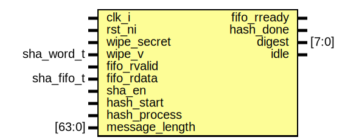

# Entity: sha2
## Diagram

## Description
Copyright lowRISC contributors.
 Licensed under the Apache License, Version 2.0, see LICENSE for details.
 SPDX-License-Identifier: Apache-2.0
 SHA-256 algorithm
 
## Ports
| Port name      | Direction | Type       | Description                              |
| -------------- | --------- | ---------- | ---------------------------------------- |
| clk_i          | input     |            |                                          |
| rst_ni         | input     |            |                                          |
| wipe_secret    | input     |            |                                          |
| wipe_v         | input     | sha_word_t |                                          |
| fifo_rvalid    | input     |            | FIFO read signal                         |
| fifo_rdata     | input     | sha_fifo_t |                                          |
| fifo_rready    | output    |            |                                          |
| sha_en         | input     |            | If disabled, it clears internal content. |
| hash_start     | input     |            |                                          |
| hash_process   | input     |            |                                          |
| hash_done      | output    |            |                                          |
| message_length | input     | [63:0]     | bits but byte based                      |
| digest         | output    | [7:0]      |                                          |
| idle           | output    |            |                                          |
## Signals
| Name               | Type                   | Description                                   |
| ------------------ | ---------------------- | --------------------------------------------- |
| msg_feed_complete  | logic                  |                                               |
| shaf_rready        | logic                  |                                               |
| shaf_rdata         | sha_word_t             |                                               |
| shaf_rvalid        | logic                  |                                               |
| round              | logic [RoundWidth-1:0] |                                               |
| w_index            | logic      [3:0]       |                                               |
| w                  | sha_word_t [15:0]      |                                               |
| update_w_from_fifo | logic                  | w, hash, digest update logic control signals  |
| calculate_next_w   | logic                  | w, hash, digest update logic control signals  |
| init_hash          | logic                  |                                               |
| run_hash           | logic                  |                                               |
| complete_one_chunk | logic                  |                                               |
| update_digest      | logic                  |                                               |
| clear_digest       | logic                  |                                               |
| hash_done_next     | logic                  | to meet the phase with digest value.          |
| hash               | sha_word_t [7:0]       | a,b,c,d,e,f,g,h                               |
| fifo_st_q          | fifoctl_state_e        |                                               |
| fifo_st_d          | fifoctl_state_e        |                                               |
| sha_st_q           | sha_st_t               |                                               |
| sha_st_d           | sha_st_t               |                                               |
## Constants
| Name       | Type         | Value            | Description |
| ---------- | ------------ | ---------------- | ----------- |
| RoundWidth | int unsigned | $clog2(NumRound) |             |
| ZeroWord   | sha_word_t   | '0               |             |
## Types
| Name            | Type                                                                     | Description  |
| --------------- | ------------------------------------------------------------------------ | ------------ |
| fifoctl_state_e | enum logic [1:0] {     FifoIdle,     FifoLoadFromFifo,     FifoWait   }  |              |
| sha_st_t        | enum logic [1:0] {     ShaIdle,     ShaCompress,     ShaUpdateDigest   } | SHA control  |
## Processes
- fill_w: _( @(posedge clk_i or negedge rst_ni) )_
Fill up w

**Description**
Fill up w

- compress_round: _( @(posedge clk_i or negedge rst_ni) )_
Update engine

**Description**
Update engine

- unnamed: _( @(posedge clk_i or negedge rst_ni) )_
Digest

**Description**
Digest

- unnamed: _( @(posedge clk_i or negedge rst_ni) )_
round

**Description**
round

- unnamed: _( @(posedge clk_i or negedge rst_ni) )_
w_index

**Description**
w_index

- unnamed: _( @(posedge clk_i or negedge rst_ni) )_

- unnamed: _( @(posedge clk_i or negedge rst_ni) )_

- unnamed: _(  )_

- unnamed: _( @(posedge clk_i or negedge rst_ni) )_

- unnamed: _(  )_

## Instantiations
- u_pad: sha2_pad
