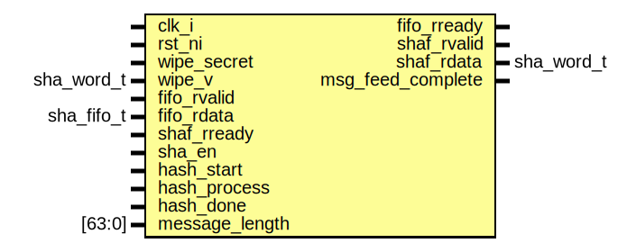

# Entity: sha2_pad
## Diagram

## Description
Copyright lowRISC contributors.
 Licensed under the Apache License, Version 2.0, see LICENSE for details.
 SPDX-License-Identifier: Apache-2.0
 SHA-256 Padding logic
 
## Ports
| Port name         | Direction | Type       | Description                             |
| ----------------- | --------- | ---------- | --------------------------------------- |
| clk_i             | input     |            |                                         |
| rst_ni            | input     |            |                                         |
| wipe_secret       | input     |            |                                         |
| wipe_v            | input     | sha_word_t |                                         |
| fifo_rvalid       | input     |            | To actual FIFO                          |
| fifo_rdata        | input     | sha_fifo_t |                                         |
| fifo_rready       | output    |            |                                         |
| shaf_rvalid       | output    |            | from SHA2 compress engine               |
| shaf_rdata        | output    | sha_word_t |                                         |
| shaf_rready       | input     |            |                                         |
| sha_en            | input     |            |                                         |
| hash_start        | input     |            |                                         |
| hash_process      | input     |            |                                         |
| hash_done         | input     |            |                                         |
| message_length    | input     | [63:0]     | # of bytes in bits (8 bits granularity) |
| msg_feed_complete | output    |            | Indicates, all message is feeded        |
## Signals
| Name              | Type         | Description                             |
| ----------------- | ------------ | --------------------------------------- |
| tx_count          | logic [63:0] | fin received data count.                |
| inc_txcount       | logic        |                                         |
| fifo_partial      | logic        |                                         |
| txcnt_eq_1a0      | logic        |                                         |
| hash_process_flag | logic        | Set by hash_process, clear by hash_done |
| sel_data          | sel_data_e   |                                         |
| st_q              | pad_st_e     |                                         |
| st_d              | pad_st_e     |                                         |
## Types
| Name       | Type                                                                                                                            | Description                                                                                                                                                                                                                                                                                                                                                         |
| ---------- | ------------------------------------------------------------------------------------------------------------------------------- | ------------------------------------------------------------------------------------------------------------------------------------------------------------------------------------------------------------------------------------------------------------------------------------------------------------------------------------------------------------------- |
| sel_data_e | enum logic [2:0] {     FifoIn,              Pad80,               Pad00,               LenHi,               LenLo              } | Data path: fout_wdata                                                                                                                                                                                                                                                                                                                                               |
| pad_st_e   | enum logic [2:0] {     StIdle,             StFifoReceive,      StPad80,            StPad00,     StLenHi,     StLenLo   }        | fifo control add 8'h 80 , N 8'h00, 64'h message_length Steps 1. `hash_start` from CPU (or DMA?) 2. calculate `padded_length` from `message_length` 3. Check if tx_count == message_length, then go to 5 4. Receiving FIFO input (hand over to fifo output) 5. Padding bit 1 (8'h80) followed by 8'h00 if needed 6. Padding with length (high -> low) State Machine  |
## Processes
- unnamed: _( @(posedge clk_i or negedge rst_ni) )_

- unnamed: _(  )_

- unnamed: _( @(posedge clk_i or negedge rst_ni) )_

- unnamed: _(  )_
Next state

**Description**
Next state

- unnamed: _( @(posedge clk_i or negedge rst_ni) )_
tx_count

**Description**
tx_count

