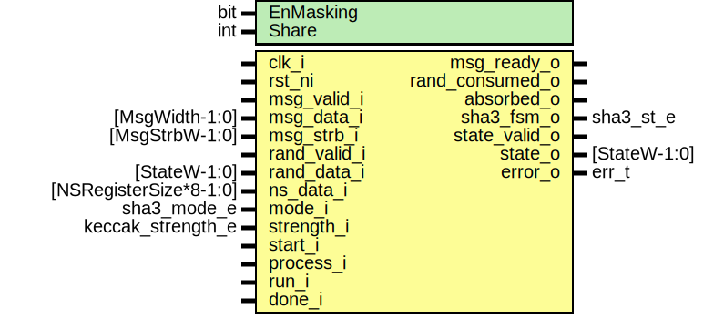

# Entity: sha3_fpv
## Diagram

## Description
Copyright lowRISC contributors.
 Licensed under the Apache License, Version 2.0, see LICENSE for details.
 SPDX-License-Identifier: Apache-2.0
 
## Generics
| Generic name | Type | Value     | Description                |
| ------------ | ---- | --------- | -------------------------- |
| EnMasking    | bit  | 0         | Enable Masked Keccak if 1  |
| Share        | int  | undefined |                            |
## Ports
| Port name       | Direction | Type                   | Description                                                                      |
| --------------- | --------- | ---------------------- | -------------------------------------------------------------------------------- |
| clk_i           | input     |                        |                                                                                  |
| rst_ni          | input     |                        |                                                                                  |
| msg_valid_i     | input     |                        | MSG interface                                                                    |
| msg_data_i      | input     | [MsgWidth-1:0]         |                                                                                  |
| msg_strb_i      | input     | [MsgStrbW-1:0]         | one masking for shares                                                           |
| msg_ready_o     | output    |                        |                                                                                  |
| rand_valid_i    | input     |                        | Entropy interface                                                                |
| rand_data_i     | input     | [StateW-1:0]           |                                                                                  |
| rand_consumed_o | output    |                        |                                                                                  |
| ns_data_i       | input     | [NSRegisterSize*8-1:0] | See kmac_pkg for details                                                         |
| mode_i          | input     | sha3_mode_e            | see sha3pad for details                                                          |
| strength_i      | input     | keccak_strength_e      | see sha3pad for details                                                          |
| start_i         | input     |                        | see sha3pad for details                                                          |
| process_i       | input     |                        | see sha3pad for details                                                          |
| run_i           | input     |                        |                                                                                  |
| done_i          | input     |                        | see sha3pad for details                                                          |
| absorbed_o      | output    |                        |                                                                                  |
| sha3_fsm_o      | output    | sha3_st_e              |                                                                                  |
| state_valid_o   | output    |                        | digest outputThis value is valid only after all absorbing process is completed.  |
| state_o         | output    | [StateW-1:0]           |                                                                                  |
| error_o         | output    | err_t                  |                                                                                  |
## Constants
| Name  | Type | Value     | Description |
| ----- | ---- | --------- | ----------- |
| Share | int  | undefined |             |
## Instantiations
- u_sha3: sha3
