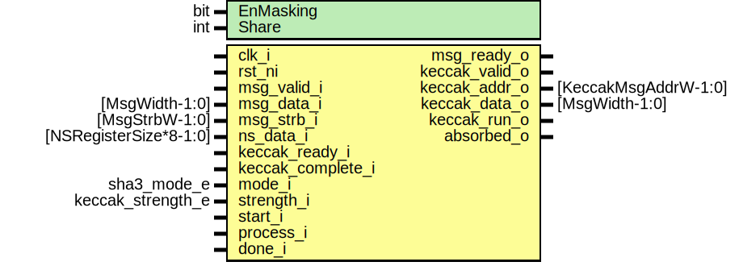

# Entity: sha3pad

- **File**: sha3pad.sv
## Diagram

## Description

 Copyright lowRISC contributors.
 Licensed under the Apache License, Version 2.0, see LICENSE for details.
 SPDX-License-Identifier: Apache-2.0

 SHA3 padding logic

## Generics

| Generic name | Type | Value     | Description |
| ------------ | ---- | --------- | ----------- |
| EnMasking    | bit  | 0         |             |
| Share        | int  | undefined |             |
## Ports

| Port name         | Direction | Type                   | Description                                                                                                                                                                                                               |
| ----------------- | --------- | ---------------------- | ------------------------------------------------------------------------------------------------------------------------------------------------------------------------------------------------------------------------- |
| clk_i             | input     |                        |                                                                                                                                                                                                                           |
| rst_ni            | input     |                        |                                                                                                                                                                                                                           |
| msg_valid_i       | input     |                        |  Message interface (FIFO)                                                                                                                                                                                                 |
| msg_data_i        | input     | [MsgWidth-1:0]         |                                                                                                                                                                                                                           |
| msg_strb_i        | input     | [MsgStrbW-1:0]         | one strobe for shares                                                                                                                                                                                                     |
| msg_ready_o       | output    |                        |                                                                                                                                                                                                                           |
| ns_data_i         | input     | [NSRegisterSize*8-1:0] | See sha3_pkg for details                                                                                                                                                                                                  |
| keccak_valid_o    | output    |                        |  output to keccak_round: message path                                                                                                                                                                                     |
| keccak_addr_o     | output    | [KeccakMsgAddrW-1:0]   |                                                                                                                                                                                                                           |
| keccak_data_o     | output    | [MsgWidth-1:0]         |                                                                                                                                                                                                                           |
| keccak_ready_i    | input     |                        |                                                                                                                                                                                                                           |
| keccak_run_o      | output    |                        |  keccak_round control and status `run` initiates the keccak_round to process full keccak_f (24rounds).  `complete` is an input from keccak round showing the current keccak_f is  completed.                              |
| keccak_complete_i | input     |                        |                                                                                                                                                                                                                           |
| mode_i            | input     | sha3_mode_e            |  configurations                                                                                                                                                                                                           |
| strength_i        | input     | keccak_strength_e      |  strength_i is used in bytepad operation. bytepad() is used in cSHAKE only. SHA3, SHAKE doesn't have encode_N,S                                                                                                           |
| start_i           | input     |                        |  control signal start_i is a pulse signal triggers the padding logic (and the rest of SHA)  to accept the incoming messages. This signal is used in the pad module,  to initiate the prefix transmitting to keccak_round  |
| process_i         | input     |                        |  process_i is a pulse signal triggers the pad logic to stop receiving the message from MSG_FIFO and pad the trailing bits specified in the SHA3  standard. Look at `funcpad` signal for the values.                       |
| done_i            | input     |                        |  done_i is a pulse signal to make the pad logic to clear internal variables and to move back to the Idle state for next hashing process.  done_i may not needed if sw controls the keccak_round directly.                 |
| absorbed_o        | output    |                        |  Indication of the Keccak Sponge Absorbing is complete, it is time for SW to control the Keccak-round if it needs more digest, or complete by asserting  `done_i`                                                         |
## Signals

| Name             | Type                          | Description                                                                                                                                                                                                                                                                                                                                                                                                                                                                                                                                                                                                                                                                                                                                                                                                                                                                                                                                                                                                                                                                                                                                                                                                                                                                                                                                                                                                                                                                                                                                                                                                                                                                                                                                                                                                                                                                                                                                                                                                                                                                                                                       |
| ---------------- | ----------------------------- | --------------------------------------------------------------------------------------------------------------------------------------------------------------------------------------------------------------------------------------------------------------------------------------------------------------------------------------------------------------------------------------------------------------------------------------------------------------------------------------------------------------------------------------------------------------------------------------------------------------------------------------------------------------------------------------------------------------------------------------------------------------------------------------------------------------------------------------------------------------------------------------------------------------------------------------------------------------------------------------------------------------------------------------------------------------------------------------------------------------------------------------------------------------------------------------------------------------------------------------------------------------------------------------------------------------------------------------------------------------------------------------------------------------------------------------------------------------------------------------------------------------------------------------------------------------------------------------------------------------------------------------------------------------------------------------------------------------------------------------------------------------------------------------------------------------------------------------------------------------------------------------------------------------------------------------------------------------------------------------------------------------------------------------------------------------------------------------------------------------------------------- |
| block_addr_limit | logic [KeccakCountW-1:0]      | //////////////////  Configurations // //////////////////                                                                                                                                                                                                                                                                                                                                                                                                                                                                                                                                                                                                                                                                                                                                                                                                                                                                                                                                                                                                                                                                                                                                                                                                                                                                                                                                                                                                                                                                                                                                                                                                                                                                                                                                                                                                                                                                                                                                                                                                                                                                          |
| sel_mux          | mux_sel_e                     | ///////////////////  Control Signals // ///////////////////  `sel_mux` selects the output data among the incoming or internally generated data.  MuxFifo:    data from external (msg_data_i)  MuxPrefix:  bytepad(encode_string(N)||encode_string(S), )  MuxFuncPad: function_pad with end of message  MuxZeroEnd: all 0                                                                                                                                                                                                                                                                                                                                                                                                                                                                                                                                                                                                                                                                                                                                                                                                                                                                                                                                                                                                                                                                                                                                                                                                                                                                                                                                                                                                                                                                                                                                                                                                                                                                                                                                                                                                          |
| sent_message     | logic [KeccakCountW-1:0]      |  `sent_message` indicates the number of entries sent to keccak round per  block. The value shall be enough to cover Maximum entry of the Keccak  storage as defined in sha3_pkg, `$clog2(KeccakEntries+1)`. Logically,  it is not needed to have more than KeccakEntries but for safety in case of  SHA3 context switch resuming the SHA3 from the middle of sponge  construction. If needed, the software should be able to write whole 1600  bits. The `sent_message` is used to check sent_blocksize.                                                                                                                                                                                                                                                                                                                                                                                                                                                                                                                                                                                                                                                                                                                                                                                                                                                                                                                                                                                                                                                                                                                                                                                                                                                                                                                                                                                                                                                                                                                                                                                                                          |
| inc_sentmsg      | logic                         |                                                                                                                                                                                                                                                                                                                                                                                                                                                                                                                                                                                                                                                                                                                                                                                                                                                                                                                                                                                                                                                                                                                                                                                                                                                                                                                                                                                                                                                                                                                                                                                                                                                                                                                                                                                                                                                                                                                                                                                                                                                                                                                                   |
| clr_sentmsg      | logic                         |                                                                                                                                                                                                                                                                                                                                                                                                                                                                                                                                                                                                                                                                                                                                                                                                                                                                                                                                                                                                                                                                                                                                                                                                                                                                                                                                                                                                                                                                                                                                                                                                                                                                                                                                                                                                                                                                                                                                                                                                                                                                                                                                   |
| prefix_index     | logic [KeccakMsgAddrW-1:0]    |  Prefix index to slice the `prefix` n-bits into multiple of 64bit.                                                                                                                                                                                                                                                                                                                                                                                                                                                                                                                                                                                                                                                                                                                                                                                                                                                                                                                                                                                                                                                                                                                                                                                                                                                                                                                                                                                                                                                                                                                                                                                                                                                                                                                                                                                                                                                                                                                                                                                                                                                                |
| fsm_keccak_valid | logic                         |  fsm_keccak_valid is an output signal from FSM which to send data generated  inside the pad logic to keccak_round                                                                                                                                                                                                                                                                                                                                                                                                                                                                                                                                                                                                                                                                                                                                                                                                                                                                                                                                                                                                                                                                                                                                                                                                                                                                                                                                                                                                                                                                                                                                                                                                                                                                                                                                                                                                                                                                                                                                                                                                                 |
| hold_msg         | logic                         |  hold_msg to prevent message from being forwarded into keccak_round and  acked. Mainly the usage is to hold the message and initiates the  keccak_round for current block.                                                                                                                                                                                                                                                                                                                                                                                                                                                                                                                                                                                                                                                                                                                                                                                                                                                                                                                                                                                                                                                                                                                                                                                                                                                                                                                                                                                                                                                                                                                                                                                                                                                                                                                                                                                                                                                                                                                                                        |
| en_msgbuf        | logic                         |  latch the partial write. Latched data is used for funcpad_merged                                                                                                                                                                                                                                                                                                                                                                                                                                                                                                                                                                                                                                                                                                                                                                                                                                                                                                                                                                                                                                                                                                                                                                                                                                                                                                                                                                                                                                                                                                                                                                                                                                                                                                                                                                                                                                                                                                                                                                                                                                                                 |
| clr_msgbuf       | logic                         |                                                                                                                                                                                                                                                                                                                                                                                                                                                                                                                                                                                                                                                                                                                                                                                                                                                                                                                                                                                                                                                                                                                                                                                                                                                                                                                                                                                                                                                                                                                                                                                                                                                                                                                                                                                                                                                                                                                                                                                                                                                                                                                                   |
| mode_eq_cshake   | logic                         | /////////////////  State Machine // /////////////////  Inputs  FSM moves to StPrefix only when cSHAKE is enabled                                                                                                                                                                                                                                                                                                                                                                                                                                                                                                                                                                                                                                                                                                                                                                                                                                                                                                                                                                                                                                                                                                                                                                                                                                                                                                                                                                                                                                                                                                                                                                                                                                                                                                                                                                                                                                                                                                                                                                                                                  |
| keccak_data_o    | MuxFuncPad                    |                                                                                                                                                                                                                                                                                                                                                                                                                                                                                                                                                                                                                                                                                                                                                                                                                                                                                                                                                                                                                                                                                                                                                                                                                                                                                                                                                                                                                                                                                                                                                                                                                                                                                                                                                                                                                                                                                                                                                                                                                                                                                                                                   |
| keccak_data_o    | MuxZeroEnd                    |                                                                                                                                                                                                                                                                                                                                                                                                                                                                                                                                                                                                                                                                                                                                                                                                                                                                                                                                                                                                                                                                                                                                                                                                                                                                                                                                                                                                                                                                                                                                                                                                                                                                                                                                                                                                                                                                                                                                                                                                                                                                                                                                   |
| keccak_data_o    | default                       |  MuxNone                                                                                                                                                                                                                                                                                                                                                                                                                                                                                                                                                                                                                                                                                                                                                                                                                                                                                                                                                                                                                                                                                                                                                                                                                                                                                                                                                                                                                                                                                                                                                                                                                                                                                                                                                                                                                                                                                                                                                                                                                                                                                                                          |
| end              | endcase                       |                                                                                                                                                                                                                                                                                                                                                                                                                                                                                                                                                                                                                                                                                                                                                                                                                                                                                                                                                                                                                                                                                                                                                                                                                                                                                                                                                                                                                                                                                                                                                                                                                                                                                                                                                                                                                                                                                                                                                                                                                                                                                                                                   |
| msg_buf          | logic [MsgWidth-8-1:0]        |  prim_packer : packing to 64bit to update keccak storage  two prim_packer in this module are used to pack the data received from  upper layer (KMAC core) and also the 5bit padding bits.  It is assumed that the message from upper layer could be partial at the  end of the message. Then the 2 or 4bit padding is required. It can be  handled by some custom logic or could be done by prim_packer.  If packer is used, the MSG_FIFO doesn't have to have another prim_packer  in front of the FIFO. This logic can handle the partial writes from the  software.   If a custom logic is implemented here, prim_packer is necessary in front  of the FIFO, as this logic only appends at the end of the message when  `process_i` is asserted. Also, in this case, even prim_packer is not  needed, still 64bit registers to latch the partial write is required.  If not, the logic has to delay the acceptance of the incoming write  accesses. It may trigger the back-pressuring in some case which may result  that the software(or upper layer) may not set process_i.   For custom logic, it could be implemented by the 8 mux selection.  for instance: (subject to be changed)    unique case (sent_byte[2:0]) // generated from msg_strb_i      3'b 000: funcpad_merged = {end_of_block, 63'(function_pad)                  };      3'b 001: funcpad_merged = {end_of_block, 55'(function_pad), msg_data_i[ 7:0]};      3'b 010: funcpad_merged = {end_of_block, 47'(function_pad), msg_data_i[15:0]};      3'b 011: funcpad_merged = {end_of_block, 39'(function_pad), msg_data_i[23:0]};      3'b 100: funcpad_merged = {end_of_block, 31'(function_pad), msg_data_i[31:0]};      3'b 101: funcpad_merged = {end_of_block, 23'(function_pad), msg_data_i[39:0]};      3'b 110: funcpad_merged = {end_of_block, 15'(function_pad), msg_data_i[47:0]};      3'b 111: funcpad_merged = {end_of_block,  7'(function_pad), msg_data_i[55:0]};      default: funcpad_merged = '0;    endcase  internal buffer to store partial write. It doesn't have to store last byte as it  stores only when partial write.  |
| msg_strb         | logic [MsgStrbW-1-1:0]        |                                                                                                                                                                                                                                                                                                                                                                                                                                                                                                                                                                                                                                                                                                                                                                                                                                                                                                                                                                                                                                                                                                                                                                                                                                                                                                                                                                                                                                                                                                                                                                                                                                                                                                                                                                                                                                                                                                                                                                                                                                                                                                                                   |
| start_valid      | logic                         |  Process only asserts after start and all message are fed.  These valid signals are qualifier of FPV to trigger the control signal  It is a little bit hard to specify these criteria in SVA property so creating  qualifiers in RTL form is easier.                                                                                                                                                                                                                                                                                                                                                                                                                                                                                                                                                                                                                                                                                                                                                                                                                                                                                                                                                                                                                                                                                                                                                                                                                                                                                                                                                                                                                                                                                                                                                                                                                                                                                                                                                                                                                                                                              |
| process_valid    | logic                         |  Process only asserts after start and all message are fed.  These valid signals are qualifier of FPV to trigger the control signal  It is a little bit hard to specify these criteria in SVA property so creating  qualifiers in RTL form is easier.                                                                                                                                                                                                                                                                                                                                                                                                                                                                                                                                                                                                                                                                                                                                                                                                                                                                                                                                                                                                                                                                                                                                                                                                                                                                                                                                                                                                                                                                                                                                                                                                                                                                                                                                                                                                                                                                              |
| absorb_valid     | logic                         |  Process only asserts after start and all message are fed.  These valid signals are qualifier of FPV to trigger the control signal  It is a little bit hard to specify these criteria in SVA property so creating  qualifiers in RTL form is easier.                                                                                                                                                                                                                                                                                                                                                                                                                                                                                                                                                                                                                                                                                                                                                                                                                                                                                                                                                                                                                                                                                                                                                                                                                                                                                                                                                                                                                                                                                                                                                                                                                                                                                                                                                                                                                                                                              |
| done_valid       | logic                         |  Process only asserts after start and all message are fed.  These valid signals are qualifier of FPV to trigger the control signal  It is a little bit hard to specify these criteria in SVA property so creating  qualifiers in RTL form is easier.                                                                                                                                                                                                                                                                                                                                                                                                                                                                                                                                                                                                                                                                                                                                                                                                                                                                                                                                                                                                                                                                                                                                                                                                                                                                                                                                                                                                                                                                                                                                                                                                                                                                                                                                                                                                                                                                              |
| keccak_valid_o   | end_of_block && !sent_blocksi |                                                                                                                                                                                                                                                                                                                                                                                                                                                                                                                                                                                                                                                                                                                                                                                                                                                                                                                                                                                                                                                                                                                                                                                                                                                                                                                                                                                                                                                                                                                                                                                                                                                                                                                                                                                                                                                                                                                                                                                                                                                                                                                                   |
## Constants

| Name  | Type | Value     | Description |
| ----- | ---- | --------- | ----------- |
| Share | int  | undefined |             |
## Types

| Name      | Type                                                                                                                                                                                                                                                                                                                                                                                                                                                                                                                                                                                                | Description                                                                                                                                  |
| --------- | --------------------------------------------------------------------------------------------------------------------------------------------------------------------------------------------------------------------------------------------------------------------------------------------------------------------------------------------------------------------------------------------------------------------------------------------------------------------------------------------------------------------------------------------------------------------------------------------------- | -------------------------------------------------------------------------------------------------------------------------------------------- |
| pad_st_e  | enum logic [3:0] {      StPadIdle,                      //               StPrefix,      StPrefixWait,                      //               StMessage,      StMessageWait,                      StPad,      StPadRun,                 StPad01,            StPadFlush   } | ///////////////  Definitions // ///////////////  Padding States  TODO: Make it has Hamming Distance >= 3 to be resistent to glitch attacks.  |
| mux_sel_e | enum logic [2:0] {      MuxNone    = 3'b 000,      MuxFifo    = 3'b 001,      MuxPrefix  = 3'b 010,      MuxFuncPad = 3'b 011,      MuxZeroEnd = 3'b 100   }                                                                                                                                                                                                                                                         |                                                                                                                                              |
## Processes
- unnamed: (  )
  - **Type:** always_comb
 **Description**
 Block size based on the address.  This is used for bytepad() and also pad10*1()  assign block_addr_limit = KeccakRate[strength_i];  but below is easier to understand 
- unnamed: ( @(posedge clk_i or negedge rst_ni) )
  - **Type:** always_ff
- unnamed: (  )
  - **Type:** always_comb
- unnamed: (  )
  - **Type:** always_comb
- unnamed: ( @(posedge clk_i or negedge rst_ni) )
  - **Type:** always_ff
- unnamed: ( @(posedge clk_i or negedge rst_ni) )
  - **Type:** always_ff
- unnamed: ( @(posedge clk_i or negedge rst_ni) )
  - **Type:** always_ff
- unnamed: ( @(posedge clk_i or negedge rst_ni) )
  - **Type:** always_ff
