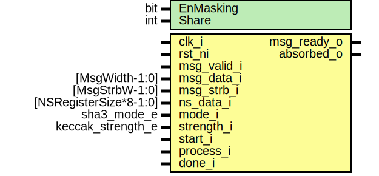

# Entity: sha3pad_fpv

## Diagram

## Description

Copyright lowRISC contributors.
 Licensed under the Apache License, Version 2.0, see LICENSE for details.
 SPDX-License-Identifier: Apache-2.0
 
## Generics

| Generic name | Type | Value     | Description |
| ------------ | ---- | --------- | ----------- |
| EnMasking    | bit  | 0         |             |
| Share        | int  | undefined |             |
## Ports

| Port name   | Direction | Type                   | Description                                                                                                    |
| ----------- | --------- | ---------------------- | -------------------------------------------------------------------------------------------------------------- |
| clk_i       | input     |                        |                                                                                                                |
| rst_ni      | input     |                        |                                                                                                                |
| msg_valid_i | input     |                        | Message interface (FIFO)                                                                                       |
| msg_data_i  | input     | [MsgWidth-1:0]         |                                                                                                                |
| msg_strb_i  | input     | [MsgStrbW-1:0]         | one masking for shares                                                                                         |
| msg_ready_o | output    |                        |                                                                                                                |
| ns_data_i   | input     | [NSRegisterSize*8-1:0] | See kmac_pkg for details                                                                                       |
| mode_i      | input     | sha3_mode_e            | configurations                                                                                                 |
| strength_i  | input     | keccak_strength_e      | strength_i is used in bytepad operation. bytepad() is used in cSHAKE only.SHA3, SHAKE doesn't have encode_N,S  |
| start_i     | input     |                        | control signal                                                                                                 |
| process_i   | input     |                        |                                                                                                                |
| done_i      | input     |                        |                                                                                                                |
| absorbed_o  | output    |                        | Indicator: Status                                                                                              |
## Signals

| Name            | Type                       | Description |
| --------------- | -------------------------- | ----------- |
| keccak_valid    | logic                      |             |
| keccak_ready    | logic                      |             |
| keccak_addr     | logic [KeccakMsgAddrW-1:0] |             |
| keccak_data     | logic [MsgWidth-1:0]       |             |
| keccak_run      | logic                      |             |
| keccak_complete | logic                      |             |
| state           | logic [1599:0]             |             |
| rand_valid      | logic                      |             |
| rand_consumed   | logic                      |             |
| rand_data       | logic [1599:0]             |             |
## Constants

| Name  | Type | Value     | Description |
| ----- | ---- | --------- | ----------- |
| Share | int  | undefined |             |
## Instantiations

- u_pad: sha3pad
- u_keccak: keccak_round
