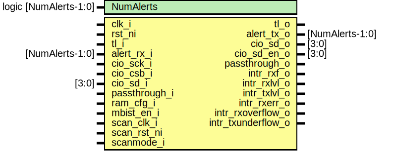

# Entity: spi_device

- **File**: spi_device.sv
## Diagram

## Description

Copyright lowRISC contributors.
 Licensed under the Apache License, Version 2.0, see LICENSE for details.
 SPDX-License-Identifier: Apache-2.0
 Serial Peripheral Interface (SPI) Device module.
 
## Generics

| Generic name | Type                  | Value     | Description |
| ------------ | --------------------- | --------- | ----------- |
| NumAlerts    | logic [NumAlerts-1:0] | undefined |             |
## Ports

| Port name          | Direction | Type            | Description             |
| ------------------ | --------- | --------------- | ----------------------- |
| clk_i              | input     |                 |                         |
| rst_ni             | input     |                 |                         |
| tl_i               | input     |                 | Register interface      |
| tl_o               | output    |                 |                         |
| alert_rx_i         | input     | [NumAlerts-1:0] | Alerts                  |
| alert_tx_o         | output    | [NumAlerts-1:0] |                         |
| cio_sck_i          | input     |                 | SPI Interface           |
| cio_csb_i          | input     |                 |                         |
| cio_sd_o           | output    | [3:0]           |                         |
| cio_sd_en_o        | output    | [3:0]           |                         |
| cio_sd_i           | input     | [3:0]           |                         |
| passthrough_o      | output    |                 | Passthrough interface   |
| passthrough_i      | input     |                 |                         |
| intr_rxf_o         | output    |                 | RX FIFO Full            |
| intr_rxlvl_o       | output    |                 | RX FIFO above level     |
| intr_txlvl_o       | output    |                 | TX FIFO below level     |
| intr_rxerr_o       | output    |                 | RX Frame error          |
| intr_rxoverflow_o  | output    |                 | RX Async FIFO Overflow  |
| intr_txunderflow_o | output    |                 | TX Async FIFO Underflow |
| ram_cfg_i          | input     |                 | Memory configuration    |
| mbist_en_i         | input     |                 | DFT related controls    |
| scan_clk_i         | input     |                 |                         |
| scan_rst_ni        | input     |                 |                         |
| scanmode_i         | input     |                 |                         |
## Signals

| Name                            | Type                                            | Description                                                                                                                                                                                             |
| ------------------------------- | ----------------------------------------------- | ------------------------------------------------------------------------------------------------------------------------------------------------------------------------------------------------------- |
| clk_spi_in                      | logic                                           | clock for latch SDI                                                                                                                                                                                     |
| clk_spi_in_muxed                | logic                                           | clock for latch SDI                                                                                                                                                                                     |
| clk_spi_in_buf                  | logic                                           | clock for latch SDI                                                                                                                                                                                     |
| clk_spi_out                     | logic                                           | clock for driving SDO                                                                                                                                                                                   |
| clk_spi_out_muxed               | logic                                           | clock for driving SDO                                                                                                                                                                                   |
| clk_spi_out_buf                 | logic                                           | clock for driving SDO                                                                                                                                                                                   |
| reg2hw                          | spi_device_reg2hw_t                             |                                                                                                                                                                                                         |
| hw2reg                          | spi_device_hw2reg_t                             |                                                                                                                                                                                                         |
| tl_sram_h2d                     | tlul_pkg::tl_h2d_t                              |                                                                                                                                                                                                         |
| tl_sram_d2h                     | tlul_pkg::tl_d2h_t                              |                                                                                                                                                                                                         |
| sram_clk                        | logic                                           | Dual-port SRAM Interface: Refer prim_ram_2p_wrapper.sv                                                                                                                                                  |
| sram_clk_en                     | logic                                           |                                                                                                                                                                                                         |
| sram_clk_ungated                | logic                                           |                                                                                                                                                                                                         |
| sram_clk_muxed                  | logic                                           |                                                                                                                                                                                                         |
| sram_rst_n                      | logic                                           |                                                                                                                                                                                                         |
| sram_rst_n_noscan               | logic                                           |                                                                                                                                                                                                         |
| mem_a_req                       | logic                                           |                                                                                                                                                                                                         |
| mem_a_write                     | logic                                           |                                                                                                                                                                                                         |
| mem_a_addr                      | logic [SramAw-1:0]                              |                                                                                                                                                                                                         |
| mem_a_wdata                     | logic [SramDw-1:0]                              |                                                                                                                                                                                                         |
| mem_a_rvalid                    | logic                                           |                                                                                                                                                                                                         |
| mem_a_rdata                     | logic [SramDw-1:0]                              |                                                                                                                                                                                                         |
| mem_a_rerror                    | logic [1:0]                                     |                                                                                                                                                                                                         |
| mem_b_req                       | logic                                           |                                                                                                                                                                                                         |
| mem_b_write                     | logic                                           |                                                                                                                                                                                                         |
| mem_b_addr                      | logic [SramAw-1:0]                              |                                                                                                                                                                                                         |
| mem_b_wdata                     | logic [SramDw-1:0]                              |                                                                                                                                                                                                         |
| mem_b_rvalid                    | logic                                           |                                                                                                                                                                                                         |
| mem_b_rdata                     | logic [SramDw-1:0]                              |                                                                                                                                                                                                         |
| mem_b_rerror                    | logic [1:0]                                     |                                                                                                                                                                                                         |
| sub_sram_req                    | logic                                           | Submoule SRAM Requests                                                                                                                                                                                  |
| sub_sram_write                  | logic                                           |                                                                                                                                                                                                         |
| sub_sram_addr                   | logic [SramAw-1:0]                              |                                                                                                                                                                                                         |
| sub_sram_wdata                  | logic [SramDw-1:0]                              |                                                                                                                                                                                                         |
| sub_sram_rvalid                 | logic                                           |                                                                                                                                                                                                         |
| sub_sram_rdata                  | logic [SramDw-1:0]                              |                                                                                                                                                                                                         |
| sub_sram_rerror                 | logic [1:0]                                     |                                                                                                                                                                                                         |
| internal_sd                     | logic [3:0]                                     | Host return path mux                                                                                                                                                                                    |
| internal_sd_en                  | logic [3:0]                                     | Host return path mux                                                                                                                                                                                    |
| passthrough_sd                  | logic [3:0]                                     |                                                                                                                                                                                                         |
| passthrough_sd_en               | logic [3:0]                                     |                                                                                                                                                                                                         |
| cpol                            | logic                                           | Clock polarity                                                                                                                                                                                          |
| cpha                            | logic                                           | Phase : Not complete                                                                                                                                                                                    |
| txorder                         | logic                                           | TX bitstream order: 0(bit 7 to 0), 1(bit 0 to 7)                                                                                                                                                        |
| rxorder                         | logic                                           | RX bitstream order: 0(bit 7 to 0), 1(bit 0 to 7)                                                                                                                                                        |
| abort                           | logic                                           | Abort current operations (txf only at this time)                                                                                                                                                        |
| csb_syncd                       | logic                                           |                                                                                                                                                                                                         |
| rst_txfifo_n                    | logic                                           |                                                                                                                                                                                                         |
| rst_rxfifo_n                    | logic                                           |                                                                                                                                                                                                         |
| rst_txfifo_reg                  | logic                                           |                                                                                                                                                                                                         |
| rst_rxfifo_reg                  | logic                                           |                                                                                                                                                                                                         |
| spi_mode                        | spi_mode_e                                      |                                                                                                                                                                                                         |
| cfg_upload_mask                 | logic [255:0]                                   |                                                                                                                                                                                                         |
| cfg_addr_4b_en                  | logic                                           |                                                                                                                                                                                                         |
| intr_sram_rxf_full              | logic                                           |                                                                                                                                                                                                         |
| intr_fwm_rxerr                  | logic                                           |                                                                                                                                                                                                         |
| intr_fwm_rxlvl                  | logic                                           |                                                                                                                                                                                                         |
| rxlvl                           | logic                                           |                                                                                                                                                                                                         |
| rxlvl_d                         | logic                                           |                                                                                                                                                                                                         |
| intr_fwm_txlvl                  | logic                                           |                                                                                                                                                                                                         |
| txlvl                           | logic                                           |                                                                                                                                                                                                         |
| txlvl_d                         | logic                                           |                                                                                                                                                                                                         |
| intr_fwm_rxoverflow             | logic                                           |                                                                                                                                                                                                         |
| intr_fwm_txunderflow            | logic                                           |                                                                                                                                                                                                         |
| rxf_overflow                    | logic                                           |                                                                                                                                                                                                         |
| txf_underflow                   | logic                                           |                                                                                                                                                                                                         |
| timer_v                         | logic        [7:0]                              | Wait timer inside rxf control                                                                                                                                                                           |
| sram_rxf_rptr                   | logic   [PtrW-1:0]                              |                                                                                                                                                                                                         |
| sram_rxf_wptr                   | logic   [PtrW-1:0]                              |                                                                                                                                                                                                         |
| sram_txf_rptr                   | logic   [PtrW-1:0]                              |                                                                                                                                                                                                         |
| sram_txf_wptr                   | logic   [PtrW-1:0]                              |                                                                                                                                                                                                         |
| sram_rxf_depth                  | logic   [PtrW-1:0]                              |                                                                                                                                                                                                         |
| sram_txf_depth                  | logic   [PtrW-1:0]                              |                                                                                                                                                                                                         |
| sram_rxf_bindex                 | logic [SramAw-1:0]                              |                                                                                                                                                                                                         |
| sram_txf_bindex                 | logic [SramAw-1:0]                              |                                                                                                                                                                                                         |
| sram_rxf_lindex                 | logic [SramAw-1:0]                              |                                                                                                                                                                                                         |
| sram_txf_lindex                 | logic [SramAw-1:0]                              |                                                                                                                                                                                                         |
| as_txfifo_depth                 | logic [AsFifoDepthW-1:0]                        |                                                                                                                                                                                                         |
| as_rxfifo_depth                 | logic [AsFifoDepthW-1:0]                        |                                                                                                                                                                                                         |
| rxf_empty                       | logic                                           |                                                                                                                                                                                                         |
| rxf_full                        | logic                                           |                                                                                                                                                                                                         |
| txf_empty                       | logic                                           |                                                                                                                                                                                                         |
| txf_full                        | logic                                           |                                                                                                                                                                                                         |
| rxf_full_syncd                  | logic                                           | sync signals                                                                                                                                                                                            |
| txf_empty_syncd                 | logic                                           | sync signals                                                                                                                                                                                            |
| io_mode                         | io_mode_e                                       |                                                                                                                                                                                                         |
| io_mode_outclk                  | io_mode_e                                       |                                                                                                                                                                                                         |
| sub_iomode                      | io_mode_e                                       |                                                                                                                                                                                                         |
| s2p_data_valid                  | logic                                           |                                                                                                                                                                                                         |
| s2p_data                        | spi_byte_t                                      |                                                                                                                                                                                                         |
| s2p_bitcnt                      | logic [BitCntW-1:0]                             |                                                                                                                                                                                                         |
| p2s_valid                       | logic                                           |                                                                                                                                                                                                         |
| p2s_data                        | spi_byte_t                                      |                                                                                                                                                                                                         |
| p2s_sent                        | logic                                           |                                                                                                                                                                                                         |
| sub_p2s_valid                   | logic                                           |                                                                                                                                                                                                         |
| sub_p2s_data                    | spi_byte_t                                      |                                                                                                                                                                                                         |
| sub_p2s_sent                    | logic                                           |                                                                                                                                                                                                         |
| cmd_dp_sel                      | sel_datapath_e                                  |                                                                                                                                                                                                         |
| cmd_dp_sel_outclk               | sel_datapath_e                                  |                                                                                                                                                                                                         |
| cmd_opcode                      | spi_byte_t                                      |                                                                                                                                                                                                         |
| mailbox_assumed                 | logic                                           | Mailbox in Passthrough needs to take SPI if readcmd hits mailbox address                                                                                                                                |
| passthrough_assumed_by_internal | logic                                           | Mailbox in Passthrough needs to take SPI if readcmd hits mailbox address                                                                                                                                |
| cmd_filter                      | logic [255:0]                                   | Passthrouth config signals                                                                                                                                                                              |
| addr_swap_mask                  | logic [31:0]                                    |                                                                                                                                                                                                         |
| addr_swap_data                  | logic [31:0]                                    |                                                                                                                                                                                                         |
| cmd_info                        | cmd_info_t [spi_device_reg_pkg::NumCmdInfo-1:0] | Command Info structure                                                                                                                                                                                  |
|                                 | [SDW+:SramAw]                                   |                                                                                                                                                                                                         |
|                                 | [SDW+:SramAw]                                   |                                                                                                                                                                                                         |
|                                 | [SDW+:SramAw]                                   |                                                                                                                                                                                                         |
|                                 | [SDW+:SramAw]                                   |                                                                                                                                                                                                         |
|                                 | [PtrW-1:0]                                      |                                                                                                                                                                                                         |
|                                 | [PtrW-1:0]                                      |                                                                                                                                                                                                         |
| rxf_full_q                      | logic                                           |                                                                                                                                                                                                         |
| txf_empty_q                     | logic                                           |                                                                                                                                                                                                         |
| sram_rxf_full_q                 | logic                                           | Interrupt Edge                                                                                                                                                                                          |
| fwm_rxerr_q                     | logic                                           | Interrupt Edge                                                                                                                                                                                          |
| sram_rxf_full                   | logic                                           |                                                                                                                                                                                                         |
| fwm_rxerr                       | logic                                           |                                                                                                                                                                                                         |
| sck_n                           | logic                                           | clk_spi cannot use glitch-free clock mux as clock switching in glitch-free requires two clocks to propagate clock selection and enable but SPI clock doesn't exist until it transmits data through SDI  |
| rst_spi_n                       | logic                                           |                                                                                                                                                                                                         |
| scanmode                        | lc_ctrl_pkg::lc_tx_t [ScanModeUseLast-1:0]      |                                                                                                                                                                                                         |
| alert_test                      | logic [NumAlerts-1:0]                           | Register module                                                                                                                                                                                         |
| alerts                          | logic [NumAlerts-1:0]                           | Register module                                                                                                                                                                                         |
## Constants

| Name         | Type | Value                    | Description |
| ------------ | ---- | ------------------------ | ----------- |
| FifoWidth    | int  | $bits(spi_byte_t)        |             |
| FifoDepth    | int  | 8                        | 2 DWords    |
| SDW          | int  | $clog2(SramDw/FifoWidth) |             |
| PtrW         | int  | SramAw + 1 + SDW         |             |
| AsFifoDepthW | int  | $clog2(FifoDepth+1)      |             |
## Processes
- unnamed: ( @(posedge clk_spi_in_buf or negedge rst_ni) )
- unnamed: ( @(posedge clk_spi_out_buf or negedge rst_ni) )
- unnamed: ( @(posedge clk_i or negedge rst_ni) )
- unnamed: (  )
- unnamed: (  )
**Description**
Connect command info

- unnamed: ( @(posedge clk_spi_out_buf or negedge rst_spi_n) )
**Description**
example: cmdparse triggers sel_dp at 8th beat of CMD bit.
-> readcmd activates, it also changes IoMode if opcode is DualIO
or QuadIO commands
-> changed io_mode affects spi_s2p module, which again affects
cmdparse module.

- unnamed: ( @(posedge clk_spi_out_buf or negedge rst_spi_n) )
- unnamed: (  )
- unnamed: (  )
## Instantiations

- u_sync_csb: prim_flop_2sync
- u_sync_rxf: prim_flop_2sync
- u_sync_txe: prim_flop_2sync
- u_scanmode_sync: prim_lc_sync
- u_clk_spi: prim_clock_inv
- u_clk_spi_in_mux: prim_clock_mux2
- u_clk_spi_in_buf: prim_clock_buf
- u_clk_spi_out_mux: prim_clock_mux2
- u_clk_spi_out_buf: prim_clock_buf
- u_csb_rst_scan_mux: prim_clock_mux2
- u_tx_rst_scan_mux: prim_clock_mux2
- u_rx_rst_scan_mux: prim_clock_mux2
- u_sram_clk_sel: prim_clock_mux2
**Description**
Programming sequence:
Change to SPI_CLK
1. Check if SPI line is idle.
2. Clear sram_clk_en to 0.
3. Change mode to FlashMode or PassThrough
4. Set sram_clk_en to 1.
Change to peripheral clk
1. Check if SPI_CLK is idle
2. Clear sram_clk_en to 0.
3. Change mode to FwMode
4. Set sram_clk_en to 1.

- u_sram_clk_scan: prim_clock_mux2
- u_sram_clk_cg: prim_clock_gating
- u_sram_rst_sel: prim_clock_mux2
- u_sram_rst_scanmux: prim_clock_mux2
- u_s2p: spi_s2p
- u_p2s: spi_p2s
- u_fwmode: spi_fwmode
- u_cmdparse: spi_cmdparse
- u_tlul2sram: tlul_adapter_sram
- u_memory_2p: prim_ram_2p_async_adv
**Description**
SRAM Wrapper

- u_reg: spi_device_reg_top
