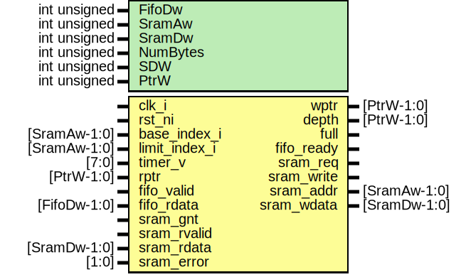

# Entity: spi_fwm_rxf_ctrl

- **File**: spi_fwm_rxf_ctrl.sv
## Diagram

## Description

 Copyright lowRISC contributors.
 Licensed under the Apache License, Version 2.0, see LICENSE for details.
 SPDX-License-Identifier: Apache-2.0

 Serial Peripheral Interface (SPI) Device module.

## Generics

| Generic name | Type         | Value            | Description         |
| ------------ | ------------ | ---------------- | ------------------- |
| FifoDw       | int unsigned | 8                |                     |
| SramAw       | int unsigned | 11               |                     |
| SramDw       | int unsigned | 32               |                     |
| NumBytes     | int unsigned | SramDw/FifoDw    |  derived parameter  |
| SDW          | int unsigned | $clog2(NumBytes) |  derived parameter  |
| PtrW         | int unsigned | SramAw + SDW + 1 |  derived parameter  |
## Ports

| Port name     | Direction | Type         | Description    |
| ------------- | --------- | ------------ | -------------- |
| clk_i         | input     |              |                |
| rst_ni        | input     |              |                |
| base_index_i  | input     | [SramAw-1:0] |  Configuration |
| limit_index_i | input     | [SramAw-1:0] |                |
| timer_v       | input     | [7:0]        |                |
| rptr          | input     | [PtrW-1:0]   |                |
| wptr          | output    | [PtrW-1:0]   |                |
| depth         | output    | [PtrW-1:0]   |                |
| full          | output    |              |                |
| fifo_valid    | input     |              |                |
| fifo_ready    | output    |              |                |
| fifo_rdata    | input     | [FifoDw-1:0] |                |
| sram_req      | output    |              |                |
| sram_write    | output    |              |                |
| sram_addr     | output    | [SramAw-1:0] |                |
| sram_wdata    | output    | [SramDw-1:0] |                |
| sram_gnt      | input     |              |                |
| sram_rvalid   | input     |              |                |
| sram_rdata    | input     | [SramDw-1:0] |                |
| sram_error    | input     | [1:0]        |                |
## Signals

| Name            | Type                 | Description                  |
| --------------- | -------------------- | ---------------------------- |
| byte_enable     | logic [NumBytes-1:0] |  Internal variable           |
| pos             | logic [SDW-1:0]      | current byte position        |
| cur_timer       | logic [7:0]          |                              |
| sramf_limit     | logic [SramAw-1:0]   |                              |
| sramf_full      | logic                | SRAM Fifo full               |
| full_sramwidth  | logic                | Write data filled full SRAM  |
| timer_expired   | logic                |                              |
| update_wdata    | logic                |  State output                |
| clr_byte_enable | logic                |                              |
| sram_req_d      | logic                |                              |
| sram_write_d    | logic                |                              |
| sram_wdata_sel  | logic                |                              |
| timer_rst       | logic                |                              |
| update_wptr     | logic                |                              |
| st_next         | state_e              |                              |
| st              | state_e              |                              |
| ptr_cmp         | logic [PtrW-1:0]     |                              |
## Constants

| Name     | Type         | Value            | Description        |
| -------- | ------------ | ---------------- | ------------------ |
| NumBytes | int unsigned | SramDw/FifoDw    | derived parameter  |
| SDW      | int unsigned | $clog2(NumBytes) | derived parameter  |
| PtrW     | int unsigned | SramAw + SDW + 1 | derived parameter  |
## Types

| Name    | Type                                                                                                                                                                                                                                                                                                                                                                                                                          | Description |
| ------- | ----------------------------------------------------------------------------------------------------------------------------------------------------------------------------------------------------------------------------------------------------------------------------------------------------------------------------------------------------------------------------------------------------------------------------- | ----------- |
| state_e | enum logic [2:0] {      StIdle   = 'h0,      StPop    = 'h1,      StWait   = 'h2,      StRead   = 'h3,      StModify = 'h4,      StWrite  = 'h5,      StUpdate = 'h6   } |             |
## Processes
- unnamed: ( @(posedge clk_i or negedge rst_ni) )
  - **Type:** always_ff
- unnamed: ( @(posedge clk_i or negedge rst_ni) )
  - **Type:** always_ff
**Description**
 Write pointer update 
- unnamed: (  )
  - **Type:** always_comb
**Description**
 Depth 
- unnamed: ( @(posedge clk_i or negedge rst_ni) )
  - **Type:** always_ff
**Description**
timer 
- unnamed: ( @(posedge clk_i or negedge rst_ni) )
  - **Type:** always_ff
**Description**
 Byte Enable control 
- unnamed: ( @(posedge clk_i or negedge rst_ni) )
  - **Type:** always_ff
- unnamed: (  )
  - **Type:** always_comb
**Description**
 If FIFO is not empty, initiate SRAM write.  As FIFOWidth and SRAM Width are different, RMW is required.  If host writes always DWord size, it is easy but it is not guaranteed.   Next State & output logic 
- unnamed: ( @(posedge clk_i or negedge rst_ni) )
  - **Type:** always_ff
