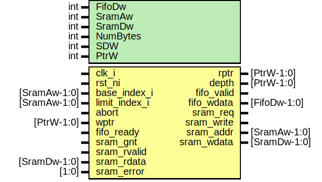

# Entity: spi_fwm_txf_ctrl
## Diagram

## Description
Copyright lowRISC contributors.
 Licensed under the Apache License, Version 2.0, see LICENSE for details.
 SPDX-License-Identifier: Apache-2.0
 Serial Peripheral Interface (SPI) Device module.
 
## Generics
| Generic name | Type | Value            | Description       |
| ------------ | ---- | ---------------- | ----------------- |
| FifoDw       | int  | 8                |                   |
| SramAw       | int  | 11               |                   |
| SramDw       | int  | 32               |                   |
| NumBytes     | int  | SramDw/FifoDw    | derived parameter |
| SDW          | int  | $clog2(NumBytes) | derived parameter |
| PtrW         | int  | SramAw + SDW + 1 | derived parameter |
## Ports
| Port name     | Direction | Type         | Description                              |
| ------------- | --------- | ------------ | ---------------------------------------- |
| clk_i         | input     |              |                                          |
| rst_ni        | input     |              |                                          |
| base_index_i  | input     | [SramAw-1:0] | Configuration                            |
| limit_index_i | input     | [SramAw-1:0] |                                          |
| abort         | input     |              | Abort State Machine if TX Async at stuck |
| wptr          | input     | [PtrW-1:0]   |                                          |
| rptr          | output    | [PtrW-1:0]   |                                          |
| depth         | output    | [PtrW-1:0]   |                                          |
| fifo_valid    | output    |              |                                          |
| fifo_ready    | input     |              |                                          |
| fifo_wdata    | output    | [FifoDw-1:0] |                                          |
| sram_req      | output    |              |                                          |
| sram_write    | output    |              |                                          |
| sram_addr     | output    | [SramAw-1:0] |                                          |
| sram_wdata    | output    | [SramDw-1:0] |                                          |
| sram_gnt      | input     |              |                                          |
| sram_rvalid   | input     |              |                                          |
| sram_rdata    | input     | [SramDw-1:0] |                                          |
| sram_error    | input     | [1:0]        |                                          |
## Signals
| Name         | Type               | Description                         |
| ------------ | ------------------ | ----------------------------------- |
| pos          | logic [SDW-1:0]    | Current write position              |
| sramf_limit  | logic [SramAw-1:0] |                                     |
| sram_rdata_q | logic [SramDw-1:0] |                                     |
| fifo_wdata_d | logic [SramDw-1:0] |                                     |
| wptr_q       | logic [PtrW-1:0]   |                                     |
| sramf_empty  | logic              | State input                         |
| cnt_eq_end   | logic              | pos goes 0 -> 1 -> 2 -> 3 -> then 0 |
| sram_req_d   | logic              | State output                        |
| update_rptr  | logic              |                                     |
| latch_wptr   | logic              |                                     |
| cnt_rst      | logic              | Reset pos to rptr[SDW-1:0] or 0     |
| cnt_incr     | logic              |                                     |
| txf_sel      | logic              | 0: sram_rdata, 1: sram_rdata_q      |
| st_next      | state_e            |                                     |
| st           | state_e            |                                     |
## Constants
| Name     | Type | Value            | Description       |
| -------- | ---- | ---------------- | ----------------- |
| NumBytes | int  | SramDw/FifoDw    | derived parameter |
| SDW      | int  | $clog2(NumBytes) | derived parameter |
| PtrW     | int  | SramAw + SDW + 1 | derived parameter |
## Types
| Name    | Type                                                                                                                      | Description |
| ------- | ------------------------------------------------------------------------------------------------------------------------- | ----------- |
| state_e | enum logic [2:0] {     StIdle   = 'h0,     StRead   = 'h1,     StLatch  = 'h2,     StPush   = 'h3,     StUpdate = 'h4   } |             |
## Processes
- unnamed: _( @(posedge clk_i or negedge rst_ni) )_

- unnamed: _(  )_
State Machine next , output logic

**Description**
State Machine next , output logic

- unnamed: _( @(posedge clk_i or negedge rst_ni) )_

- unnamed: _( @(posedge clk_i or negedge rst_ni) )_

- unnamed: _( @(posedge clk_i or negedge rst_ni) )_

- unnamed: _(  )_
Depth

**Description**
Depth

- unnamed: _( @(posedge clk_i or negedge rst_ni) )_

- unnamed: _( @(posedge clk_i or negedge rst_ni) )_

- unnamed: _(  )_

