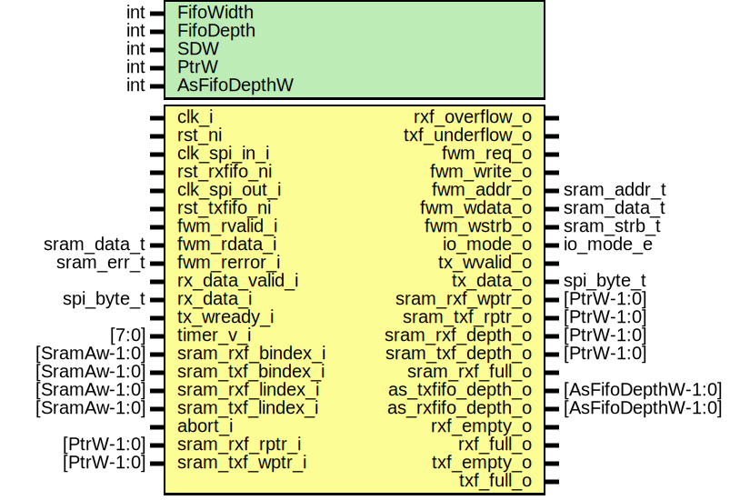

# Entity: spi_fwmode
## Diagram

## Description
Copyright lowRISC contributors.
 Licensed under the Apache License, Version 2.0, see LICENSE for details.
 SPDX-License-Identifier: Apache-2.0
 SPI FW Mode: Intention of this mode is to download FW image. Doesn't parse Commands
 
## Generics
| Generic name | Type | Value                    | Description |
| ------------ | ---- | ------------------------ | ----------- |
| FifoWidth    | int  | $bits(spi_byte_t)        |             |
| FifoDepth    | int  | 8                        |             |
| SDW          | int  | $clog2(SramDw/FifoWidth) |             |
| PtrW         | int  | SramAw + 1 + SDW         |             |
| AsFifoDepthW | int  | $clog2(FifoDepth+1)      |             |
## Ports
| Port name         | Direction | Type               | Description                                                                     |
| ----------------- | --------- | ------------------ | ------------------------------------------------------------------------------- |
| clk_i             | input     |                    | main peripheral clock                                                           |
| rst_ni            | input     |                    |                                                                                 |
| clk_spi_in_i      | input     |                    |                                                                                 |
| rst_rxfifo_ni     | input     |                    |                                                                                 |
| clk_spi_out_i     | input     |                    |                                                                                 |
| rst_txfifo_ni     | input     |                    |                                                                                 |
| rxf_overflow_o    | output    |                    | ConfigurationsNo sync logic. Configuration should be static when SPI operating  |
| txf_underflow_o   | output    |                    |                                                                                 |
| fwm_req_o         | output    |                    | SRAM interface                                                                  |
| fwm_write_o       | output    |                    |                                                                                 |
| fwm_addr_o        | output    | [SramAw-1:0]       |                                                                                 |
| fwm_wdata_o       | output    | [SramDw-1:0]       |                                                                                 |
| fwm_rvalid_i      | input     |                    |                                                                                 |
| fwm_rdata_i       | input     | [SramDw-1:0]       |                                                                                 |
| fwm_rerror_i      | input     | [1:0]              |                                                                                 |
| rx_data_valid_i   | input     |                    | Serial to Parallel                                                              |
| rx_data_i         | input     | spi_byte_t         |                                                                                 |
| io_mode_o         | output    | io_mode_e          |                                                                                 |
| tx_wvalid_o       | output    |                    | Parallel to SPI                                                                 |
| tx_data_o         | output    | spi_byte_t         |                                                                                 |
| tx_wready_i       | input     |                    |                                                                                 |
| timer_v_i         | input     | [7:0]              | Wait timer inside rxf control                                                   |
| sram_rxf_bindex_i | input     | [SramAw-1:0]       |                                                                                 |
| sram_txf_bindex_i | input     | [SramAw-1:0]       |                                                                                 |
| sram_rxf_lindex_i | input     | [SramAw-1:0]       |                                                                                 |
| sram_txf_lindex_i | input     | [SramAw-1:0]       |                                                                                 |
| abort_i           | input     |                    |                                                                                 |
| sram_rxf_rptr_i   | input     | [PtrW-1:0]         | pointers                                                                        |
| sram_rxf_wptr_o   | output    | [PtrW-1:0]         |                                                                                 |
| sram_txf_rptr_o   | output    | [PtrW-1:0]         |                                                                                 |
| sram_txf_wptr_i   | input     | [PtrW-1:0]         |                                                                                 |
| sram_rxf_depth_o  | output    | [PtrW-1:0]         |                                                                                 |
| sram_txf_depth_o  | output    | [PtrW-1:0]         |                                                                                 |
| sram_rxf_full_o   | output    |                    |                                                                                 |
| as_txfifo_depth_o | output    | [AsFifoDepthW-1:0] |                                                                                 |
| as_rxfifo_depth_o | output    | [AsFifoDepthW-1:0] |                                                                                 |
| rxf_empty_o       | output    |                    | FIFO Status                                                                     |
| rxf_full_o        | output    |                    |                                                                                 |
| txf_empty_o       | output    |                    |                                                                                 |
| txf_full_o        | output    |                    |                                                                                 |
## Signals
| Name            | Type               | Description                                     |
| --------------- | ------------------ | ----------------------------------------------- |
| rxf_wvalid      | logic              | RX Async FIFO Signals Write: SCK positive edge  |
| rxf_wready      | logic              | RX Async FIFO Signals Write: SCK positive edge  |
| rxf_wdata       | spi_byte_t         |                                                 |
| rxf_rvalid      | logic              | Read: Main clock                                |
| rxf_rready      | logic              | Read: Main clock                                |
| rxf_rdata       | spi_byte_t         |                                                 |
| txf_rvalid      | logic              | TX Async FIFO Signals Read: SCK negative edge   |
| txf_rready      | logic              | TX Async FIFO Signals Read: SCK negative edge   |
| txf_rdata       | spi_byte_t         |                                                 |
| txf_wvalid      | logic              | Write: Main clock                               |
| txf_wready      | logic              | Write: Main clock                               |
| txf_wdata       | spi_byte_t         |                                                 |
| fwm_sram_req    | logic        [1:0] |                                                 |
| fwm_sram_addr   | logic [SramAw-1:0] |                                                 |
| fwm_sram_write  | logic              |                                                 |
| fwm_sram_wdata  | logic [SramDw-1:0] |                                                 |
| fwm_sram_gnt    | logic        [1:0] |                                                 |
| fwm_sram_rvalid | logic        [1:0] | RXF doesn't use                                 |
| fwm_sram_rdata  | logic [SramDw-1:0] | RXF doesn't use                                 |
| fwm_sram_error  | logic        [1:0] |                                                 |
## Constants
| Name         | Type | Value                    | Description |
| ------------ | ---- | ------------------------ | ----------- |
| SDW          | int  | $clog2(SramDw/FifoWidth) |             |
| PtrW         | int  | SramAw + 1 + SDW         |             |
| AsFifoDepthW | int  | $clog2(FifoDepth+1)      |             |
## Types
| Name       | Type                                                              | Description        |
| ---------- | ----------------------------------------------------------------- | ------------------ |
| fwm_fifo_e | enum logic {     FwModeRxFifo = 1'b0,     FwModeTxFifo = 1'b1   } | SRAM FIFO control  |
## Instantiations
- u_rx_fifo: prim_fifo_async
**Description**
FIFO: Connecting FwMode to SRAM CTRLs

- u_tx_fifo: prim_fifo_async
- u_rxf_ctrl: spi_fwm_rxf_ctrl
**Description**
RX Fifo control (FIFO Read port --> SRAM request)

- u_txf_ctrl: spi_fwm_txf_ctrl
**Description**
TX Fifo control (SRAM read request --> FIFO write)

- u_fwmode_arb: prim_sram_arbiter
**Description**
Arbiter for FIFOs : Connecting between SRAM Ctrls and SRAM interface

