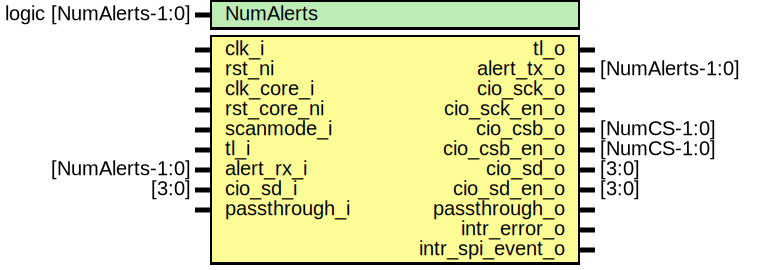

# Entity: spi_host

- **File**: spi_host.sv
## Diagram

## Description

 Copyright lowRISC contributors.
 Licensed under the Apache License, Version 2.0, see LICENSE for details.
 SPDX-License-Identifier: Apache-2.0

 Serial Peripheral Interface (SPI) Host module.

## Generics

| Generic name | Type                  | Value     | Description |
| ------------ | --------------------- | --------- | ----------- |
| NumAlerts    | logic [NumAlerts-1:0] | undefined |             |
## Ports

| Port name        | Direction | Type            | Description            |
| ---------------- | --------- | --------------- | ---------------------- |
| clk_i            | input     |                 |                        |
| rst_ni           | input     |                 |                        |
| clk_core_i       | input     |                 |                        |
| rst_core_ni      | input     |                 |                        |
| scanmode_i       | input     |                 |                        |
| tl_i             | input     |                 |  Register interface    |
| tl_o             | output    |                 |                        |
| alert_rx_i       | input     | [NumAlerts-1:0] |  Alerts                |
| alert_tx_o       | output    | [NumAlerts-1:0] |                        |
| cio_sck_o        | output    |                 |  SPI Interface         |
| cio_sck_en_o     | output    |                 |                        |
| cio_csb_o        | output    | [NumCS-1:0]     |                        |
| cio_csb_en_o     | output    | [NumCS-1:0]     |                        |
| cio_sd_o         | output    | [3:0]           |                        |
| cio_sd_en_o      | output    | [3:0]           |                        |
| cio_sd_i         | input     | [3:0]           |                        |
| passthrough_i    | input     |                 |  Passthrough interface |
| passthrough_o    | output    |                 |                        |
| intr_error_o     | output    |                 |                        |
| intr_spi_event_o | output    |                 |                        |
## Signals

| Name                  | Type                                                | Description                                                                                                                                                                                                                                                      |
| --------------------- | --------------------------------------------------- | ---------------------------------------------------------------------------------------------------------------------------------------------------------------------------------------------------------------------------------------------------------------- |
| reg2hw                | spi_host_reg2hw_t                                   |                                                                                                                                                                                                                                                                  |
| hw2reg                | spi_host_hw2reg_t                                   |                                                                                                                                                                                                                                                                  |
| fifo_win_h2d          | tlul_pkg::tl_h2d_t                                  |                                                                                                                                                                                                                                                                  |
| fifo_win_d2h          | tlul_pkg::tl_d2h_t                                  |                                                                                                                                                                                                                                                                  |
| alert_test            | logic [NumAlerts-1:0]                               |  Register module                                                                                                                                                                                                                                                 |
| alerts                | logic [NumAlerts-1:0]                               |  Register module                                                                                                                                                                                                                                                 |
| sck                   | logic                                               |                                                                                                                                                                                                                                                                  |
| csb                   | logic [NumCS-1:0]                                   |                                                                                                                                                                                                                                                                  |
| sd_out                | logic [3:0]                                         |                                                                                                                                                                                                                                                                  |
| sd_en                 | logic [3:0]                                         |                                                                                                                                                                                                                                                                  |
| sd_i                  | logic [3:0]                                         |                                                                                                                                                                                                                                                                  |
| unused_pt_sck_gate_en | logic                                               |                                                                                                                                                                                                                                                                  |
| unused_scan           | logic                                               |  TODO: REMOVE THIS CODE  Temp tie-offs to silence lint warnings                                                                                                                                                                                                  |
| command_valid         | logic                                               |                                                                                                                                                                                                                                                                  |
| core_command_valid    | logic                                               |                                                                                                                                                                                                                                                                  |
| command_busy          | logic                                               |                                                                                                                                                                                                                                                                  |
| core_command_ready    | logic                                               |                                                                                                                                                                                                                                                                  |
| core_command          | command_t                                           |                                                                                                                                                                                                                                                                  |
| command               | command_t                                           |                                                                                                                                                                                                                                                                  |
| error_csid_inval      | logic                                               |                                                                                                                                                                                                                                                                  |
| error_cmd_inval       | logic                                               |                                                                                                                                                                                                                                                                  |
| error_busy            | logic                                               |                                                                                                                                                                                                                                                                  |
| test_csid_inval       | logic                                               |                                                                                                                                                                                                                                                                  |
| test_dir_inval        | logic                                               |                                                                                                                                                                                                                                                                  |
| test_speed_inval      | logic                                               |                                                                                                                                                                                                                                                                  |
| configopts            | spi_host_reg_pkg::spi_host_reg2hw_configopts_mreg_t |                                                                                                                                                                                                                                                                  |
| cmd_qes               | logic [3:0]                                         |                                                                                                                                                                                                                                                                  |
| active                | logic                                               |  TODO: Determine the correct way to trigger a command.  The following assertion confirms that at lease in  some cases, the writes to COMMAND are not atomic.   Disabling this assertion for now `ASSERT(CmdAtomicity_A, &cmd_qes ^ |cmd_qes, clk_i, rst_ni);  |
| core_active           | logic                                               |  TODO: Determine the correct way to trigger a command.  The following assertion confirms that at lease in  some cases, the writes to COMMAND are not atomic.   Disabling this assertion for now `ASSERT(CmdAtomicity_A, &cmd_qes ^ |cmd_qes, clk_i, rst_ni);  |
| rx_stall              | logic                                               |                                                                                                                                                                                                                                                                  |
| core_rx_stall         | logic                                               |                                                                                                                                                                                                                                                                  |
| tx_stall              | logic                                               |                                                                                                                                                                                                                                                                  |
| core_tx_stall         | logic                                               |                                                                                                                                                                                                                                                                  |
| sw_rst                | logic                                               |                                                                                                                                                                                                                                                                  |
| core_sw_rst           | logic                                               |                                                                                                                                                                                                                                                                  |
| tx_data               | logic [31:0]                                        |                                                                                                                                                                                                                                                                  |
| tx_be                 | logic [3:0]                                         |                                                                                                                                                                                                                                                                  |
| tx_valid              | logic                                               |                                                                                                                                                                                                                                                                  |
| tx_ready              | logic                                               |                                                                                                                                                                                                                                                                  |
| rx_data               | logic [31:0]                                        |                                                                                                                                                                                                                                                                  |
| rx_valid              | logic                                               |                                                                                                                                                                                                                                                                  |
| rx_ready              | logic                                               |                                                                                                                                                                                                                                                                  |
| core_tx_data          | logic [31:0]                                        |                                                                                                                                                                                                                                                                  |
| core_tx_be            | logic [3:0]                                         |                                                                                                                                                                                                                                                                  |
| core_tx_valid         | logic                                               |                                                                                                                                                                                                                                                                  |
| core_tx_ready         | logic                                               |                                                                                                                                                                                                                                                                  |
| core_rx_data          | logic [31:0]                                        |                                                                                                                                                                                                                                                                  |
| core_rx_valid         | logic                                               |                                                                                                                                                                                                                                                                  |
| core_rx_ready         | logic                                               |                                                                                                                                                                                                                                                                  |
| rx_watermark          | logic [7:0]                                         |                                                                                                                                                                                                                                                                  |
| tx_watermark          | logic [7:0]                                         |                                                                                                                                                                                                                                                                  |
| rx_qd                 | logic [7:0]                                         |                                                                                                                                                                                                                                                                  |
| tx_qd                 | logic [7:0]                                         |                                                                                                                                                                                                                                                                  |
| tx_empty              | logic                                               |                                                                                                                                                                                                                                                                  |
| tx_full               | logic                                               |                                                                                                                                                                                                                                                                  |
| tx_wm                 | logic                                               |                                                                                                                                                                                                                                                                  |
| rx_empty              | logic                                               |                                                                                                                                                                                                                                                                  |
| rx_full               | logic                                               |                                                                                                                                                                                                                                                                  |
| rx_wm                 | logic                                               |                                                                                                                                                                                                                                                                  |
| error_overflow        | logic                                               |                                                                                                                                                                                                                                                                  |
| error_underflow       | logic                                               |                                                                                                                                                                                                                                                                  |
| en_sw                 | logic                                               |  CDCs for a handful of continuous or pulsed control and status signals                                                                                                                                                                                           |
| enb_error             | logic                                               |                                                                                                                                                                                                                                                                  |
| en                    | logic                                               |                                                                                                                                                                                                                                                                  |
| core_en               | logic                                               |                                                                                                                                                                                                                                                                  |
| event_error           | logic                                               |                                                                                                                                                                                                                                                                  |
| error_vec             | logic [4:0]                                         |                                                                                                                                                                                                                                                                  |
| error_mask            | logic [4:0]                                         |                                                                                                                                                                                                                                                                  |
| sw_error_status       | logic [4:0]                                         |                                                                                                                                                                                                                                                                  |
| event_spi_event       | logic                                               |                                                                                                                                                                                                                                                                  |
| event_idle            | logic                                               |                                                                                                                                                                                                                                                                  |
| event_ready           | logic                                               |                                                                                                                                                                                                                                                                  |
| event_tx_wm           | logic                                               |                                                                                                                                                                                                                                                                  |
| event_rx_wm           | logic                                               |                                                                                                                                                                                                                                                                  |
| event_tx_empty        | logic                                               |                                                                                                                                                                                                                                                                  |
| event_rx_full         | logic                                               |                                                                                                                                                                                                                                                                  |
| event_vector          | logic [5:0]                                         |                                                                                                                                                                                                                                                                  |
| event_mask            | logic [5:0]                                         |                                                                                                                                                                                                                                                                  |
| idle_d                | logic                                               |                                                                                                                                                                                                                                                                  |
| idle_q                | logic                                               |                                                                                                                                                                                                                                                                  |
| ready_d               | logic                                               |                                                                                                                                                                                                                                                                  |
| ready_q               | logic                                               |                                                                                                                                                                                                                                                                  |
| tx_wm_d               | logic                                               |                                                                                                                                                                                                                                                                  |
| tx_wm_q               | logic                                               |                                                                                                                                                                                                                                                                  |
| rx_wm_d               | logic                                               |                                                                                                                                                                                                                                                                  |
| rx_wm_q               | logic                                               |                                                                                                                                                                                                                                                                  |
| tx_empty_d            | logic                                               |                                                                                                                                                                                                                                                                  |
| tx_empty_q            | logic                                               |                                                                                                                                                                                                                                                                  |
| rx_full_d             | logic                                               |                                                                                                                                                                                                                                                                  |
| rx_full_q             | logic                                               |                                                                                                                                                                                                                                                                  |
## Processes
- unnamed: (  )
  - **Type:** always_comb
- unnamed: (  )
  - **Type:** always_comb
- unnamed: ( @(posedge clk_i or negedge rst_ni) )
  - **Type:** always_ff
## Instantiations

- u_reg: spi_host_reg_top
- u_cmd_cdc: spi_host_command_cdc
- u_window: spi_host_window
- u_data_cdc: spi_host_data_cdc
 **Description**
 Note on ByteOrder and ByteSwapping.
 ByteOrder == 1 is for Little-Endian transmission (i.e. LSB first), which is acheived by default
 with the prim_packer_fifo implementation.  Thus we have to swap if Big-Endian transmission
 is required (i.e. if ByteOrder == 0).

- u_sync_stat_from_core: prim_flop_2sync
- u_sync_en_to_core: prim_flop_2sync
- u_spi_core: spi_host_core
- intr_hw_error: prim_intr_hw
- intr_hw_spi_event: prim_intr_hw
