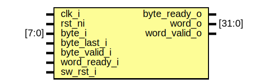

# Entity: spi_host_byte_merge

## Diagram

## Description

Copyright lowRISC contributors.
 Licensed under the Apache License, Version 2.0, see LICENSE for details.
 SPDX-License-Identifier: Apache-2.0
 Byte-merge module for collecting words in SPI Host IP
 
## Ports

| Port name    | Direction | Type   | Description |
| ------------ | --------- | ------ | ----------- |
| clk_i        | input     |        |             |
| rst_ni       | input     |        |             |
| byte_i       | input     | [7:0]  |             |
| byte_last_i  | input     |        |             |
| byte_valid_i | input     |        |             |
| byte_ready_o | output    |        |             |
| word_o       | output    | [31:0] |             |
| word_valid_o | output    |        |             |
| word_ready_i | input     |        |             |
| sw_rst_i     | input     |        |             |
## Signals

| Name          | Type  | Description |
| ------------- | ----- | ----------- |
| clr           | logic |             |
| byte_valid    | logic |             |
| byte_ready    | logic |             |
| last_q        | logic |             |
| last_d        | logic |             |
| do_fill       | logic |             |
| byte_incoming | logic |             |
## Processes
- unnamed: ( @(posedge clk_i or negedge rst_ni) )
## Instantiations

- u_packer: prim_packer_fifo
