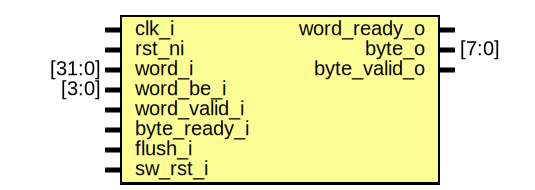

# Entity: spi_host_byte_select

## Diagram

## Description

Copyright lowRISC contributors.
 Licensed under the Apache License, Version 2.0, see LICENSE for details.
 SPDX-License-Identifier: Apache-2.0
 Byte-select module for dispensing words in SPI Host IP
 
## Ports

| Port name    | Direction | Type   | Description |
| ------------ | --------- | ------ | ----------- |
| clk_i        | input     |        |             |
| rst_ni       | input     |        |             |
| word_i       | input     | [31:0] |             |
| word_be_i    | input     | [3:0]  |             |
| word_valid_i | input     |        |             |
| word_ready_o | output    |        |             |
| byte_o       | output    | [7:0]  |             |
| byte_valid_o | output    |        |             |
| byte_ready_i | input     |        |             |
| flush_i      | input     |        |             |
| sw_rst_i     | input     |        |             |
## Signals

| Name       | Type               | Description |
| ---------- | ------------------ | ----------- |
| wdata_be   | logic       [35:0] |             |
| do_drain   | logic              |             |
| byte_en    | logic              |             |
| byte_valid | logic              |             |
| byte_ready | logic              |             |
| clr        | logic              |             |
## Instantiations

- u_packer: prim_packer_fifo
