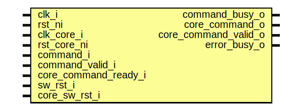

# Entity: spi_host_command_cdc

## Diagram

## Description

Copyright lowRISC contributors.
 Licensed under the Apache License, Version 2.0, see LICENSE for details.
 SPDX-License-Identifier: Apache-2.0
 CDC module for SPI_HOST commands
 
## Ports

| Port name            | Direction | Type | Description |
| -------------------- | --------- | ---- | ----------- |
| clk_i                | input     |      |             |
| rst_ni               | input     |      |             |
| clk_core_i           | input     |      |             |
| rst_core_ni          | input     |      |             |
| command_i            | input     |      |             |
| command_valid_i      | input     |      |             |
| command_busy_o       | output    |      |             |
| core_command_o       | output    |      |             |
| core_command_valid_o | output    |      |             |
| core_command_ready_i | input     |      |             |
| error_busy_o         | output    |      |             |
| sw_rst_i             | input     |      |             |
| core_sw_rst_i        | input     |      |             |
## Signals

| Name         | Type                                  | Description                                                                                     |
| ------------ | ------------------------------------- | ----------------------------------------------------------------------------------------------- |
| command_ack  | logic                                 |                                                                                                 |
| command_q    | logic [spi_host_cmd_pkg::CmdSize-1:0] |                                                                                                 |
| command_d    | logic [spi_host_cmd_pkg::CmdSize-1:0] |                                                                                                 |
| cdc_req_q    | logic                                 |                                                                                                 |
| cdc_req_d    | logic                                 |                                                                                                 |
| cdc_ack      | logic                                 |                                                                                                 |
| core_cdc_req | logic                                 | When sw_rst is established, let the handshake end passively by always acknowledging when valid  |
| core_cdc_ack | logic                                 |                                                                                                 |
## Processes
- unnamed: ( @(posedge clk_i or negedge rst_ni) )
## Instantiations

- u_sync_reqack: prim_sync_reqack_data
