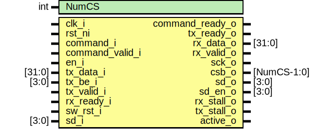

# Entity: spi_host_core

- **File**: spi_host_core.sv
## Diagram

## Description

Copyright lowRISC contributors.
 Licensed under the Apache License, Version 2.0, see LICENSE for details.
 SPDX-License-Identifier: Apache-2.0
 Core Implemenation module for Serial Peripheral Interface (SPI) Host IP.
 
## Generics

| Generic name | Type | Value | Description |
| ------------ | ---- | ----- | ----------- |
| NumCS        | int  | 1     |             |
## Ports

| Port name       | Direction | Type        | Description   |
| --------------- | --------- | ----------- | ------------- |
| clk_i           | input     |             |               |
| rst_ni          | input     |             |               |
| command_i       | input     |             |               |
| command_valid_i | input     |             |               |
| command_ready_o | output    |             |               |
| en_i            | input     |             |               |
| tx_data_i       | input     | [31:0]      |               |
| tx_be_i         | input     | [3:0]       |               |
| tx_valid_i      | input     |             |               |
| tx_ready_o      | output    |             |               |
| rx_data_o       | output    | [31:0]      |               |
| rx_valid_o      | output    |             |               |
| rx_ready_i      | input     |             |               |
| sw_rst_i        | input     |             |               |
| sck_o           | output    |             | SPI Interface |
| csb_o           | output    | [NumCS-1:0] |               |
| sd_o            | output    | [3:0]       |               |
| sd_en_o         | output    | [3:0]       |               |
| sd_i            | input     | [3:0]       |               |
| rx_stall_o      | output    |             | Status bits   |
| tx_stall_o      | output    |             |               |
| active_o        | output    |             |               |
## Signals

| Name        | Type        | Description |
| ----------- | ----------- | ----------- |
| rx_valid_sr | logic       |             |
| rx_ready_sr | logic       |             |
| rx_last_sr  | logic       |             |
| rx_data_sr  | logic [7:0] |             |
| tx_valid_sr | logic       |             |
| tx_ready_sr | logic       |             |
| tx_flush_sr | logic       |             |
| tx_data_sr  | logic [7:0] |             |
| wr_en       | logic       |             |
| rd_en       | logic       |             |
| wr_ready    | logic       |             |
| rd_ready    | logic       |             |
| sample_en   | logic       |             |
| shift_en    | logic       |             |
| speed       | logic [1:0] |             |
| full_cyc    | logic       |             |
| cmd_end     | logic       |             |
## Instantiations

- u_merge: spi_host_byte_merge
- u_select: spi_host_byte_select
- u_shift_reg: spi_host_shift_register
- u_fsm: spi_host_fsm
