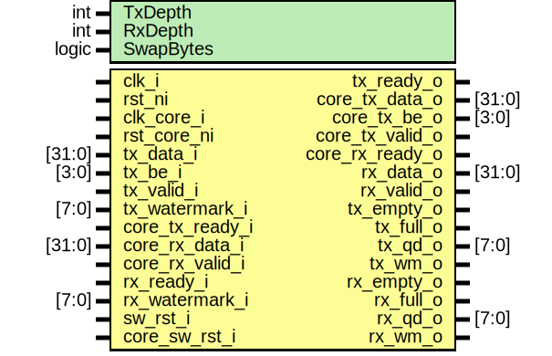

# Entity: spi_host_data_cdc

- **File**: spi_host_data_cdc.sv
## Diagram

## Description

Copyright lowRISC contributors.
 Licensed under the Apache License, Version 2.0, see LICENSE for details.
 SPDX-License-Identifier: Apache-2.0
 CDC module for SPI_HOST RX and TX data
 
## Generics

| Generic name | Type  | Value | Description |
| ------------ | ----- | ----- | ----------- |
| TxDepth      | int   | 72    |             |
| RxDepth      | int   | 64    |             |
| SwapBytes    | logic | 0     |             |
## Ports

| Port name       | Direction | Type   | Description |
| --------------- | --------- | ------ | ----------- |
| clk_i           | input     |        |             |
| rst_ni          | input     |        |             |
| clk_core_i      | input     |        |             |
| rst_core_ni     | input     |        |             |
| tx_data_i       | input     | [31:0] |             |
| tx_be_i         | input     | [3:0]  |             |
| tx_valid_i      | input     |        |             |
| tx_ready_o      | output    |        |             |
| tx_watermark_i  | input     | [7:0]  |             |
| core_tx_data_o  | output    | [31:0] |             |
| core_tx_be_o    | output    | [3:0]  |             |
| core_tx_valid_o | output    |        |             |
| core_tx_ready_i | input     |        |             |
| core_rx_data_i  | input     | [31:0] |             |
| core_rx_valid_i | input     |        |             |
| core_rx_ready_o | output    |        |             |
| rx_data_o       | output    | [31:0] |             |
| rx_valid_o      | output    |        |             |
| rx_ready_i      | input     |        |             |
| rx_watermark_i  | input     | [7:0]  |             |
| sw_rst_i        | input     |        |             |
| core_sw_rst_i   | input     |        |             |
| tx_empty_o      | output    |        |             |
| tx_full_o       | output    |        |             |
| tx_qd_o         | output    | [7:0]  |             |
| tx_wm_o         | output    |        |             |
| rx_empty_o      | output    |        |             |
| rx_full_o       | output    |        |             |
| rx_qd_o         | output    | [7:0]  |             |
| rx_wm_o         | output    |        |             |
## Signals

| Name                  | Type                      | Description                     |
| --------------------- | ------------------------- | ------------------------------- |
| tx_data_ordered       | logic [31:0]              |                                 |
| tx_be_ordered         | logic [3:0]               |                                 |
| rx_data_unordered     | logic [31:0]              |                                 |
| tx_data_be            | logic [35:0]              |                                 |
| core_tx_data_be       | logic [35:0]              |                                 |
| tx_data_be_async_fifo | logic [35:0]              | I/O connections to async fifos  |
| tx_valid_async_fifo   | logic                     |                                 |
| tx_ready_async_fifo   | logic                     |                                 |
| rx_data_async_fifo    | logic [31:0]              |                                 |
| rx_valid_async_fifo   | logic                     |                                 |
| rx_ready_async_fifo   | logic                     |                                 |
| tx_depth_async_fifo   | logic [TxAsyncDepthW-1:0] |                                 |
| rx_depth_async_fifo   | logic [RxAsyncDepthW-1:0] |                                 |
| tx_depth_total        | logic [7:0]               |                                 |
| rx_depth_total        | logic [7:0]               |                                 |
## Constants

| Name            | Type  | Value                               | Description |
| --------------- | ----- | ----------------------------------- | ----------- |
| TxDepthW        | int   | $clog2(TxDepth)                     |             |
| RxDepthW        | int   | $clog2(RxDepth)                     |             |
| TxAsyncOnlyFifo | logic | undefined                           |             |
| RxAsyncOnlyFifo | logic | undefined                           |             |
| TxAsyncDepth    | int   | TxAsyncOnlyFifo ? 2**TxDepthW       |             |
| RxAsyncDepth    | int   | RxAsyncOnlyFifo ? 2**RxDepthW       |             |
| TxSyncDepth     | int   | TxDepth - TxAsyncDepth              |             |
| RxSyncDepth     | int   | RxDepth - RxAsyncDepth              |             |
| TxAsyncDepthW   | int   | prim_util_pkg::vbits(TxAsyncDepth+1 |             |
| RxAsyncDepthW   | int   | prim_util_pkg::vbits(RxAsyncDepth+1 |             |
| TxSyncDepthW    | int   | prim_util_pkg::vbits(TxSyncDepth+1  |             |
| RxSyncDepthW    | int   | prim_util_pkg::vbits(RxSyncDepth+1  |             |
## Instantiations

- u_tx_async_fifo: prim_fifo_async
**Description**
TODO: Establish better sw_rst technique
Given the lack of external clear sw_rst just drains the fifo over ~64 clocks

- u_rx_async_fifo: prim_fifo_async
