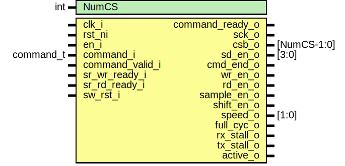

# Entity: spi_host_fsm

## Diagram

## Description

Copyright lowRISC contributors.
 Licensed under the Apache License, Version 2.0, see LICENSE for details.
 SPDX-License-Identifier: Apache-2.0
 Core Implemenation module for Serial Peripheral Interface (SPI) Host IP.
 
## Generics

| Generic name | Type | Value | Description |
| ------------ | ---- | ----- | ----------- |
| NumCS        | int  | 1     |             |
## Ports

| Port name       | Direction | Type        | Description |
| --------------- | --------- | ----------- | ----------- |
| clk_i           | input     |             |             |
| rst_ni          | input     |             |             |
| en_i            | input     |             |             |
| command_i       | input     | command_t   |             |
| command_valid_i | input     |             |             |
| command_ready_o | output    |             |             |
| sck_o           | output    |             |             |
| csb_o           | output    | [NumCS-1:0] |             |
| sd_en_o         | output    | [3:0]       |             |
| cmd_end_o       | output    |             |             |
| wr_en_o         | output    |             |             |
| sr_wr_ready_i   | input     |             |             |
| rd_en_o         | output    |             |             |
| sr_rd_ready_i   | input     |             |             |
| sample_en_o     | output    |             |             |
| shift_en_o      | output    |             |             |
| speed_o         | output    | [1:0]       |             |
| full_cyc_o      | output    |             |             |
| rx_stall_o      | output    |             |             |
| tx_stall_o      | output    |             |             |
| active_o        | output    |             |             |
| sw_rst_i        | input     |             |             |
## Signals

| Name                | Type              | Description                                                                                                                                                   |
| ------------------- | ----------------- | ------------------------------------------------------------------------------------------------------------------------------------------------------------- |
| isIdle              | logic             |                                                                                                                                                               |
| clkdiv              | logic [15:0]      |                                                                                                                                                               |
| clkdiv_q            | logic [15:0]      |                                                                                                                                                               |
| clk_cntr_q          | logic [15:0]      |                                                                                                                                                               |
| clk_cntr_d          | logic [15:0]      |                                                                                                                                                               |
| clk_cntr_en         | logic             |                                                                                                                                                               |
| csid                | logic [CSW-1:0]   |                                                                                                                                                               |
| csid_q              | logic [CSW-1:0]   |                                                                                                                                                               |
| csnidle             | logic [3:0]       |                                                                                                                                                               |
| csntrail            | logic [3:0]       |                                                                                                                                                               |
| csnlead             | logic [3:0]       |                                                                                                                                                               |
| csnidle_q           | logic [3:0]       |                                                                                                                                                               |
| csntrail_q          | logic [3:0]       |                                                                                                                                                               |
| csnlead_q           | logic [3:0]       |                                                                                                                                                               |
| full_cyc            | logic             |                                                                                                                                                               |
| cpha                | logic             |                                                                                                                                                               |
| cpol                | logic             |                                                                                                                                                               |
| full_cyc_q          | logic             |                                                                                                                                                               |
| cpha_q              | logic             |                                                                                                                                                               |
| cpol_q              | logic             |                                                                                                                                                               |
| cmd_speed           | logic [1:0]       |                                                                                                                                                               |
| cmd_speed_q         | logic [1:0]       |                                                                                                                                                               |
| cmd_wr_en           | logic             |                                                                                                                                                               |
| cmd_wr_en_q         | logic             |                                                                                                                                                               |
| cmd_rd_en           | logic             |                                                                                                                                                               |
| cmd_rd_en_q         | logic             |                                                                                                                                                               |
| cmd_len             | logic [8:0]       | cmd_len needs no data latching as it is only used at the very start of a command. The corresponding register, cmd_len_q, would create a warning at synthesis  |
| csaat               | logic             |                                                                                                                                                               |
| csaat_q             | logic             |                                                                                                                                                               |
| bit_cntr_d          | logic [2:0]       |                                                                                                                                                               |
| bit_cntr_q          | logic [2:0]       |                                                                                                                                                               |
| byte_cntr_d         | logic [8:0]       |                                                                                                                                                               |
| byte_cntr_q         | logic [8:0]       |                                                                                                                                                               |
| lead_cntr_d         | logic [3:0]       |                                                                                                                                                               |
| idle_cntr_d         | logic [3:0]       |                                                                                                                                                               |
| trail_cntr_d        | logic [3:0]       |                                                                                                                                                               |
| lead_cntr_q         | logic [3:0]       |                                                                                                                                                               |
| idle_cntr_q         | logic [3:0]       |                                                                                                                                                               |
| trail_cntr_q        | logic [3:0]       |                                                                                                                                                               |
| last_bit            | logic             |                                                                                                                                                               |
| last_byte           | logic             |                                                                                                                                                               |
| state_changing      | logic             |                                                                                                                                                               |
| byte_starting       | logic             |                                                                                                                                                               |
| byte_starting_cpha0 | logic             |                                                                                                                                                               |
| byte_starting_cpha1 | logic             |                                                                                                                                                               |
| bit_shifting        | logic             |                                                                                                                                                               |
| bit_shifting_cpha0  | logic             |                                                                                                                                                               |
| bit_shifting_cpha1  | logic             |                                                                                                                                                               |
| byte_ending         | logic             |                                                                                                                                                               |
| byte_ending_cpha0   | logic             |                                                                                                                                                               |
| byte_ending_cpha1   | logic             |                                                                                                                                                               |
| lead_starting       | logic             |                                                                                                                                                               |
| trail_starting      | logic             |                                                                                                                                                               |
| idle_starting       | logic             |                                                                                                                                                               |
| sample_en_d         | logic             |                                                                                                                                                               |
| sample_en_q         | logic             |                                                                                                                                                               |
| sample_en_q2        | logic             |                                                                                                                                                               |
| switch_required     | logic             |                                                                                                                                                               |
| fsm_en              | logic             |                                                                                                                                                               |
| new_command         | logic             |                                                                                                                                                               |
| csb_single_d        | logic             |                                                                                                                                                               |
| csb_q               | logic [NumCS-1:0] |                                                                                                                                                               |
| sck_d               | logic             |                                                                                                                                                               |
| sck_q               | logic             |                                                                                                                                                               |
| wr_en_internal      | logic             |                                                                                                                                                               |
| rd_en_internal      | logic             |                                                                                                                                                               |
| sample_en_internal  | logic             |                                                                                                                                                               |
| shift_en_internal   | logic             |                                                                                                                                                               |
| stall               | logic             |                                                                                                                                                               |
| spi_host_st_q       | spi_host_st_e     |                                                                                                                                                               |
| spi_host_st_d       | spi_host_st_e     |                                                                                                                                                               |
| shift_size          | logic [2:0]       |                                                                                                                                                               |
| start_bit           | logic [2:0]       |                                                                                                                                                               |
## Types

| Name          | Type                                                                                                                                                  | Description |
| ------------- | ----------------------------------------------------------------------------------------------------------------------------------------------------- | ----------- |
| spi_host_st_e | enum logic [2:0] {     Idle,     WaitLead,     InternalClkLow,     InternalClkHigh,     WaitTrail,     WaitIdle,     CSBSwitch,     IdleCSBActive   } |             |
## Processes
- unnamed: (  )
- unnamed: ( @(posedge clk_i or negedge rst_ni) )
- unnamed: (  )
- unnamed: ( @(posedge clk_i or negedge rst_ni) )
**Description**
All register updates freeze when a stall is detected.
The definition of the stall signal looks ahead to determine whether a conflict is looming.
Thus stall depends on spi_host_st_d.  Making spi_host_st_d depend on stall
would create a circular logic loop, and lint errors.  Therefore stall is applied here, not
in the previous always_comb block;

- unnamed: ( @(posedge clk_i or negedge rst_ni) )
**Description**
We can calculate byte transitions for CHPA=1 by noting
that in this implmentation, the sck edges have a 1-1
correspondence with FSM transitions.
New bytes are loaded exactly one state transition behind the time
when they would be loaded if CPHA=0

- unnamed: (  )
- unnamed: ( @(posedge clk_i or negedge rst_ni) )
- unnamed: ( @(posedge clk_i or negedge rst_ni) )
- unnamed: (  )
- unnamed: (  )
