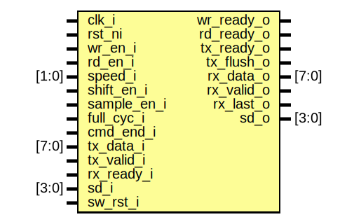

# Entity: spi_host_shift_register

## Diagram

## Description

Copyright lowRISC contributors.
 Licensed under the Apache License, Version 2.0, see LICENSE for details.
 SPDX-License-Identifier: Apache-2.0
 Shift Register for Serial Peripheral Interface (SPI) Host IP.
 
## Ports

| Port name   | Direction | Type  | Description |
| ----------- | --------- | ----- | ----------- |
| clk_i       | input     |       |             |
| rst_ni      | input     |       |             |
| wr_en_i     | input     |       |             |
| wr_ready_o  | output    |       |             |
| rd_en_i     | input     |       |             |
| rd_ready_o  | output    |       |             |
| speed_i     | input     | [1:0] |             |
| shift_en_i  | input     |       |             |
| sample_en_i | input     |       |             |
| full_cyc_i  | input     |       |             |
| cmd_end_i   | input     |       |             |
| tx_data_i   | input     | [7:0] |             |
| tx_valid_i  | input     |       |             |
| tx_ready_o  | output    |       |             |
| tx_flush_o  | output    |       |             |
| rx_data_o   | output    | [7:0] |             |
| rx_valid_o  | output    |       |             |
| rx_ready_i  | input     |       |             |
| rx_last_o   | output    |       |             |
| sd_i        | input     | [3:0] |             |
| sd_o        | output    | [3:0] |             |
| sw_rst_i    | input     |       |             |
## Signals

| Name           | Type               | Description                                                                                                   |
| -------------- | ------------------ | ------------------------------------------------------------------------------------------------------------- |
| sr_q           | logic        [7:0] |                                                                                                               |
| sr_d           | logic        [7:0] |                                                                                                               |
| sd_i_q         | logic        [3:0] |                                                                                                               |
| sd_i_d         | logic        [3:0] |                                                                                                               |
| next_bits      | logic        [3:0] |                                                                                                               |
| sr_shifted     | logic        [7:0] |                                                                                                               |
| rx_buf_q       | logic        [8:0] | 9-bit buffer to hold shift register data and the cmd_end bit to indicate whether it is the last in a series.  |
| rx_buf_d       | logic        [8:0] |                                                                                                               |
| rx_buf_valid_q | logic              |                                                                                                               |
| rx_buf_valid_d | logic              |                                                                                                               |
## Processes
- unnamed: ( @(posedge clk_i or negedge rst_ni) )
