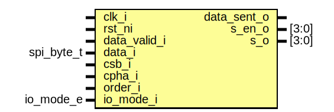

# Entity: spi_p2s

- **File**: spi_p2s.sv
## Diagram

## Description

 Copyright lowRISC contributors.
 Licensed under the Apache License, Version 2.0, see LICENSE for details.
 SPDX-License-Identifier: Apache-2.0

 SPI byte to SPI (Single/ Dual/ Quad)

## Ports

| Port name    | Direction | Type       | Description                                                                                                                               |
| ------------ | --------- | ---------- | ----------------------------------------------------------------------------------------------------------------------------------------- |
| clk_i        | input     |            |                                                                                                                                           |
| rst_ni       | input     |            |                                                                                                                                           |
| data_valid_i | input     |            |  Input byte interface                                                                                                                     |
| data_i       | input     | spi_byte_t |                                                                                                                                           |
| data_sent_o  | output    |            |                                                                                                                                           |
| csb_i        | input     |            | for line floating                                                                                                                         |
| s_en_o       | output    | [3:0]      |                                                                                                                                           |
| s_o          | output    | [3:0]      |                                                                                                                                           |
| cpha_i       | input     |            |  Configuration If CPHA=1, then the first byte should be delayed.  But this does not matter in SPI Flash. Only applicable to Generic mode  |
| order_i      | input     |            |  Control txorder: controls which bit goes out first.                                                                                      |
| io_mode_i    | input     | io_mode_e  |  IO mode                                                                                                                                  |
## Signals

| Name        | Type        | Description                                                                                                                                                                               |
| ----------- | ----------- | ----------------------------------------------------------------------------------------------------------------------------------------------------------------------------------------- |
| tx_state    | tx_state_e  | Only for handling CPHA                                                                                                                                                                    |
| io_mode     | io_mode_e   |  Latching io_mode_i when last beat is set.  This guarantees cnt not abruptly changed during operation  which affects `last_beat` again.                                                   |
| first_beat  | logic       |  in Mode3, the logic skips first clock edge to move to next bit.  This is not necessary for Flash / Passthrough mode. But Generic mode  sends the data through TX line right after reset  |
| last_beat   | logic       |  in Mode3, the logic skips first clock edge to move to next bit.  This is not necessary for Flash / Passthrough mode. But Generic mode  sends the data through TX line right after reset  |
| cnt         | count_t     |                                                                                                                                                                                           |
| out_enable  | logic [3:0] |                                                                                                                                                                                           |
| out_shift   | spi_byte_t  |                                                                                                                                                                                           |
| out_shift_d | spi_byte_t  |                                                                                                                                                                                           |
## Constants

| Name     | Type         | Value             | Description                                   |
| -------- | ------------ | ----------------- | --------------------------------------------- |
| Bits     | int unsigned | $bits(spi_byte_t) | //////////////  Definition // //////////////  |
| BitWidth | int unsigned | $clog2(Bits)      |                                               |
## Types

| Name       | Type                                                                                                              | Description |
| ---------- | ----------------------------------------------------------------------------------------------------------------- | ----------- |
| count_t    | logic [BitWidth-1:0]                                                                                              |             |
| tx_state_e | enum logic {      TxIdle,      TxActive   } |             |
## Processes
- unnamed: (  )
  - **Type:** always_comb
 **Description**
 Enable selection  in Single mode, line 1 is for output.  in Dual mode, line 0:1 are for output  in Quad mode, all lines 0:3 are for output. 
- unnamed: (  )
  - **Type:** always_comb
 **Description**
 `data_sent`  Popping signal is a little bit tricky if p2s supports Quad IO  The sent signal cannot be sent at the end of the beat, as it does not have  enought time to affect the FIFO.   If the sent signal asserted at the first beat, at the very first byte of  SPI has no time to assert valid signal. So the sent signal does not affect  the FIFO. So the logic sends first byte twice.   This won't affect in Flash mode as in Flash/Passthrough mode, first byte is  always SPI command. It does not send anything on the SPI bus.   So, the logic generating `sent` signal looks not straightforward. It tries  assert second last beat. So, in SingleIO (right after reset always), it  asserts at 7th beat. Then the mode could be changed to Dual/ Quad. 
- unnamed: ( @(posedge clk_i) )
  - **Type:** always_ff
 **Description**
 data shift 
- unnamed: (  )
  - **Type:** always_comb
 **Description**
 SPI out 
- unnamed: ( @(posedge clk_i or negedge rst_ni) )
  - **Type:** always_ff
 **Description**
 io_mode  io_mode reset value is SingleIO (as described in assumption)  Then, every byte sent, the logic updates its value to `io_mode_i`  This makes the logic safer than direct use of `io_mode_i`.  If `io_mode_i` value is changed within a byte, it affects to `last_beat`  then, the incorrect `last_beat` affects `cnt`, which could break  the data operation.   Following logic has high chance to break the rule. As there's no  indication of the end of a byte. `data_sent_o` is not a valid indicator  as the signal asserted one cycle earlier than the last beat. 
- unnamed: ( @(posedge clk_i or negedge rst_ni) )
  - **Type:** always_ff
 **Description**
 cnt  TODO: Consider dummy cycle that is not aligned to a byte        Is this valid scenario? 
- unnamed: (  )
  - **Type:** always_comb
 **Description**
 Last beat depends on the mode 
- unnamed: ( @(posedge clk_i or negedge rst_ni) )
  - **Type:** always_ff
 **Description**
/////////  State // /////////  At reset, tx state sits in TxIdle. It moves to TxActive.  This is to delay the first posedge in Mode 3. 
