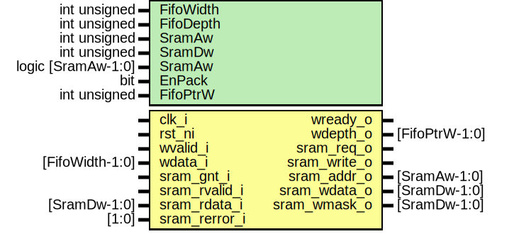

# Entity: spid_fifo2sram_adapter

- **File**: spid_fifo2sram_adapter.sv
## Diagram

## Description

 Copyright lowRISC contributors.
 Licensed under the Apache License, Version 2.0, see LICENSE for details.
 SPDX-License-Identifier: Apache-2.0

 FIFO interface to SRAM interface

## Generics

| Generic name | Type               | Value             | Description          |
| ------------ | ------------------ | ----------------- | -------------------- |
| FifoWidth    | int unsigned       | 8                 |                      |
| FifoDepth    | int unsigned       | 256               |                      |
| SramAw       | int unsigned       | 10                |                      |
| SramDw       | int unsigned       | 32                |                      |
| SramAw       | logic [SramAw-1:0] | '0                |                      |
| EnPack       | bit                | 1                 |  Byte Write to pack  |
| FifoPtrW     | int unsigned       | $clog2(FifoDepth) |                      |
## Ports

| Port name     | Direction | Type            | Description |
| ------------- | --------- | --------------- | ----------- |
| clk_i         | input     |                 |             |
| rst_ni        | input     |                 |             |
| wvalid_i      | input     |                 |             |
| wready_o      | output    |                 |             |
| wdata_i       | input     | [FifoWidth-1:0] |             |
| wdepth_o      | output    | [FifoPtrW-1:0]  |             |
| sram_req_o    | output    |                 |             |
| sram_gnt_i    | input     |                 |             |
| sram_write_o  | output    |                 |             |
| sram_addr_o   | output    | [SramAw-1:0]    |             |
| sram_wdata_o  | output    | [SramDw-1:0]    |             |
| sram_wmask_o  | output    | [SramDw-1:0]    |             |
| sram_rvalid_i | input     |                 |             |
| sram_rdata_i  | input     | [SramDw-1:0]    |             |
| sram_rerror_i | input     | [1:0]           |             |
## Signals

| Name        | Type                 | Description                       |
| ----------- | -------------------- | --------------------------------- |
| fifoptr     | logic [FifoPtrW-1:0] | //////////  Signal // //////////  |
| sram_ack    | logic                |                                   |
| fifoptr_inc | logic                |                                   |
## Constants

| Name            | Type         | Value             | Description |
| --------------- | ------------ | ----------------- | ----------- |
| FifoPtrW        | int unsigned | $clog2(FifoDepth) |             |
| NumEntryPerWord | int unsigned | SramDw/FifoWidth  |             |
## Processes
- unnamed: ( @(posedge clk_i or negedge rst_ni) )
  - **Type:** always_ff
