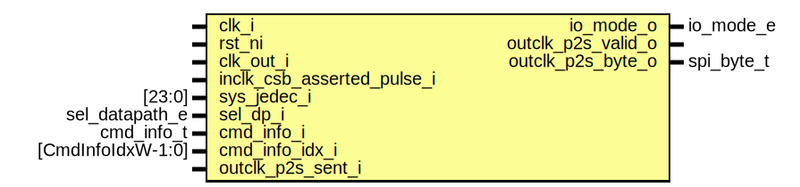

# Entity: spid_jedec

- **File**: spid_jedec.sv
## Diagram

## Description

 Copyright lowRISC contributors.
 Licensed under the Apache License, Version 2.0, see LICENSE for details.
 SPDX-License-Identifier: Apache-2.0

 SPI Flash Read JEDEC ID handler

## Ports

| Port name                  | Direction | Type              | Description                 |
| -------------------------- | --------- | ----------------- | --------------------------- |
| clk_i                      | input     |                   |                             |
| rst_ni                     | input     |                   |                             |
| clk_out_i                  | input     |                   | Output clock (inverted SCK) |
| inclk_csb_asserted_pulse_i | input     |                   |                             |
| sys_jedec_i                | input     | [23:0]            | from CSR                    |
| io_mode_o                  | output    | io_mode_e         |                             |
| sel_dp_i                   | input     | sel_datapath_e    |                             |
| cmd_info_i                 | input     | cmd_info_t        |                             |
| cmd_info_idx_i             | input     | [CmdInfoIdxW-1:0] |                             |
| outclk_p2s_valid_o         | output    |                   |                             |
| outclk_p2s_byte_o          | output    | spi_byte_t        |                             |
| outclk_p2s_sent_i          | input     |                   |                             |
## Signals

| Name            | Type         | Description |
| --------------- | ------------ | ----------- |
| st_q            | st_e         |             |
| st_d            | st_e         |             |
| jedec           | logic [23:0] |             |
| p2s_valid       | logic        |             |
| p2s_byte        | spi_byte_t   |             |
| next_byte       | logic        |             |
| byte_sel_q      | logic [1:0]  |             |
| byte_sel_d      | logic [1:0]  |             |
| unused_cmd_info | logic        |  Unused     |
| p2s_byte        | begin        |             |
| else            | end          |             |
| p2s_byte        | begin        |             |
| p2s_byte_logic  | end          |             |
## Types

| Name | Type                                                                                                              | Description |
| ---- | ----------------------------------------------------------------------------------------------------------------- | ----------- |
| st_e | enum logic {      StIdle,      StActive   } |             |
## Processes
- unnamed: ( @(posedge clk_i or negedge rst_ni) )
  - **Type:** always_ff
**Description**
////////////  Datapath // ////////////  Jedec latch 
- unnamed: ( @(posedge clk_out_i or negedge rst_ni) )
  - **Type:** always_ff
**Description**
 Output to Parallel-to-Serial 
- p2s_byte_logic: (  )
  - **Type:** always_comb
- byte_sel_latch: ( @(posedge clk_i or negedge rst_ni) )
  - **Type:** always_ff
- state_latch: ( @(posedge clk_i or negedge rst_ni) )
  - **Type:** always_ff
**Description**
/////////  State // ///////// 
- next_state_logic: (  )
  - **Type:** always_comb
