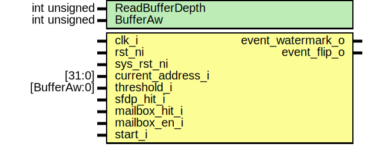

# Entity: spid_readbuffer

- **File**: spid_readbuffer.sv
## Diagram

## Description

 Copyright lowRISC contributors.
 Licensed under the Apache License, Version 2.0, see LICENSE for details.
 SPDX-License-Identifier: Apache-2.0

 SPI Flash Read Command: Read Buffer Manager

## Generics

| Generic name    | Type         | Value                        | Description                                                                                                        |
| --------------- | ------------ | ---------------------------- | ------------------------------------------------------------------------------------------------------------------ |
| ReadBufferDepth | int unsigned | spi_device_pkg::SramMsgDepth |  Buffer size: # of indices assigned to Read Buffer.     This is used to calculate double buffering and threshold.  |
| BufferAw        | int unsigned | $clog2(ReadBufferDepth)      |  Derived parameters                                                                                                |
## Ports

| Port name         | Direction | Type         | Description                                                          |
| ----------------- | --------- | ------------ | -------------------------------------------------------------------- |
| clk_i             | input     |              |                                                                      |
| rst_ni            | input     |              |                                                                      |
| sys_rst_ni        | input     |              | to keep the addr, bufidx, flip signals                               |
| current_address_i | input     | [31:0]       |                                                                      |
| threshold_i       | input     | [BufferAw:0] | A buffer size among two buffers (in bytes)                           |
| sfdp_hit_i        | input     |              |                                                                      |
| mailbox_hit_i     | input     |              |                                                                      |
| mailbox_en_i      | input     |              |                                                                      |
| start_i           | input     |              |  start: data Output phase indicator. Either pulse or level are fine. |
| event_watermark_o | output    |              |                                                                      |
| event_flip_o      | output    |              |                                                                      |
## Signals

| Name               | Type                     | Description                                                                                                                                                                                                      |
| ------------------ | ------------------------ | ---------------------------------------------------------------------------------------------------------------------------------------------------------------------------------------------------------------- |
| st_q               | st_e                     |                                                                                                                                                                                                                  |
| st_d               | st_e                     |                                                                                                                                                                                                                  |
| watermark_cross    | logic                    | //////////  Signal // //////////                                                                                                                                                                                 |
| watermark_crossed  | logic                    | set by event / clear by flip                                                                                                                                                                                     |
| flip               | logic                    |                                                                                                                                                                                                                  |
| next_buffer_addr   | logic [31-OneBufferAw:0] |  The logic keeps next buffer address. Compare this with the  current_address and if it hits with mask, then the flip event occurs.  TODO: If the device goes sleep, the next_buffer_addr should be recoverable.  |
| active             | logic                    |                                                                                                                                                                                                                  |
| current_buffer_idx | logic [31-OneBufferAw:0] |                                                                                                                                                                                                                  |
## Constants

| Name          | Type         | Value                   | Description                                   |
| ------------- | ------------ | ----------------------- | --------------------------------------------- |
| BufferAw      | int unsigned | $clog2(ReadBufferDepth) |  Derived parameters                           |
| BufferSize    | int unsigned | ReadBufferDepth         | //////////////  Definition // //////////////  |
| OneBufferSize | int unsigned | BufferSize / 2          |  bytes                                        |
| OneBufferAw   | int unsigned | $clog2(OneBufferSize)   |                                               |
## Types

| Name | Type                                                                                                              | Description |
| ---- | ----------------------------------------------------------------------------------------------------------------- | ----------- |
| st_e | enum logic {      StIdle,      StActive   } |             |
## Processes
- unnamed: ( @(posedge clk_i or negedge sys_rst_ni) )
  - **Type:** always_ff
 **Description**
 Flip event handling 
- unnamed: ( @(posedge clk_i or negedge sys_rst_ni) )
  - **Type:** always_ff
- unnamed: ( @(posedge clk_i or negedge rst_ni) )
  - **Type:** always_ff
 **Description**
/////////////////  State Machine // ///////////////// 
- unnamed: (  )
  - **Type:** always_comb
