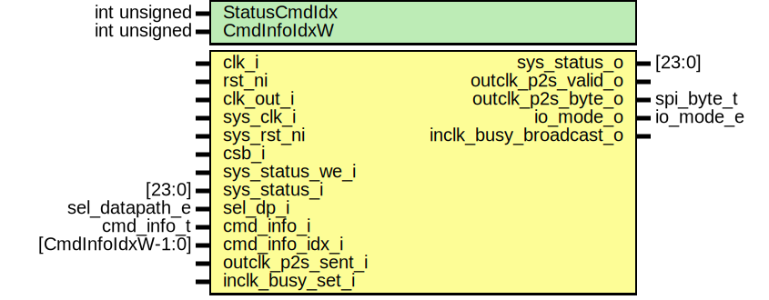

# Entity: spid_status

- **File**: spid_status.sv
## Diagram

## Description

 Copyright lowRISC contributors.
 Licensed under the Apache License, Version 2.0, see LICENSE for details.
 SPDX-License-Identifier: Apache-2.0

 SPI Flash Read Status handler

## Generics

| Generic name | Type         | Value                       | Description                                                                                                                                                                                              |
| ------------ | ------------ | --------------------------- | -------------------------------------------------------------------------------------------------------------------------------------------------------------------------------------------------------- |
| StatusCmdIdx | int unsigned | undefined                   |  Read Status module recognizes the command by the cmd_info_idx from the  cmdparse logic as the Opcode of the command could vary. Use the index and  determines the return order of the status register.  |
| CmdInfoIdxW  | int unsigned | spi_device_pkg::CmdInfoIdxW |                                                                                                                                                                                                          |
## Ports

| Port name              | Direction | Type              | Description                                                                                   |
| ---------------------- | --------- | ----------------- | --------------------------------------------------------------------------------------------- |
| clk_i                  | input     |                   |                                                                                               |
| rst_ni                 | input     |                   |                                                                                               |
| clk_out_i              | input     |                   | Output clock (inverted SCK)                                                                   |
| sys_clk_i              | input     |                   | Handling STATUS CSR (ext type)                                                                |
| sys_rst_ni             | input     |                   |                                                                                               |
| csb_i                  | input     |                   | CSb as a signal (not as a reset)                                                              |
| sys_status_we_i        | input     |                   |  status register from CSR: sys_clk domain bit [   0]: RW0C by SW / W1S by HW  bit [23:1]: RW  |
| sys_status_i           | input     | [23:0]            |                                                                                               |
| sys_status_o           | output    | [23:0]            | sys_clk domain                                                                                |
| sel_dp_i               | input     | sel_datapath_e    |  from cmdparse                                                                                |
| cmd_info_i             | input     | cmd_info_t        |                                                                                               |
| cmd_info_idx_i         | input     | [CmdInfoIdxW-1:0] |                                                                                               |
| outclk_p2s_valid_o     | output    |                   |                                                                                               |
| outclk_p2s_byte_o      | output    | spi_byte_t        |                                                                                               |
| outclk_p2s_sent_i      | input     |                   |                                                                                               |
| io_mode_o              | output    | io_mode_e         |                                                                                               |
| inclk_busy_set_i       | input     |                   | SCK domain                                                                                    |
| inclk_busy_broadcast_o | output    |                   | SCK domain                                                                                    |
## Signals

| Name               | Type         | Description                                                                                                                   |
| ------------------ | ------------ | ----------------------------------------------------------------------------------------------------------------------------- |
| unused_cmd_info    | logic        | /////////////  Temporary // /////////////                                                                                     |
| unused_p2s_sent    | logic        |                                                                                                                               |
| st_q               | st_e         |                                                                                                                               |
| st_d               | st_e         |                                                                                                                               |
| status_sck         | logic [23:0] | //////////  Signal // //////////                                                                                              |
| unused_status_sck  | logic        |                                                                                                                               |
| p2s_valid_inclk    | logic        |                                                                                                                               |
| p2s_byte_inclk     | spi_byte_t   |                                                                                                                               |
| reg_en             | logic        | If 1, register in bus clock domain can be updated by SW                                                                       |
| reg_update         | logic        | indicator of HW update (when CSb is de-asserted)                                                                              |
| status             | logic [23:0] |  Register interface update in bus clock domain                                                                                |
| csb_sync_d         | logic        |  CSb pulse                                                                                                                    |
| csb_sync_q         | logic        |  CSb pulse                                                                                                                    |
| csb_asserted_pulse | logic        |  CSb pulse                                                                                                                    |
| reg_en_q           | logic        |  CSb de-asserted pulse is used as reg_update.  TODO: merge this to the top then receive the signal through the module  port?  |
| byte_sel_d         | logic [1:0]  |  cmd_idx to data selector                                                                                                     |
| byte_sel_q         | logic [1:0]  |  cmd_idx to data selector                                                                                                     |
| byte_sel_update    | logic        |                                                                                                                               |
| byte_sel_inc       | logic        |                                                                                                                               |
## Types

| Name | Type                                                                                                              | Description |
| ---- | ----------------------------------------------------------------------------------------------------------------- | ----------- |
| st_e | enum logic {      StIdle,      StActive   } |             |
## Processes
- unnamed: ( @(posedge sys_clk_i or negedge sys_rst_ni) )
  - **Type:** always_ff
**Description**
  BUSY 
- unnamed: ( @(posedge sys_clk_i or negedge sys_rst_ni) )
  - **Type:** always_ff
**Description**
  rest of STATUS 
- unnamed: ( @(posedge clk_i or negedge rst_ni) )
  - **Type:** always_ff
- unnamed: ( @(posedge sys_clk_i or negedge sys_rst_ni) )
  - **Type:** always_ff
- unnamed: ( @(posedge clk_i or negedge sys_rst_ni) )
  - **Type:** always_ff
**Description**
 Status in SCK 
- unnamed: ( @(posedge clk_out_i or negedge rst_ni) )
  - **Type:** always_ff
**Description**
///////////////  Data Return // ///////////////  Latch in clk_out 
- unnamed: ( @(posedge clk_i or negedge rst_ni) )
  - **Type:** always_ff
- byte_sel_input: (  )
  - **Type:** always_comb
- unnamed: ( @(posedge clk_i or negedge rst_ni) )
  - **Type:** always_ff
**Description**
 State Machine 
- unnamed: (  )
  - **Type:** always_comb
