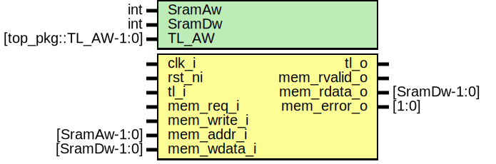

# Entity: sram2tlul

## Diagram

## Description

Copyright lowRISC contributors.
 Licensed under the Apache License, Version 2.0, see LICENSE for details.
 SPDX-License-Identifier: Apache-2.0
 SRAM interface to TL-UL converter
      Current version only supports if TL-UL width and SRAM width are same
      If SRAM interface requests more than MaxOutstanding cap, it generates
      error in simulation but not in Silicon.
 
## Generics

| Generic name | Type                       | Value | Description                  |
| ------------ | -------------------------- | ----- | ---------------------------- |
| SramAw       | int                        | 12    |                              |
| SramDw       | int                        | 32    |                              |
| TL_AW        | logic [top_pkg::TL_AW-1:0] | 'h0   | Base address of SRAM request |
## Ports

| Port name    | Direction | Type         | Description |
| ------------ | --------- | ------------ | ----------- |
| clk_i        | input     |              |             |
| rst_ni       | input     |              |             |
| tl_o         | output    |              |             |
| tl_i         | input     |              |             |
| mem_req_i    | input     |              | SRAM        |
| mem_write_i  | input     |              |             |
| mem_addr_i   | input     | [SramAw-1:0] |             |
| mem_wdata_i  | input     | [SramDw-1:0] |             |
| mem_rvalid_o | output    |              |             |
| mem_rdata_o  | output    | [SramDw-1:0] |             |
| mem_error_o  | output    | [1:0]        |             |
## Constants

| Name     | Type         | Value            | Description |
| -------- | ------------ | ---------------- | ----------- |
| SRAM_DWB | int unsigned | $clog2(SramDw/8) |             |
