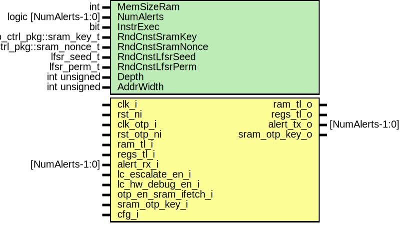

# Entity: sram_ctrl
## Diagram

## Description
Copyright lowRISC contributors.
 Licensed under the Apache License, Version 2.0, see LICENSE for details.
 SPDX-License-Identifier: Apache-2.0
 SRAM controller.
 
## Generics
| Generic name        | Type                       | Value                      | Description                                 |
| ------------------- | -------------------------- | -------------------------- | ------------------------------------------- |
| NumAlerts           | logic [NumAlerts-1:0]      | undefined                  | Enable asynchronous transitions on alerts.  |
| InstrExec           | bit                        | 1                          |                                             |
| RndCnstSramKey      | otp_ctrl_pkg::sram_key_t   | RndCnstSramKeyDefault      | Random netlist constants                    |
| RndCnstSramNonce    | otp_ctrl_pkg::sram_nonce_t | RndCnstSramNonceDefault    |                                             |
| RndCnstSramLfsrPerm | lfsr_perm_t                | RndCnstSramLfsrPermDefault |                                             |
## Ports
| Port name            | Direction | Type                | Description                                              |
| -------------------- | --------- | ------------------- | -------------------------------------------------------- |
| clk_i                | input     |                     | SRAM Clock                                               |
| rst_ni               | input     |                     |                                                          |
| clk_otp_i            | input     |                     | OTP Clock (for key interface)                            |
| rst_otp_ni           | input     |                     |                                                          |
| tl_i                 | input     |                     | Bus Interface (device) for CSRs                          |
| tl_o                 | output    |                     |                                                          |
| alert_rx_i           | input     | [NumAlerts-1:0]     | Alert outputs.                                           |
| alert_tx_o           | output    | [NumAlerts-1:0]     |                                                          |
| lc_escalate_en_i     | input     |                     | Life-cycle escalation input (scraps the scrambling keys) |
| lc_hw_debug_en_i     | input     |                     |                                                          |
| otp_en_sram_ifetch_i | input     |                     | Otp configuration for sram execution                     |
| sram_otp_key_o       | output    |                     | Key request to OTP (running on clk_fixed)                |
| sram_otp_key_i       | input     |                     |                                                          |
| intg_error_i         | input     |                     | Integrity error detection on corresponding sram          |
| sram_scr_o           | output    | sram_scr_req_t      | Interface with SRAM scrambling wrapper                   |
| sram_scr_i           | input     | sram_scr_rsp_t      |                                                          |
| sram_scr_init_o      | output    | sram_scr_init_req_t | Interface with SRAM scrambling wrapper init              |
| sram_scr_init_i      | input     | sram_scr_init_rsp_t |                                                          |
| en_ifetch_o          | output    |                     | Interface with corresponding tlul adapters               |
## Signals
| Name              | Type                                     | Description                                                                                                                                                                                                                                                                                                                                   |
| ----------------- | ---------------------------------------- | --------------------------------------------------------------------------------------------------------------------------------------------------------------------------------------------------------------------------------------------------------------------------------------------------------------------------------------------- |
| reg2hw            | sram_ctrl_reg_pkg::sram_ctrl_reg2hw_t    |                                                                                                                                                                                                                                                                                                                                               |
| hw2reg            | sram_ctrl_reg_pkg::sram_ctrl_hw2reg_t    |                                                                                                                                                                                                                                                                                                                                               |
| key_d             | logic [otp_ctrl_pkg::SramKeyWidth-1:0]   | Key and attribute outputs to scrambling device                                                                                                                                                                                                                                                                                                |
| key_q             | logic [otp_ctrl_pkg::SramKeyWidth-1:0]   | Key and attribute outputs to scrambling device                                                                                                                                                                                                                                                                                                |
| nonce_d           | logic [otp_ctrl_pkg::SramNonceWidth-1:0] |                                                                                                                                                                                                                                                                                                                                               |
| nonce_q           | logic [otp_ctrl_pkg::SramNonceWidth-1:0] |                                                                                                                                                                                                                                                                                                                                               |
| parity_error_d    | logic                                    | Status register outputs                                                                                                                                                                                                                                                                                                                       |
| parity_error_q    | logic                                    | Status register outputs                                                                                                                                                                                                                                                                                                                       |
| escalated_q       | logic                                    |                                                                                                                                                                                                                                                                                                                                               |
| key_valid_d       | logic                                    |                                                                                                                                                                                                                                                                                                                                               |
| key_valid_q       | logic                                    |                                                                                                                                                                                                                                                                                                                                               |
| key_seed_valid_d  | logic                                    |                                                                                                                                                                                                                                                                                                                                               |
| key_seed_valid_q  | logic                                    |                                                                                                                                                                                                                                                                                                                                               |
| key_req           | logic                                    | Control register                                                                                                                                                                                                                                                                                                                              |
| unused_error      | logic                                    | Correctable RAM errors are not supported                                                                                                                                                                                                                                                                                                      |
| unused_perm_param | lfsr_perm_t                              | Parameter not used within module The memory is the user of the perm parameter.  At the moment memories are not instantianted inside sram_ctrl but parallel to it.                                                                                                                                                                             |
| alert             | logic [NumAlerts-1:0]                    |                                                                                                                                                                                                                                                                                                                                               |
| alert_test        | logic [NumAlerts-1:0]                    |                                                                                                                                                                                                                                                                                                                                               |
| escalate_en       | lc_ctrl_pkg::lc_tx_t                     |                                                                                                                                                                                                                                                                                                                                               |
| key_ack           | logic                                    | The scrambling key and nonce have to be requested from the OTP controller via a req/ack protocol. Since the OTP controller works in a different clock domain, we have to synchronize the req/ack protocol as described in more details here: https://docs.opentitan.org/hw/ip/otp_ctrl/doc/index.html#interfaces-to-sram-and-otbn-scramblers  |
| key_req_pending_d | logic                                    |                                                                                                                                                                                                                                                                                                                                               |
| key_req_pending_q | logic                                    |                                                                                                                                                                                                                                                                                                                                               |
| init_q            | logic                                    |                                                                                                                                                                                                                                                                                                                                               |
| clk_i             | prim_sync_reqack_data                    |                                                                                                                                                                                                                                                                                                                                               |
| rst_ni            | prim_sync_reqack_data                    |                                                                                                                                                                                                                                                                                                                                               |
| clk_otp_i         | prim_sync_reqack_data                    |                                                                                                                                                                                                                                                                                                                                               |
| rst_otp_ni        | prim_sync_reqack_data                    |                                                                                                                                                                                                                                                                                                                                               |
| key_req_pending_q | prim_sync_reqack_data                    |                                                                                                                                                                                                                                                                                                                                               |
| key_ack           | prim_sync_reqack_data                    |                                                                                                                                                                                                                                                                                                                                               |
| req               | prim_sync_reqack_data                    |                                                                                                                                                                                                                                                                                                                                               |
| ack               | prim_sync_reqack_data                    |                                                                                                                                                                                                                                                                                                                                               |
| key               | prim_sync_reqack_data                    |                                                                                                                                                                                                                                                                                                                                               |
| sram_otp_key_i    | prim_sync_reqack_data                    |                                                                                                                                                                                                                                                                                                                                               |
| sram_otp_key_i    | prim_sync_reqack_data                    |                                                                                                                                                                                                                                                                                                                                               |
| key_d             | prim_sync_reqack_data                    |                                                                                                                                                                                                                                                                                                                                               |
| nonce_d           | prim_sync_reqack_data                    |                                                                                                                                                                                                                                                                                                                                               |
| key_seed_valid_d  | prim_sync_reqack_data                    |                                                                                                                                                                                                                                                                                                                                               |
## Processes
- unnamed: _( @(posedge clk_i or negedge rst_ni) )_

- p_regs: _( @(posedge clk_i or negedge rst_ni) )_

## Instantiations
- u_reg: sram_ctrl_reg_top
- u_prim_lc_sync: prim_lc_sync
