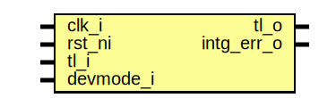

# Entity: sram_ctrl_ram_reg_top

- **File**: sram_ctrl_ram_reg_top.sv
## Diagram

## Description

 Copyright lowRISC contributors.
 Licensed under the Apache License, Version 2.0, see LICENSE for details.
 SPDX-License-Identifier: Apache-2.0

 Register Top module auto-generated by `reggen`

## Ports

| Port name  | Direction | Type | Description                                              |
| ---------- | --------- | ---- | -------------------------------------------------------- |
| clk_i      | input     |      |                                                          |
| rst_ni     | input     |      |                                                          |
| tl_i       | input     |      |                                                          |
| tl_o       | output    |      |                                                          |
| intg_err_o | output    |      |  To HW Integrity check errors                            |
| devmode_i  | input     |      | If 1, explicit error return for unmapped register access |
## Signals

| Name           | Type               | Description                                                             |
| -------------- | ------------------ | ----------------------------------------------------------------------- |
| intg_err       | logic              |  incoming payload check                                                 |
| intg_err_q     | logic              |                                                                         |
| tl_o_pre       | tlul_pkg::tl_d2h_t |  outgoing integrity generation                                          |
| tl_socket_h2d  | tlul_pkg::tl_h2d_t |                                                                         |
| tl_socket_d2h  | tlul_pkg::tl_d2h_t |                                                                         |
| reg_steer      | logic [0:0]        |                                                                         |
| unused_devmode | logic              |  Unused signal tieoff  devmode_i is not used if there are no registers  |
## Processes
- unnamed: ( @(posedge clk_i or negedge rst_ni) )
  - **Type:** always_ff
- unnamed: (  )
  - **Type:** always_comb
**Description**
 Create steering logic 
## Instantiations

- u_chk: tlul_cmd_intg_chk
- u_rsp_intg_gen: tlul_rsp_intg_gen
- u_socket: tlul_socket_1n
**Description**
 socket_1n connection
 Create Socket_1n

