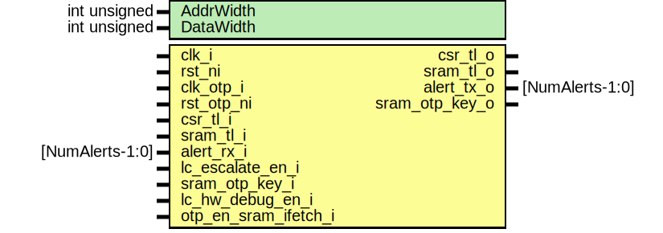

# Entity: sram_ctrl_wrapper

- **File**: sram_ctrl_wrapper.sv
## Diagram

## Description

Copyright lowRISC contributors.
 Licensed under the Apache License, Version 2.0, see LICENSE for details.
 SPDX-License-Identifier: Apache-2.0
 Wrapper module for DV that instantiates all 3 requisite module to form the full SRAM:
 - sram_ctrl
 - tlul_adapter_sram
 - prim_ram_1p_scr
 
## Generics

| Generic name | Type         | Value | Description |
| ------------ | ------------ | ----- | ----------- |
| AddrWidth    | int unsigned | 14    |             |
| DataWidth    | int unsigned | 32    |             |
## Ports

| Port name            | Direction | Type            | Description                        |
| -------------------- | --------- | --------------- | ---------------------------------- |
| clk_i                | input     |                 | clock/reset for sram_ctrl          |
| rst_ni               | input     |                 |                                    |
| clk_otp_i            | input     |                 | clock/reset for otp_ctrl           |
| rst_otp_ni           | input     |                 |                                    |
| csr_tl_i             | input     |                 | TLUL interface for CSR regfile     |
| csr_tl_o             | output    |                 |                                    |
| sram_tl_i            | input     |                 | TLUL interface for the SRAM memory |
| sram_tl_o            | output    |                 |                                    |
| alert_rx_i           | input     | [NumAlerts-1:0] | Alert I/O                          |
| alert_tx_o           | output    | [NumAlerts-1:0] |                                    |
| lc_escalate_en_i     | input     |                 | Life-cycle escalation input        |
| sram_otp_key_o       | output    |                 | Key request to OTP                 |
| sram_otp_key_i       | input     |                 |                                    |
| lc_hw_debug_en_i     | input     |                 | Executable SRAM inputs             |
| otp_en_sram_ifetch_i | input     |                 |                                    |
## Signals

| Name         | Type                    | Description                                             |
| ------------ | ----------------------- | ------------------------------------------------------- |
| scr_req      | sram_scr_req_t          |                                                         |
| scr_rsp      | sram_scr_rsp_t          |                                                         |
| scr_init_req | sram_scr_init_req_t     |                                                         |
| scr_init_rsp | sram_scr_init_rsp_t     |                                                         |
| req          | wire                    | SRAM interface between TLUL adapter and scrambling RAM  |
| gnt          | wire                    |                                                         |
| we           | wire                    |                                                         |
| addr         | wire [AddrWidth-1:0]    |                                                         |
| wdata        | wire [DataWidth-1:0]    |                                                         |
| wmask        | wire [DataWidth-1:0]    |                                                         |
| rdata        | wire [DataWidth-1:0]    |                                                         |
| rvalid       | wire                    |                                                         |
| intg_error   | wire                    |                                                         |
| en_ifetch    | tlul_pkg::tl_instr_en_e |                                                         |
## Instantiations

- u_sram_ctrl: sram_ctrl
**Description**
SRAM Controller

- u_tl_adapter_sram: tlul_adapter_sram
**Description**
TLUL Adapter SRAM

- u_ram1p_sram: prim_ram_1p_scr
**Description**
Scrambling memory

